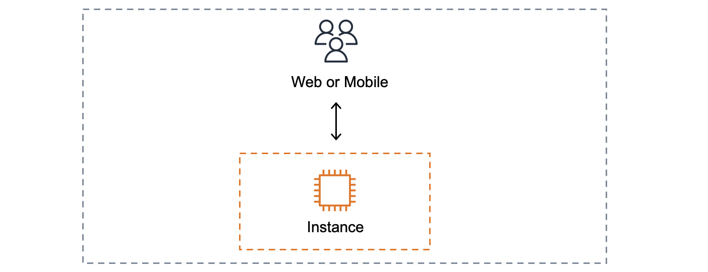
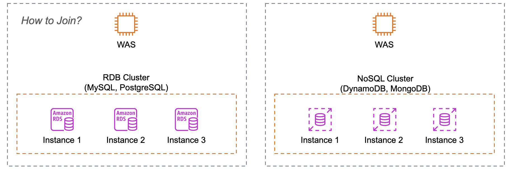
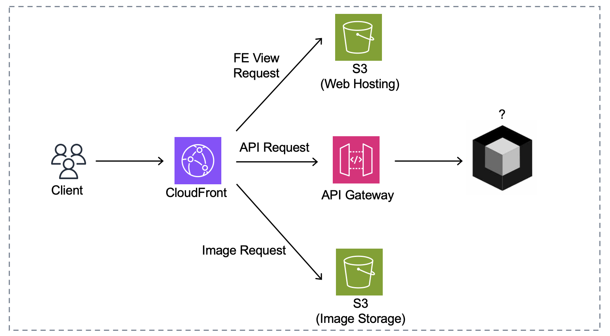

# 목표

- 한 명의 사용자를 지원하는 시스템에서 시작하여, 몇백만 사용자를 지원하는 시스템을 설계해보자.
- 이번 장을 통해, 규모 확장성과 관련된 설계 문제를 푸는 데 쓰일 유용한 지식을 배울 수 있다.
    - 하나씩 살펴볼까?

---

# 단일 서버

- 가장 단순한 시스템
- 모든 컴포넌트가 단 한 대의 서버에서 실행된다
- SPOF

---

# 데이터베이스

- 역할 분리, 독립적 확장 측면에서 데이터베이스 서버를 분리
- 데이터베이스 서버를 무한정 확장할 수 있을까?

### RDB vs NoSQL

- RDB
    - ACID
    - 정규화
    - Join
    - Scale Up
- NoSQL
    - Not Only SQL
    - 비정형 데이터
    - low latency

---

# 수직적 규모 확장 vs 수평적 규모 확장

### Scale Up

- 서버 스펙 향상
- 단순함이 큰 장점
- 한계가 존재
    - 스펙의 한계
    - 다중화 및 Failover 미지원

### Scale Out

- 더 많은 서버를 추가
- 대규모 애플리케이션을 지원하는 경우 수평적 규모 확장법이 적절
- 어떻게 트래픽을 여러 서버로 분산?

---

# 로드밸런서

- 부하 분산을 위한 계층
- Proxy 역할
    - 클라이언트는 직접적으로 웹 서버를 알지 못한다.
    - private ip 이용 가능

---

# 데이터베이스 다중화

- Master
    - CUD 지원
    - 변경사항 Slave 복제
    - Slave 보다 수가 적다
- Slave
    - Read Only
    - 일반적인 웹 애플리케이션에서는 Read 비율이 Write보다 월등히 높음
    - 따라서 Master보다 많게 설정, 독립적인 Scale Out 가능
    - Master 승격 가능 (Failover)

---

# 캐시

- 값비싼 연산 결과 or 자주 참조되는 데이터를 메모리에 보관

### 유의할 점

- 바람직한 상황
    - 데이터 갱신이 자주 일어나지 않지만 참조는 빈번
- 어떤 데이터를 캐시?
    - 영속화 대상은 여전히 persistent layer에 보관
    - 일시적, 휘발성 데이터
- 만료 정책
    - 너무 짧으면 자주 DB 접근
    - 너무 길면 일관성 문제
- 캐시 서버는 몇 대?
    - 한 대만 두면 SPOF

### Redis

- 단일 노드 운영
    - 데이터 사라질 위험 존재
    - 이를 위해 영속화 기능 제공
        - RDB(Redis Database)
            - 특정 주기마다 스냅샷을 디스크에 저장
            - 디스크 I/O 부담 적어, 재시작 시 빠르게 복구 가능
            - 주기 사이에 데이터 유실 가능
        - AOF(Append Only File)
            - 모든 write/update 연산을 log 파일에 남기는 방식
            - 복구 시 저장된 모든 연산을 재실행, RDB 방식보다 느리다.
        - → 적절한 주기로 RDB 방식을 사용하고, 주기 사이에 AOF 방식을 적용하면 어떨까?
- 다중 노드 운영
    - 논클러스터링
        - 한 대의 Master 및 기타 Slave로 구성
        - Only Master-Slave: 장애 시 수동 복구 필요
        - Sentinal: 감시 노드 추가, 마스터를 모니터링하여 Failover
    - 클러스터링
        - 다중 Master 환경, 샤딩을 통해 구성
        - 어떻게 데이터가 위치하는 노드(Master)로 이동?
            - 0~16383번까지의 해시 슬롯 보유
            - 따라서 Key를 기반으로 해시 함수를 통해 원하는 슬롯으로 이동 가능
            - 최초 클러스터 내 노드 중 하나에 연결
            - 이 후 요청한 키의 슬롯이 현재 노드에 있는지 확인, 없다면 해시값을 계산하고
            MOVED 명령을 통해 올바른 노드로 요청을 전달
            - 한 번의 이동이면 가능!
- 운영 꿀팁!
    - Max Memory 설정
        - AOF rewrite 시 fork()를 통해 두 배의 메모리를 사용
        - 이 때 실제 서버의 메모리를 초과할 수 도?
        - 따라서 Redis의 MaxMemory를 최대 서버 메모리의 절반 수준으로 설정
    - `keys *` 사용 금지
        - 만약 데이터가 많으면 blocking 되어 레디스가 멈춘다.

---

# CDN

- 정적 컨텐츠 캐싱
- AWS CloudFront가 대표적

### 사용 사례

- CDN 및 Proxy
    - 정적 페이지 캐싱
    - 다중 Origin 구성
        - `cloudfront-url/api/*` 접근 시 내부적으로 API Gateway 호출
        - `cloudfront-url/images/*` 접근 시 내부적으로 Image Bucket 호출
        - CORS 정책 만족이 간단!
    - 하나의 origin 당 하나의 CDN 필수? → X

---

# Stateless

- 웹 계층의 수평적 확장
- 이를 위해선 서버 내부 상태 정보를 제거해야함
    - 그렇지 않으면, 같은 클라이언트의 요청은 항상 같은 서버로 전송되어야함
    - AWS ELB도 sticky session 기능을 제공하지만, 이는 로드밸런서에 부담을 준다.
- 상태 정보가 필요한 경우, 공유 저장소를 활용하자
    - RDB, NoSQL, 캐시…

---

# 메세지 큐

- 메세지의 무손실을 보장하는 비동기 통신 컴포넌트
- 보통 Consumer / Producer 구조
- !서비스 간 결합이 느슨해짐

### EDA (Event-Driven-Architecture) 유의사항

- 중복 메세지
    - 수신 측 멱등성 확보 필수
        - 처리한 이벤트 정보를 영속화, 이미 처리한 경우 필터링
        - 이 경우 update 트랜잭션이 종료되기 전 중복 처리 가능
        - Q. 어떻게 해결 가능할까요?
- HOL(Head-Of-Line Blocking)
    - 장애 성격의 메세지가 큐의 앞에 위치해, 뒤에 있는 정상 메세지들이 처리가 늦어지면?
    - Q. 어떻게 해결 가능할까요?

---

# 로그, 메트릭, 그리고 자동화

- 애플리케이션 규모가 커진다면, 로그, 메트릭, 자동화 도구가 필수이다.
- 로그
    - 로그를 단일 서비스로 모아주는 도구 활용
- 메트릭
    - 시스템의 현재 상태를 파악
- 자동화
    - CI/CD 도구를 통해 검증 절차 및 배포과정 자동화

---

# 데이터베이스 규모 확장

### Scale Up

- 무한정 증설 불가
- SPOF
- 고비용

### Scale Out

- 일반적으로 샤딩이라고도 부름
- 샤딩을 도입하면 시스템이 복잡해지고, 새로운 문제가 발생
    - resharding: 데이터가 너무 많아져, 추가 샤드가 필요한 경우 샤드 키를 계산하는 함수를 변경해야함.
    → 5장에서 다룰 안정 해시 기법을 활용하면 이 문제를 해결 가능
    - join: 여러 샤드에 걸친 데이터를 조인하기가 힘들다
    → 역정규화하여 하나의 테이블에서 쿼리가 가능하도록 하면 해결 가능
    → 이러면 NoSQL도 대안이 될 수 있지 않을까?