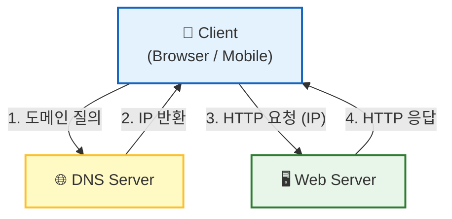
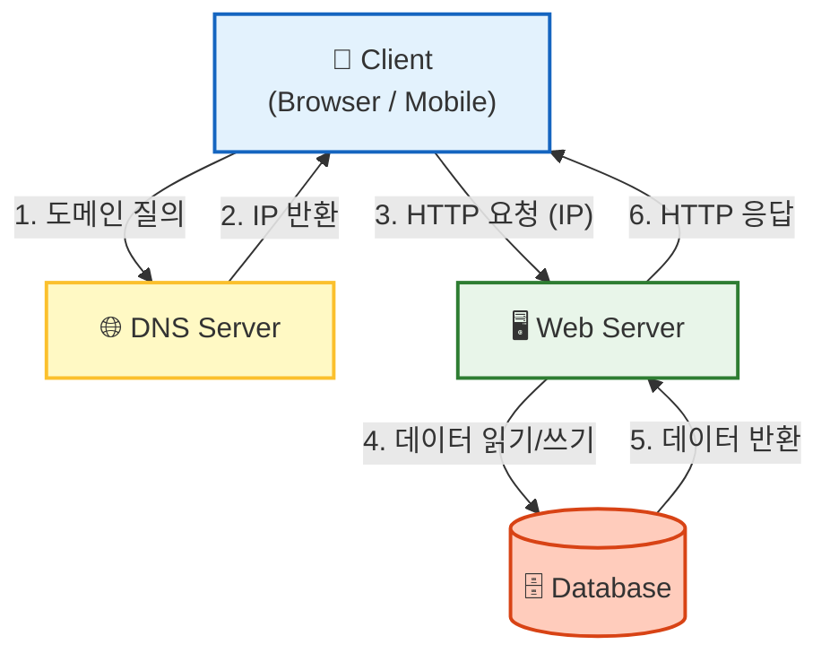
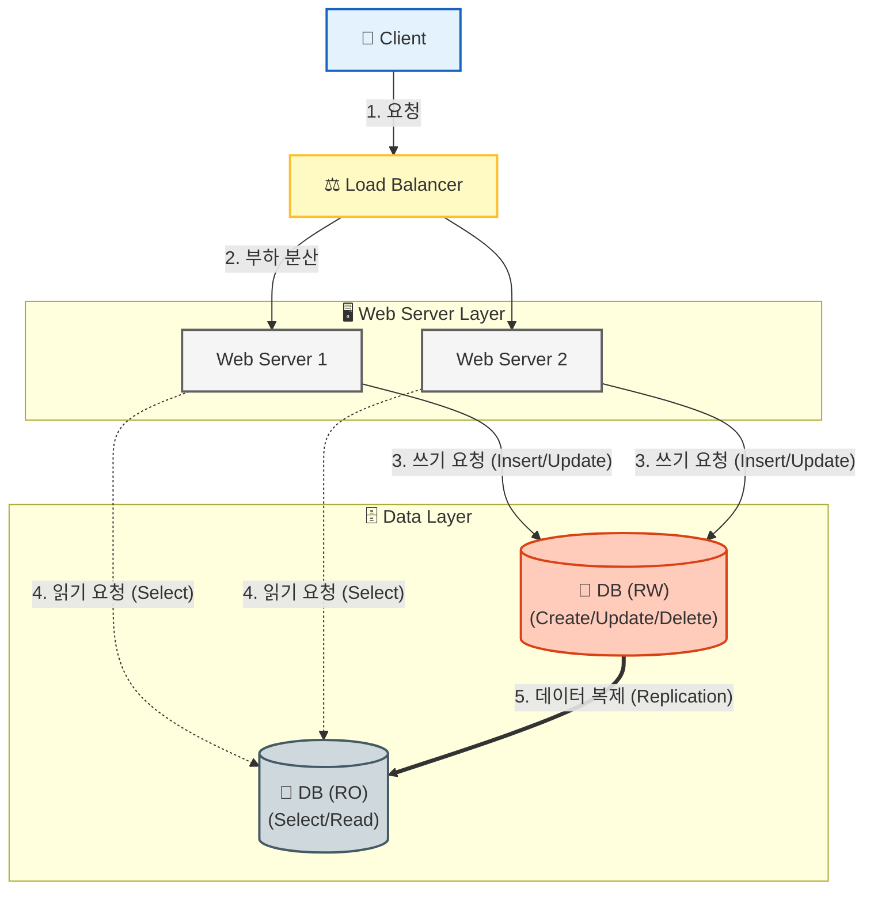
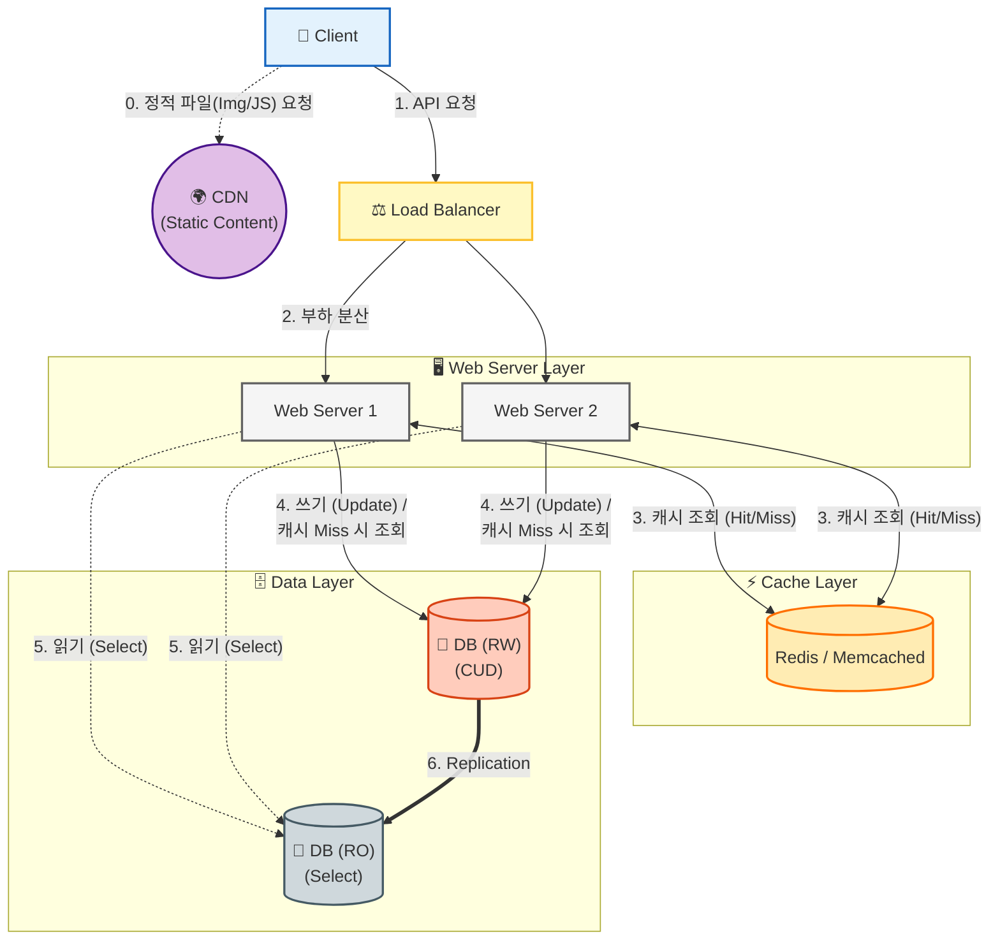
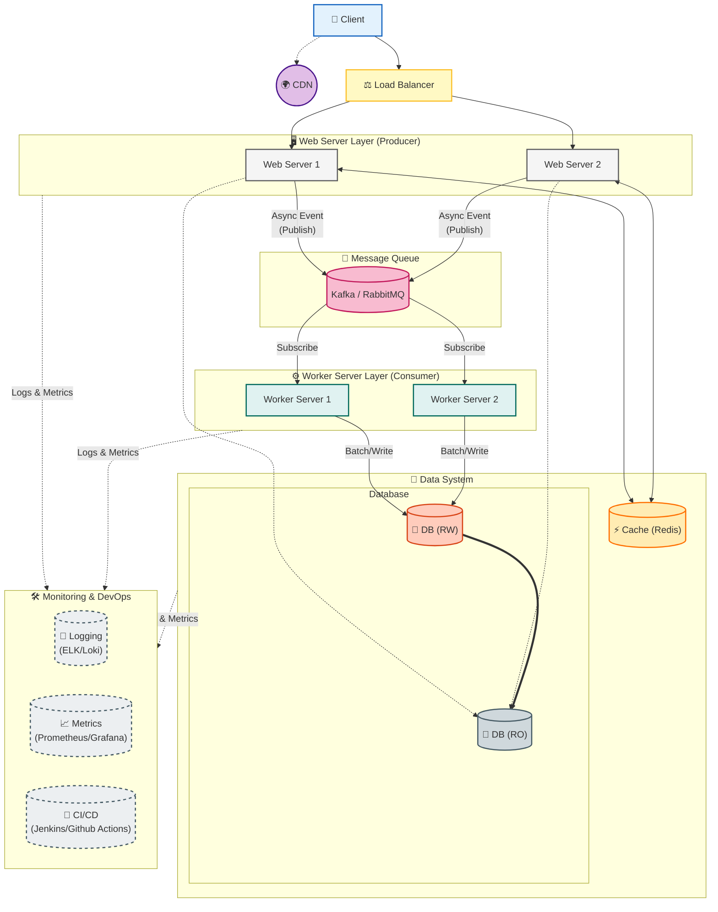
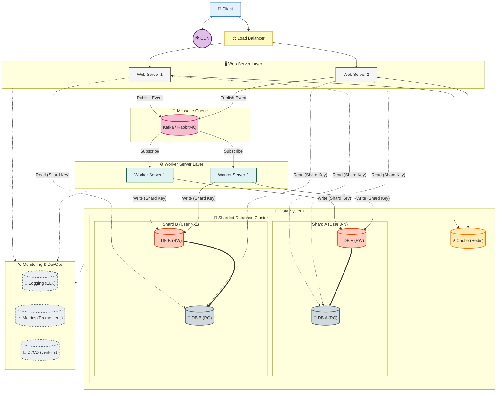

# 1장 사용자 수에 따른 규모 확장성

* 한 명의 사용자에서 시작해서 수백만 사용자를 지원하는 시스템의 설계를 해보자.

## 목표
* 규모 확장성(scalability)과 관련된 설계를 푸는데 쓰이는 유용한 지식 학습!
  * 사용자가 확대될 때 어떠한 요소를 고려해야 하는가? 

----

## 단일 서버
* 소수의 사용자만 사용하는 서비스는 단일 서버로 충분하다.
  * **모든 컴포넌트가 단 1대의 서버에서만 실행되는 시스템**
 

* Client가 DNS로 IP를 얻고, Web Server에 요청하여 원하는 Response (HTML 페이지 or JSON Reponse) 응답

| 장점 | 단점 |
| :--- | :--- |
| 1. Web Server 1대의 최소 인프라 비용으로 운영할 수 있다. | 1. 사용자 요청/응답 처리 계층과 비즈니스를 처리하고 데이터를 관리하는 계층이 섞여 있다.   따라서, 확장 시에도 비효율적으로 모든 로직을 확장해야 한다. 변경에 유연하지 못하다.|  

----

## 데이터베이스
* 이전 아키텍쳐에서 DB 로직만 담당하는 서버를 분리

| 장점 | 단점 |
| :--- | :--- |
| 1. DB Server가 분리되어 DB 처리 트래픽이 분산되어 서버 부하가 줄어든다.   2. 병목이 생기는 지점을 파악하면 해당 서버만 확장하여 효율적으로 서버를 늘릴 수 있다. | 1. DB 계층을 서버로 분리했지만, 여전히 웹 계층과 비즈니스 처리 계층이 혼재되어 있다.|  

* 해당 챕터에서는 Web Server와 Web Application Server의 분리는 다루고 있는 것 같지 않아서, 우선 그림 상으로는 합쳤지만 분리된 것으로 판단하겠음!

### 어떤 DB를 사용할까?

### RDB vs NoSQL
* 일반적으로는 RDB를 사용하고, 다음과 같은 경우에 NoSQL을 고려한다.
  * 데이터가 Latency 없이 실시간 응답이 요구될 때
  * 데이터 자체가 관계형 데이터가 아닌 비정형 데이터일 때!
  * 데이터를 단순히 저장하고 직렬화/역직렬화만 할 때 -> Meteralized View?
  * 대량의 데이터를 저장해야 할 때
* **TODO NoSQL 활용 사례 공부해야함!** 
* [책에서 나온 NoSQL 다양한 활용 사례](https://highscalability.com/what-the-heck-are-you-actually-using-nosql-for/)
 
### PostgreSQL
* 현재 사내에서는 PostgreSQL을 사용하는데, 사용해보면서 느낀 장단점 간단 정리
  * 장점
    * 특정 자료구조를 사용하여 테이블을 역정규화 할 수 있다. (Array, Json/Jsonb)
    * 여러 Extension이 많이 존재한다. (pg_cron, pg_partman, ...)
  * 단점
    * insert 성능이 좋지 않다. (jsonb 필드가 존재하면 더 느린 것 같다.)
    * count 쿼리 성능 너무 안 좋음 (페이징 불가능한 수준)
   

----

## Scale-Up / Scale-Out
* Scale Up은 오히려 확장 필요가 적을 때 효율적인 방법
  * 서버 스펙업은 빠르게 진행 가능하고 단순.
  * 1대의 서버의 메모리/CPU를 무한대로 늘리는 것은 불가능
  * 또, SPOF로 스펙업을 많이 해둬도 서버가 다운되면 무용지물
* **그래서 일반적으로 확장을 생각할 때 서버 관점에서는 Scale Out을 일반적으로 생각한다.**

### 웹 계층의 부하 분산 
* Web Server를 Scale Out해서 부하를 분산했을 때, 특정 Web Server에만 트래픽이 몰릴 수 있다.
* 이러한 현상을 방지하기 위해 여러 Sever에 골고루 부하를 분산해주는 것이 바로 **로드 밸런서**
* ++ 로드밸런서를 사용하면 실제 Web Server 주소를 숨기고 로드밸런서의 주소를 노출하여 보안상 Proxy 이점도 존재

? : 항상 로드 밸런서를 볼 때 로드 밸런서에 장애가 나면 결국 SPOF 같은데 어떻게 하나? -> 로드 밸런서도 Scale Out ㅋㅎㅎ;;

### DB 계층의 부하 분산 -> 데이터베이스 다중화

* 일반적인 DBMS가 모두 RW/RO 분리를 지원
  * CUD를 RW 서버에만 처리하고, 저장된 데이터를 RO 서버에 복제
  * Read는 RO 서버에서만 처리
  * 일반적인 서비스에서 Read의 비중이 CUD의 비중보다 크기 때문에 RO 서버를 여러대 Scale Out한다.
    * RW/RO를 목적에 맞게 분리했기 때문에 효율적으로 서버를 분리할 수 있다!

✅ 데이터베이스 다중화 이점 (RW/RO를 분리하고, RO 여러대)
* 처리량 : CUD는 RW, Read는 RO로 처리함으로써 병렬 처리량이 늘어난다.
* 안정성(reliability): DB Server 여러대가 존재하므로 1대가 Down 되어도 다른 DB로 대체할 수 있다.
  * 데이터를 여러 Server에 복제함으로써 1대가 아예 Down 되어도 데이터는 보존
* 가용성(availability): DB Server 여러대가 존재하므로 1대가 Down 되어도 다른 DB로 대체할 수 있다.
  * RW가 Down 되면 RO 중 1대가 RW로 승격되어 처리
  * RO가 여러 대일 때, RO 1대가 다운되어도 나머지 RO로 서비스
  * RO가 1대일 때 RO가 다운되어도 RW가 처리

**🔎 RW/RO 분리 운영 시 문제가 되었던 부분**
* RW -> RO로 데이터 복제 시 지연(Lag)에 의한 데이터 정합성 보장 X
  * Event Driven 구조에서 Zero-Payload를 사용해서 이벤트에서 받은 도메인의 API를 호출하여 정보를 얻는 구조
  * 이때, 도메인이 영속화되어 저장 이벤트 발행 -> Consumer가 소비하여 데이터 Read (API 호출) -> RO로 데이터를 읽는데, 아직 RW-RO 복제가 안된 경우 발생
    * 해결은, 해당 로직만 RW를 보도록 해서 처리  

  

**일반적으로, 사내에서도 위와 같은 아키텍쳐를 기본으로 사용중!**

* 이전 아키텍쳐로부터 개선점
👍🏻 Web 계층과 DB 계층이 분리되어 책임 분리 -> 병목 지점에 따라 효율적으로 서버를 확장할 수 있다. (DB 부하가 크다면 DB Server만 늘리면 됨)
👍🏻 SPOF를 줄여서 가용성을 확보한 구조 (서버 1대가 죽더라도 서비스 다운 없이 다른 서버가 대체할 수 있다.)

---

## 캐시
* 캐시는 CPU를 많이 사용 하는 데이터나 DB I/O를 많이 사용하는 데이터를 미리 저장하여 성능을 크게 향상시킬 수 있다!
* **TODO 캐시 전략 공부해야함!**
※ [책에 나온 캐시 전략 Reference](https://codeahoy.com/2017/08/11/caching-strategies-and-how-to-choose-the-right-one/)

### 캐시 사용 시 고려할 점
* Cache Hit가 많이 될 데이터인가? : 갱신이 많지 않지만 조회가 잦은 데이터인가?
* 영속적으로 보관할 데이터는 캐시에 두지 않아야 한다. -> 서버 시작 시 캐시가 초기화되므로 영속화될 데이터는 DB에 저장해야한다.
* **TTL을 적절히 설계해야함 -> 개인적으로 캐싱 TTL을 어떻게 잡을지 아직은 잘 감이 안옴 (감으로 함)**
* 데이터의 일관성이 유지되는가? -> 데이터 갱신 시 '캐시 갱신'과 DB 업데이트'가 하나의 트랜잭션으로 원자성을 보장할 수 있는가?
  * [책에 나온 캐싱 데이터 일관성 페이스북 논문](https://www.usenix.org/system/files/conference/nsdi13/nsdi13-final170_update.pdf)
 * **단일 캐싱 서버는 SPOF가 됨 -> 캐시 서버를 분산해야 하는데, 이때 분산된 캐시 사이의 데이터 동기화는 어떻게 되는지 궁금함 (TODO 공부해야함)**
 * 캐시 메모리 할당 기준 ? 
 * Eviction 정책 : LRU / LFU / FIFO ?

## CDN
* CDN은 정적 콘텐츠를 캐싱하는 서버의 네트워크 (Content Delivery Network)
* 일반적으로 AWS 환경의 S3와 연계하여 사용했었다!
  * 사내 코드를 관리하는 코드 시스템에서 S3로 코드 응답 JSON을 저장
  * 해당 JSON을 Web 계층에서 사용자 요청 시마다 읽어가게 되면 부하 발생
  * CloudFront CDN을 사용해서 코드 응답 JSON을 캐싱

* 이전 아키텍쳐로부터 개선점
👍🏻 정적 콘텐츠 성능 개선 (CDN 캐싱)
👍🏻 캐시 계층을 둬서 DB 부하 감소

---

## 무상태 Web 계층 (Stateless)
* 분산 시스템, Scale Out 환경에서는 Stateless 아키텍쳐를 따라야 한다.
※ **State? : 여기서 상태 정보란, 사용자 세션 데이터와 같은 사용자의 이전 요청 정보**

* Stateful 하다면
  * 사용자 정보를 서버별로 가진다.
  * 특정 서버가 다운되면 사용자 정보는 삭제된다.
    * 유지되게 하려면 로드 밸런서의 Sticky Session(클라이언트별 세션 고정)을 사용해야 하는데 이는 부하 분산의 의미가 없어짐
  * **따라서, 이전 사용자 Context는 별도 저장소에 저장하고 Stateless를 하여 확장에 열려있어야 한다.** 

---
## 데이터 센터
* 일반적으로 현재 추세가 IDC, On-Premise 환경에서 Cloud 환경으로 마이그레이션하는 추세,,, 적어도 지금 회사는 그럼 ㅎㅎ,, 그래서 해당 장은 패쓰

---
## 메시지 큐
* **메시지를 발행하면, 해당 메시지 큐에 쌓인 메시지는 손실되지 않음을 보장하는 비동기 통신 컴포넌트**
* 메시지를 발행하는 Producer/Publisher, 메시지를 소비하는 Consumer/Subscriber 개념 존재
* **🚀 메시지 큐를 사용하는 이유**
  * 사용자의 요청을 받는 서버에서 작업 메시지를 발행하고, 메시지를 소비하여 실제 작업을 처리하는 Worker 서버 책임을 분리할 수 있다.
    * 책임이 분리됨에 따라 결합이 느슨해지고, 작업 처리량을 늘리고 싶을 때 해당 Worker 서버만 Scale Out 할 수 있다.
    * 분산 시스템 환경에서 시스템 간의 결합을 줄여준다. (회원 작업 시 회원 시스템은 단순 메시지만 발행하고, 다른 도메인 시스템에서 메시지를 받아서 처리할 수 있어서 결합이 느슨해진다.)
    * 그에 따라 장애 전파도 막는다!

---
## 로그, 메트릭, 자동화
* 현재 사내에서는 로그, 메트릭 툴으로 `OpenTelemetry` 사용
  * Java Spring Application에 OpenTelemetry의 `javaagent`를 사용해서 요청 시마다 자동으로 Trace, Log 생성
  * OpenTelemetry의 표준 Otel Spec으로 로그, 메트릭을 전달하고 Prometheus, Clickhouse 등에 적재
* 자동화 (CI)로는 gitlab-ci, jenkins 사용

---
## DB Scale Up / Scale Out
* DB도 사용자가 많아지면 결국 캐싱으로는 부하 분산이 한계가 있기 때문에 확장을 고려해야 한다.
* DB도 마찬가지로 Scale Up은 무한대로 확장하기 한계가 있기 때문에 Scale Out을 사용한다.
* DB Scale Out은 일반적으로 샤딩을 사용한다.

* [우아콘 2023 샤딩 내용 있는 발표 영상(14m 14s ~ 25m 37s](https://www.youtube.com/watch?v=704qQs6KoUk&t=1758s)
* 실무에서는 샤딩 대신 파티셔닝을 사용해봤음.
  * 파티셔닝은 DB를 Scale Out하는 것이 아닌 하나의 DB Server의 테이블을 물리적으로 파티셔닝 테이블로 분리하고 CRUD 시 논리적으로 합침
* 샤딩 적용 시에도 부작용이 존재하므로 조심히 사용해야함.
* TODO: 샤딩 정리하기 ㅎㅎ..

---

## 정리
* 사용자가 확대될 때 어떠한 요소를 고려해야 하는가?
  * **기본적으로 서버의 Scale Out을 고려해야 한다.**  
    * **각 서버별로 책임 분리가 이루어져야 한다. -> 책임 분리가 이루어져야 Scale Out을 효율적으로 할 수 있다.**
      * DB Server
      * 사용자 Web Server(API Server)
      * 작업 처리 Worker Server
    * 각 계층별 Scale Out 방법
      * 일반적인 WAS : Stateless로 설계, 앞 단의 로드밸런서를 두고 부하 분산 처리
      * DB : 샤딩  
  * **특정 시스템을 통해 부하를 분산 시키기**
    * 캐싱 : 자주 조회되는 데이터를 캐싱하여 DB 부하나 서버의 CPU 부하를 분산시킬 수 있다.
    * CDN : 정적 콘텐츠를 로딩하는 부하를 줄일 수 있다.
    * Message Queue : 비동기로 처리하는 작업으로 작업 부하를 줄이고(메시지만 발행) 비동기로 처리할 수 있다. (++ 시스템 결합도 감소)

---
## TODO
* **TODO 캐시 전략 공부해야함!**
※ [책에 나온 캐시 전략 Reference](https://codeahoy.com/2017/08/11/caching-strategies-and-how-to-choose-the-right-one/)

* **단일 캐싱 서버는 SPOF가 됨 -> 캐시 서버를 분산해야 하는데, 이때 분산된 캐시 사이의 데이터 동기화는 어떻게 되는지 궁금함 (TODO 공부해야함)**

* **TODO: 샤딩 정리하기 ㅎㅎ..**

* **TODO NoSQL 활용 사례 공부해야함!** 

