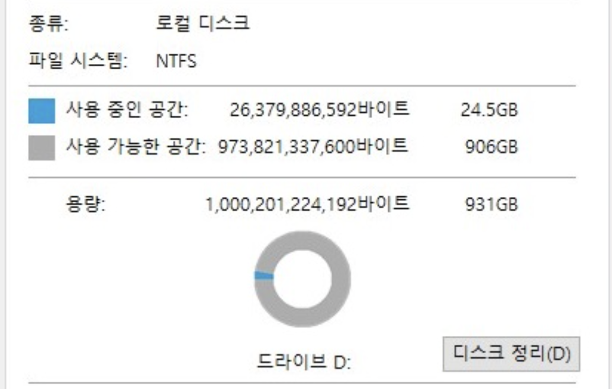

# 개요

- 시스템 설계 면접을 볼 때, 때로는 시스템 용량이나 성능 요구사항을 **개략적으로 추정**해 보라는 요구를 받게 된다.
- 개략적 규모 추정을 위해서는 **규모 확장성**을 표현하는 데 필요한 기본기에 능숙해야한다.
    - 2의 제곱수
    - 응답지연(latency)
    - 가용성

---

# 2의 제곱수

- why 2의 제곱수?
    - bit는 0, 1로 구성
        - 1byte = 8bit = 2^8개의 경우의 수 존재
        - 아스키 한 문자에 1바이트
    - 2^10 = 1,024 ~= 1,000
        - 따라서 1,000byte ~= 1KB
        - 흔히 말하는 **1k는** 실제로 1,000이 아니라 **1,024**
        - 1TB(1,000,000,000,000 바이트) → 976,562,500KB → 953,674MB → 931GB 
    
    - 국제적으로 통용되는 단위
        - KB, MB, GB, TB, PB → 모두 2^10 배수 ~= 10^3 배수
      
---

# 모든 프로그래머가 알아야 하는 응답지연 값

- 이 수치들을 통해 컴퓨터 연산들의 처리 속도가 어느 정도인지 **짐작**할 수 있다.

| 연산명 | 시간 |
| --- | --- |
| L1 캐시 | 0.5ns |
| L2 캐시 | 7ns |
| 뮤텍스 락/언락 | 100ns |
| 주 메모리(RAM) 참조 | 100ns |
| 1KB 압축 | 10*μs* |
| 1Gbps 네트워크로 2KB 전송 | 20*μs* |
| 메모리에서 1MB 순차I/O | 250*μs* |
| 네트워크에서 1MB 순차I/O | 10ms |
| 디스크에서 1MB 순차I/O | 30ms |
- 결론
    - 메모리는 빠르지만 디스크는 느리다.
    - 압축 알고리즘은 빠르다. 가능하면 압축하고 네트워크를 태워라
    - 네트워크보다 디스크I/O가 느리다.

---

# 가용성에 관계된 수치들

- 고가용성은 퍼센트로 표현한다.
- 대부분의 서비스는 99% ~ 100% 사이의 값을 갖는다.

| 가용률 | 하루당 장애시간 | 연간 장애시간 |
| --- | --- | --- |
| 99% | 14.4m | 3.65일 |
| 99.9% | 1.44m | 9h |
| 99.99% | 8.6s | 50m |
| 99.999% | 0.864s | 5m |
| 99.9999% | 86ms | 30s |
- AWS S3
    - AWS는 S3 서비스에 대한 **서비스 수준 계약(SLA)**를 통해 가용성을 보장. 
    만약 월별 가용률이 특정 기준치(일반적으로 99.9% 미만) 아래로 떨어질 경우, 고객은 지불한 요금에 대해 서비스 크레딧을 받을 수 있음.
    - S3 Standard: 99.99% 가용성 제공
    - S3 Standard-IA(Infrequent Access): 자주 사용하진 않지만, 빠른 검색 필요 시 사용 → 99.9%
    - S3 Glacier XXX: 장기 아카이빙용, 느림 → 99.99%
    - 참고! S3의 **내구성**은 11나인, 99.999999999%

---

# 시간이 남는다면 ^_^

### JK & AM의 QPS 추정

### JK & AM의 저장소 요구량 추정