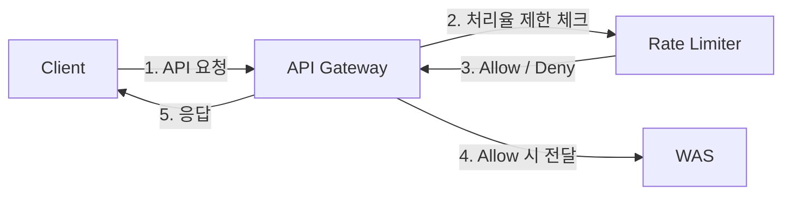
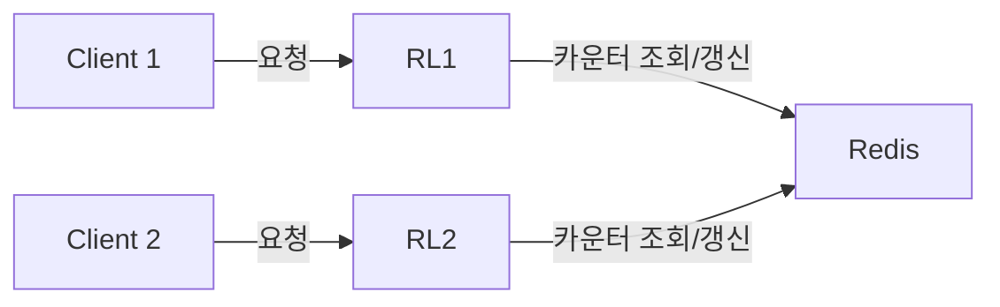

# 개요

- HTTP를 예로 들면, 특정 기간 내에 전송되는 클라이언트의 요청 횟수를 제한하는 것
    - 초당 2회 이상 새 글 발행 불가
    - 같은 IP 주소로는 하루에 10개 이상의 계정 생성 불가
- API 처리에 처리율 제한 장치를 두면 좋은점은?
    - DoS(Denial of Service) 공격에 의한 자원 고갈을 방지
        - DDos는 Distributed, 즉 다수의 좀비 PC(봇)에 의한 대규모 분산 공격
    - 비용 절감의 효과
        - 과금형 Third-Party API를 사용한다면, 호출 횟수 제한에 대한 이득이 발생
            - 카드 결제
            - 신용 확인

---

# 1. 문제 이해 및 설계 범위 확정

→ 내가 만약 설게 면접을 본다면?

- 백엔드 서버를 한 대라고 가정해도 되는가?
    - 백엔드 애플리케이션 코드 레벨에서 같이 구현해도 되는지 체크
    - 안된다면 별도 시스템으로 개발하는 방향으로 논의
- 처리율 제한에서, 어느정도 오차 범위를 감안할 수 있는가?
    - 완벽하게 limit을 제한해야만 하는지 체크
    - 예를 들어 다수의 동시 요청에서, 현재 처리 카운트 limit 전이라 모두 요청을 받아들일 수 있다.
        - 이 경우 별도의 글로벌 락 등 추가 처리가 필요할 수 있으니 사전에 체크
    - 오차 범위를 감안할 수 있다 → 성능 상 이점으로도 연결될 수 있음
- 처리율을 제한하는 기준은 무엇인가?
    - ID 기반인지, IP 기반인지 등
- 기존 운영에 API Gateway가 사용중인지?
    - API Gateway에 처리율 제한 장치를 심는 방식이 가능한 지?

### 설계안 가정

- 분산 시스템 환경에서 처리율 제한 장치가 동작해야함
- 오차 범위는 현재는 어느정도 감안 가능. 하지만 정책 상 변동 가능성 있음.
- 처리율 제한 기준은 API 별로 유동적으로 가능해야함.
- 기존에 API Gateway 사용중. 하지만 API Gateway 자체에 처리율 제한 기능은 없음.

---

# 2. 개략적 설계안 제시 및 동의 구하기

- API Gateway가 없다면, 처리율 제한 장치를 위한 미들웨어가 필요했음. 하지만 이미 그 역할을 할 수 있는 API Gateway가 존재하기 때문에 운영 상 문제가 없다면 API Gateway → Rate Limiter로 처리율 제한 체크를 확인하는 방식으로 설계
- 미들웨어(API Gateway)에서 처리율 제한에 걸린다면 429(Too Many Request) 응답
- Rate Limiter는 내부적으로 처리율을 관리
    - User ID 별, IP 별 유동적으로 가능해야함
    - 낮은 Latency, 생명주기 관리, 불필요한 영속성의 특성으로 Redis Cache 선택

### 참고

- 상용 API Gateway는 자체적으로 처리율 제한 기능이 있음
- 이 때문에 고정적인 출발지 IP를 기준으로 부하 테스트를 진행할 때 어려울 수 있음
- 처리율 제한을 해제하거나, 클라이언트를 여러대 둬서 해결?

### 다양한 처리율 제한 알고리즘

[토큰 버킷]

- 간단하고 보편적으로 사용하고 있다.
- 동작 원리
    - 미리 [**토큰 버킷]**이라는 공간에 처리 가능한 양의 토큰을 할당
    - 요청이 오면 버킷에 토큰을 소모하여 요청을 처리. 비어있다면 요청도 Deny
- 장점
    - 구현이 쉽다.
    - 메모리 사용 측면에서도 효율적이다.
- 단점
    - 버킷 크기와 토큰 공급률을 적절하게 튜닝하는게 어렵다.

[누출 버킷] 

- 요청 처리율이 고정되어 있음
    - 지정된 시간당 몇 개의 요청을 처리할 지
- FIFO 큐를 버킷으로 활용하며, 큐에 빈 자리가 있으면 요청은 등록되고 빈 자리가 없다면 버려진다.
- 장점
    - 큐의 크기가 제한되어 있어 메모리 사용 측면에서 효율적
- 단점
    - 스파이크 트래픽에 대해서는 최신 요청들이 버려지게 된다.

TODO: [기타 알고리즘]

---

# 3. 상세 설계

### Race Condition

- 서두에서 살짝 언급한 내용으로, 카운터 값을 읽어오는 과정에서 여러 동시요청이 limit을 넘지 않아 정상처리
- 그래서 실제 제한율보다 처리량이 늘어날 수 있다.
- 해결책
    - 글로벌한 락은 성능 저하로 이어질 수 있음
    - 버저닝 및 CAS 알고리즘을 활용해 버전 충돌을 감지 (레디스 WATCH, MULTI, EXEC)
    - 루아스크립트
    

### 분산 Rate Limiter

- Rate Limiter 자체도 하나의 서버로 부족할 수 있음.
- scale out하면?
    - 만약 각 서버에서 처리율 데이터를 독립적으로 다루면 동기화가 필수
    - or sticky session
    - 대표적인 해결책은 레디스와 같은 중앙 집중형 데이터 저장소를 사용하는 것

---

# 4. 마무리

- 더 이야기 해볼만한 이야기
    - 처리율 제한 기준
        - 경성 제한: 요청의 개수는 임계치를 절대 넘어갈 수 없다.
        - 연성 제한: 요청의 개수는 잠시 동안은 임계치를 넘어갈 수 있다.
    - 처리율 제한 자체를 회피
        - 브라우저, 클라이언트 측 캐시를 사용하여 API 호출 자체를 줄인다.