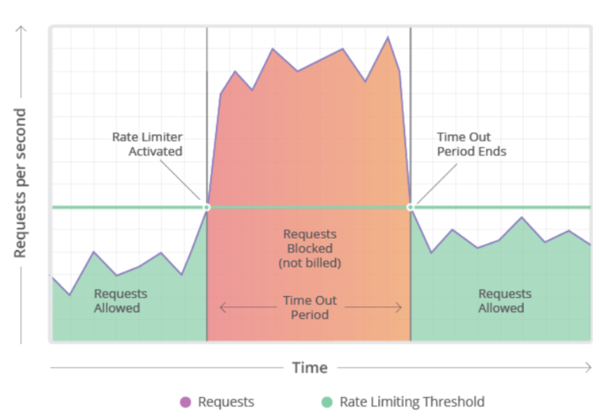
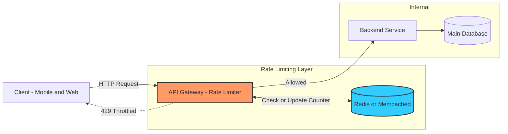
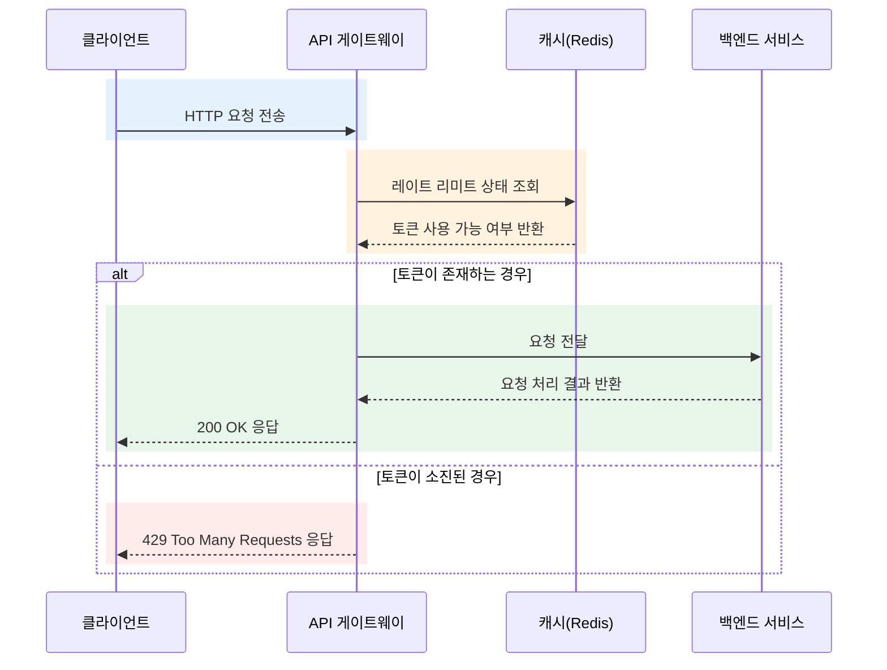
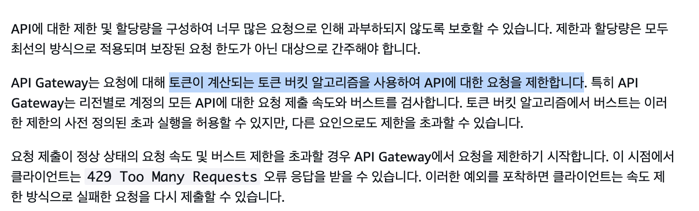

# **Rate Limiting**

API Throttling 이라고도 섞어서 많이 쓰는듯 하다

## 개요

**처리율 제한 장치**

트래픽의 처리율을 제어하기 위한 장치이다. HTTP의 경우 요청 횟수를 제한하고 임계치를 넘어서면 호출을 중단시킨다.

- 주요 이점
    - 공격(DoS 등)에 의한 자원 고갈 방지
    - 서버 과부하 방지
    - 비용 절감: 무분별한 오토스케일링을 방지함
- **응답 처리**: 제한 발생 시 `429 Too Many Requests` 상태 코드와 함께 최대 처리율 정보를 포함한 헤더를 반환하는 것이 권장된다.
    
    e.g. `X-Ratelimit-Limit`(전체 용량), `X-Ratelimit-Remaining`(남은 토큰), `X-Ratelimit-Retry-After`(재시도 가능 시간)
    

<aside>
💡

**example**

- 초당 2회 이상 새 글을 올릴 수 없다
- 같은 IP주소로 하루에 10개 이상의 계정을 생성할 수 없다
</aside>

## Step 01. 문제 이해 및 설계 범위 확정

- 설계하기에 앞서 명확한 문제인식과 해결 범위가 필요. 충분한 소통을 통해 요구사항을 스펙화

<aside>
💡

**example**

- 설정된 처리율을 초과하는 요청은 정확하게 제한한다
- 응답시간에 나쁜 영향을 주어서는 안된다
- 적은 메모리를 사용한다
- 하나의 처리율 제한 장치를 공유할 수 있어야한다
</aside>

## Step 02. 개략적 설계안 제시 및 동의 구하기

**구현 위치**

- 클라이언트 요청은 위변조가 쉽기 때문에 서버측에 두는 것이 안전하다.
- 서버의 앞단에 두거나 서버와 함께 사용하는 두가지 방법이 있다. 일반적으로는 API Gateway나 미들웨어를 통해 구현되는 경우가 많은 것 같다.
- 서버와 함께 사용하는 경우 Spring boot + 라이브러리 조합으로 사용하기도 한다.

| **구분** | **AWS API Gateway** | **Nginx Reverse Proxy** | **오픈소스 API Gateway** | **Application Level** |
| --- | --- | --- | --- | --- |
| **특징** | 완전 관리형 서비스 | conf 파일 설정 기반 | MSA 관리 서비스 제공 | 라이브러리 활용 구현 |
| **알고리즘** | Token bucket | Leaky bucket | - | - |
| **장점** | 구현이 쉬움 | 설정 단순 | 확장 용이, 플러그인 지원 | 추가 서버 불필요 |
| **단점** | 비용, 람다 지연 가능성 | 세밀한 제어 힘듦 | 높은 성능 사양 요구 | 분산 환경 시 외부 캐시 필요 |
| **라이브러리** | - | - | Kong, KrakenD, Tyk | Bucket4J, Guava |
- Gateway를 쓸까? LoadBalancer를 쓸까?
    
    GW는 보안 및 전달이 목적이고, LB는 성능 및 가용성이 목적이다
    

**시스템 아키텍처**

**처리율 제한 알고리즘**

- 토큰 버킷(Token Bucket)
    
    토큰 버킷은 일정 용량을 가진 컨테이너에 토큰을 주기적으로 채워 넣는 방식의 레이트 리미팅 알고리즘이다. 요청이 도착하면 토큰이 있는 경우 하나를 소비해 요청을 처리하고, 토큰이 부족한 경우 요청을 거부하며 일반적으로 429 Too Many Requests 응답을 반환한다. 버킷의 최대 용량은 한 시점에 처리 가능한 최대 요청 수를 의미하며, 이 값이 곧 Maximum Burst Size가 된다. 이로 인해 토큰 버킷은 평균 처리율은 제한하면서도, 토큰이 누적된 범위 내에서는 순간적인 트래픽 폭증을 허용한다.
    
    - 버스트 허용
    - 유연함 실제 트래픽 패턴에 잘 맞음
    
    <aside>
    💡
    
    example
    
    - rest api
    - 모바일 앱/웹 서비스 (새로고침이나 버튼 연속클릭)
    </aside>
    
- 누출 버킷(Leaky Bucket)
    
    누출 버킷은 유입되는 요청을 내부 큐에 저장한 뒤, 미리 정의된 고정된 속도로 요청을 하나씩 처리하는 레이트 리미팅 알고리즘이다. 요청은 FIFO 방식으로 처리되며, 큐의 최대 크기가 정해져 있어 초과 요청은 버려진다. 이로 인해 처리 속도가 일정하게 유지되고, 메모리 사용량 또한 예측 가능하게 관리된다.
    
    - 고정된 속도로 처리
    - 처리량과 메모리 사용을 안정적으로 제한
- 고정 윈도 카운터(Fixed Window Counter)
- 이동 윈도 로그(Sliding Window Log)
- 이동 윈도 카운터(Sliding Window Counter)

<aside>
💡

rate limit을 구현할 때에는 rate limit이 사용할 메모리 양을 알고 있어야한다. 안 그러면 OOM이 발생할 수 있다.

</aside>

**API gateway**

- 처리율 제한, SSL 종단, 사용자 인증, IP 관리, 부하분산
- 버스트 제한을 api gateway에서 설정 가능

<aside>

[API Gateway의 처리량 향상을 위해 REST API에 대한 요청을 제한할 수 있습니다. - Amazon API Gateway](https://docs.aws.amazon.com/ko_kr/apigateway/latest/developerguide/api-gateway-request-throttling.html)

</aside>

| **HTTP API** | OIDC 및 OAuth2와 같은 기능과 기본 CORS 지원이 내장된, 지연 시간이 짧고 비용 효율적인 REST API를 구축합니다. | Lambda, HTTP 백엔드 |
| --- | --- | --- |
| **WebSocket API** | 채팅 애플리케이션 또는 대시보드와 같은 실시간 사용 사례를 위해 지속적 연결을 사용하여 WebSocket API를 구축합니다. | Lambda, HTTP, AWS 서비스 |
| **REST API** | API 관리 기능과 함께 요청 및 응답을 완벽하게 제어할 수 있는 REST API를 개발합니다. | Lambda, HTTP, AWS 서비스 |
| **REST API 프라이빗** | VPC 내에서만 액세스할 수 있는 REST API를 생성합니다. | Lambda, HTTP, AWS 서비스 |

## Step 03. 상세 설계

- 처리율 제한 규칙
- 제한된 요청에 대한 처리 방법
    1. 버리기
    2. 큐에 보관
- 처리율 제한 장치가 사용하는 HTTP헤더

**상세설계**

- 클라이언트의 요청에 대한 제한 규칙을 캐시에서 가져오고 카운터와 마지막 요청 타임 스탬프를 레디스 캐시에서 가져와서 허용이 되는 요청인지를 의사결정하고 ㅇㅋ하면 API서버에 접근할 수 있게한다.

**분산환경에서의 설계**

- 주의해야할 점
    - 경쟁조건
        - 락(비추)이나 루아스크립트, 정렬 집합등을 통해 해결한다
    - 동기화 이슈
        - 여러대의 처리율 제한 장치의 상태를 저장하는 redis를 쓰는 것이 좋다.
        - 여러 면에서 api gateway의 sticky session은 지양되는 느낌이다.

**성능최적화**

- 사용자의 트래픽을 가장 가까운 edge 서버로 전달해서 지연시간을 줄인다. CloudFront 같은 CDN(Edge) 단에서 처리율을 제한시 트래픽이 실제 서버 인프라에 오지 못하게 차단할 수 있어 보안과 비용 효율성면에서 큰 이점이 있다.
- 처리율 제한장치간 동기화할때 최종 일관성 모델을 사용한다
    
    **최종 일관성 모델:** 수만 대의 서버가 실시간으로 카운트를 동기화하려면 성능 저하가 심하므로, 각 노드가 약간의 오차를 허용하되 나중에 동기화되는 방식을 쓴다…
    

**모니터링**

처리율 제한 장치의 알고리즘과 규칙이 효율적인지를 지속적으로 모니터링해야한다.

## Step 04. 마무리

- **Hard vs Soft 제한**: 절대적인 제한(Hard)과 일시적 초과를 허용하는 유연한 제한(Soft)이 있다.
- layer별 처리율 제한
    - OSI 7계층의 다른 layer에서도 처리율 제한이 가능하다
- **회피 방법:** 클라이언트 측에서 캐시를 활용해 호출을 줄이거나, 에러 발생 시 Back-off 시간을 둔 Retry를 구현합니다.
