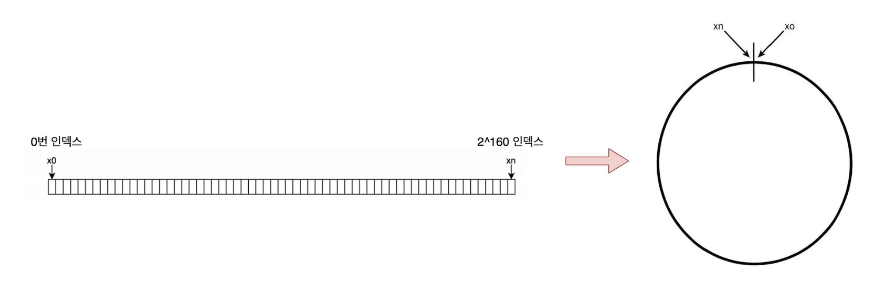
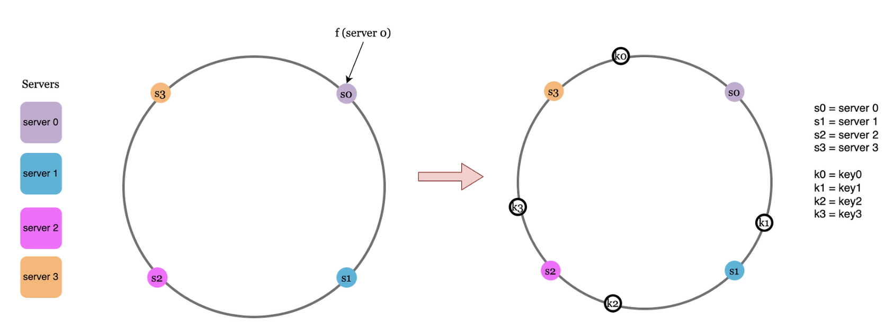
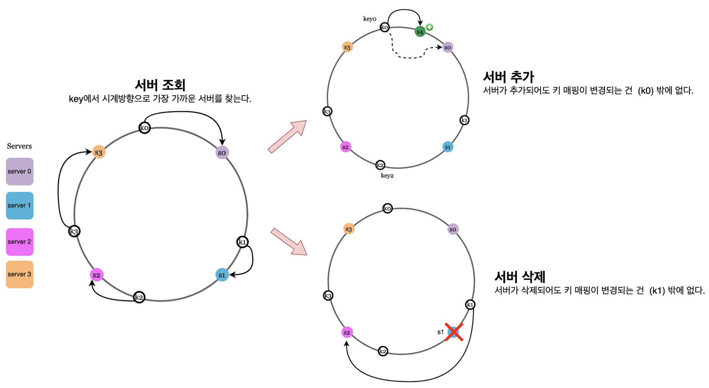
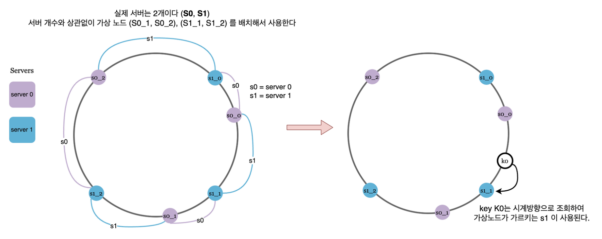

# 개요

### 보편적인 해시 알고리즘

- MD5 (2^128): 속도가 보안보다 중요한 어플리케이션. SHA-256 에 비해 해시 공간은 작다.
- SHA-256 (2^256): 더 긴 해시 크기와 더 강력한 암호화 속성. 속도는 MD5 에 비해 느리다. 매우 큰 해시 공간을 갖기 때문에 충돌이 거의 발생하지 않는다.

### 안정 해시?

- 일반적인 해시 함수 만으로는 안정적이지 않다는 의미?
- 무엇이 안정적일까
    - 균등하게 나눈다 == 안정?
    - 어떤 상황에도 동작한다 == 안정?

---

# 해시 키 재배치(rehash) 문제

- N개의 서버에 부하를 균등하게 나누는 보편적인 방법은 아래와 같다.
    - `serverIndex = hash(key) % N` (N = 서버 개수)
- 이 방식은 서버 풀의 크기가 고정적일 때 잘 동작한다.
- 하지만 서버가 장애가 나거나, 추가되면?
    - 서버 풀의 크기가 변해 데이터 재배치, 즉 **리밸런싱**이 이뤄져야한다.
    - 기존에 잘 동작하던 서버들도 삭제 or 추가된 서버로 인해 데이터 재배치가 발생한다.
    - 이는 k개의 key를 모두 재배치한다는 의미
    - 이건 좀 비효율적일지도..?

---

# 안정 해시, 그리고 기본 구현법

- 정의: 해시 테이블의 크기가 조정될 때, 평균적으로 k/n개의 키만 재배치하는 기술
    - n은 슬롯의 개수
- 안정 해시는 해시 공간을 구부려, 원형 링 형태로 만든 것이다.
- 예시로 해시함수 SHA-1을 사용한다 하자. 그럼 0 ~ 2^160 - 1까지의 공간이 생긴다.

- 이렇게 구성한 해시 링 위에 서버와 키를 배치할 수 있다.

- 이 때 일반적인 해시 함수가 아닌, 균등 분포 함수를 사용한다.

- 어떤 키가 저장되는 서버는, 해당 키로부터 시계 방향으로 탐색해 나가며 만나는 첫 번째 서버이다.
- 이 개념 덕분에, 서버를 추가하거나 삭제 하더라도 키 가운데 일부만 재배치하면 된다.
    - 그래서 평균적으로 k/n개의 키만 재배치할 수 있다는 것

---

# 기본 구현법의 두 가지 문제

- 안정 해시 알고리즘은 MIT에서 처음 제안되었다. 기본 절차는 다음과 같다.
    - 서버와 키를 균등 분포(uniform distribution) 해시 함수를 사용해 해시 링에 배치한다.
    - 키의 위치에서 링을 시계 방향으로 탐색하다 만나는 최초의 서버가 키가 저장될 서버이다.
- 이 접근법에는 두 가지 문제가 있다.
    - 서버가 추가 or 삭제되면, 인접한 사이의 해시 공간(파티션)을 일정하게 유지할 수 없다.
        - 어떤 서버는 굉장히 큰 해시 공간을 할당 받는다.
    - 균등 분포 자체를 달성하는 것이 어렵다.
        - 왜 어려울까?
        - 표본이 적을수록, 균등 분포를 달성하기 더 까다롭다.
        - 어떤 무작위 입력 키가 N개(작은 수) 들어올 때, 이를 균등 분포 시키는 해시 함수를 만들기 어렵기 때문
- 이 문제를 해결하기 위해 제안된 기법이 가상 노드, 또는 복제라 불리는 기법이다.

---

# 가상 노드(Virtual Node)

- 가상 노드는 실제 서버를 가르키는 노드, 하나의 서버는 링 위에 여러 개의 가상 노드를 가질 수 있다.

- 가상 노드의 개수를 늘리면 키의 분포는 점점 더 균등해진다. 이는 표준 편차가 작아져서, 데이터가 고르게 분포되기 때문이다.
- 무작정 많이 늘리면 좋을까?
    - 균등 분포는 달성할 수 있겠지만, 그 만큼 서버가 추가 or 삭제되는 상황에서 정리해야할 노드 수가 많아지고 메모리를 많이 차지하게 된다.
    - 균등 분포 달성 ↔ 운영 비용(노드 관리 비용) 간 trade-off 관계이지 않나, 생각이 듭니다.

*사진 출처: https://jiwondev.tistory.com/299*