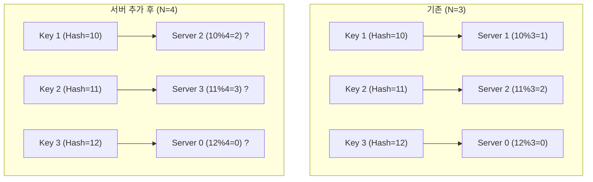
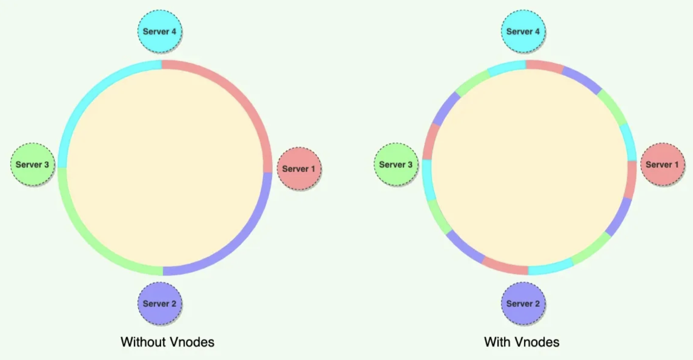

# 안정 해시

**Consistent Hashing**은 분산 시스템에서 데이터나 요청을 여러 서버에 고르게 분산하면서, 서버 추가/삭제 시 데이터 재배치를 최소화하기 위해 고안된 해시 기법이다.

안정 해시, 일관된 해시 등으로 번역되며, 실무에서는 보통 영문 그대로 Consistent Hashing이라 부른다. 시간복잡도는 **O(log N)**

## 전통적인 해시 테이블의 한계 (% 방식)

전통적인 해싱은 **`serverIndex = hash(key) % N`** (N은 서버의 개수) 공식을 사용한다. 

### 재배치 문제(Rehashing)

서버의 개수 N이 변하면, 거의 모든 키의 결과값(index)이 바뀐다. 

- 캐시 시스템 → 대규모 캐시 미스
- 스토리지 시스템 → 데이터 대량 이동 → 트래픽이 몰려 서버에 장애가 발생할 확률이 높아진다.
- 스케일아웃이 취약한 구조가 된다.

## 기본 안정 해시 동작 방식

1. **서버 배치:** 서버들을 해시 함수를 통해 링 위의 특정 지점에 배치
2. **키 배치:** 저장할 키(Key) 역시 같은 해시 함수를 사용하여 링 위에 배치
3. **서버 결정:** 데이터의 위치에서 **시계 방향**으로 가장 먼저 만나는 서버에 데이터를 저장

### 서버 추가/삭제 시 영향

- 특정 서버가 추가되거나 삭제될 때, 링 위에서 해당 서버와 인접한 구간의 키들만 재배치 된다
- 위키피디아 정의에 따르면, 평균적으로 (키의 개수) / (서버의 개수)만큼의 키만 재배치된다.

### 기본 안정 해시의 문제

1. 균등 분포 해시 함수 사용
2. 시계 방향 첫 번째의 서버를 지정하는 것

이 해시의 문제점은 균등 분포 해시 함수를 사용해도?`해시 파티션(partition) 의 크기를 균등하게 유지하는게 불가능`?하다는 것과 이로 인해?`키가 균등하게 분포되기 어렵다`는 문제가 있다.

### 해결: 가상 노드

실제 물리 서버 한 대를 링 위의 여러 지점(가상 노드)에 대응시키는 기법

![사진에서는 가상노드가 순서대로 되어있으나 실제로는 랜덤이다.]

사진에서는 가상노드가 순서대로 되어있으나 실제로는 랜덤이다.

- 가상 노드 개수가 많을 수록 키의 분포는 더 균등해진다. 하지만 그만큼 가상 노드 데이터 저장공간이 더 필요하기 때문에 적절한 선택이 필요하다.
- 가상 노드 개수 결정 기준
    - 노드 수가 적을수록 가상 노드는 많아야한다.
    - 일반적으로 서버 한 대당 100~200개 정도를 사용. 100개 정도면 표준편차 10%, 200개면 5% 정도의 차이가 난다고 한다.
    - 가상노드를 많이 사용하면 표준편차는 낮아지지만 그만큼의 비용과 메모리사용량, 속도를 trade off 해야한다
- 서버의 성능이 각각 다른 경우 성능이 좋은 서버에 더 많은 가상 노드를 할당하여 요청을 분산시킬 수 있음.

## 안정 해시 장점

- 서버 추가/삭제 시 재배치되는 키의 수 최소화
- 데이터가 보다 균등하게 분포되므로, 스케일아웃에 용이하다
- 핫스팟 키문제를 줄일 수 있다
- 스케일 아웃에 유리

### 안정해시를 사용

### 안정해시 사용 예시

| **시스템** | **안정 해시 활용 방식** | 링크 |
| --- | --- | --- |
| **AWS DynamoDB / Cassandra** | 가상 노드를 사용해 파티션 및 복제 관리 |  |
| **Discord** | 게이트웨이 노드에 클라이언트 할당 |  |
| Slack | 채널·사용자 ID를 해시해 CS/PS 서버에 분산 매핑 | https://www.youtube.com/watch?v=UQfNytDFpgk&t=102s |
| Memcached | 클라이언트 단에서 안정 해시로 캐시 노드 선택 |  |

## 구현 시 고려사항

### 해시 함수 선택

- 캐시/파티셔닝 목적이라면 **속도와 분산성**이 중요
    - MurmurHash, MD5
- 보안 목적 해시(SHA-256)는 보통 **과하다**

| 상황 | 선택 |
| --- | --- |
| 캐시 / 샤딩 / 파티션 | **MD5 / Murmur / xxHash** |
| 분산 DB (고성능) | **Murmur / xxHash** |
| 인증, 서명, 토큰 | **SHA-256**  |

**실제 사용 예**

- Cassandra → MurmurHash
- DynamoDB / Memcached → MD5

## Rendezvous Hashing (HRW Hashing)

안정 해시와 자주 비교되는 분산 알고리즘

### 특징

- 노드 추가·삭제 시 **이론적으로 최소한의 키만 이동**
- 가상 노드 없이도 **매우 균등한 분포**
- 노드 가중치 지원이 자연스러움

### 단점

- 키 조회 시 **O(N)** 계산 필요
- 노드 수가 많은 대규모 캐시에는 부담

> 모든 노드와 점수를 계산하기 때문에 해시이지만 O(1)이 아닌 O(N)의 속도를 가진다.
> 
- 사용 예시
    - CDN.. Cloudflare 내부에서 해시사용시에 HRW 계열 해싱을 사용한다.

## 면접을 본다면

Q. 10대의 캐시 서버를 운영중인데 갑자기 할인행사를 해서 잠깐 트래픽이 확 늘 것 같다. 그렇다면 어떤 준비를 할 것 인가?

→ 안정 해싱을 사용

Q. 팔로워가 1억 명인 연예인의 데이터에 트래픽이 몰리는 문제가 있다. 어떻게 해결할 것인가?

→ 안정해싱 뿐만 아니라 로컬캐싱을 앞에 둬서 L1 → L2 → Disk fallback하게 해야함.

→  핫스팟이 되는 키 뒤에 랜덤 접미사(예: `user_123_1`, `user_123_2`)를 붙여 강제로 여러 노드에 흩어지게 만든 뒤 읽기 시에는 병렬로 읽거나 밸런싱