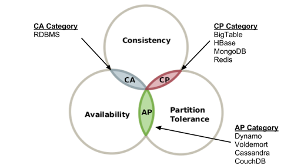
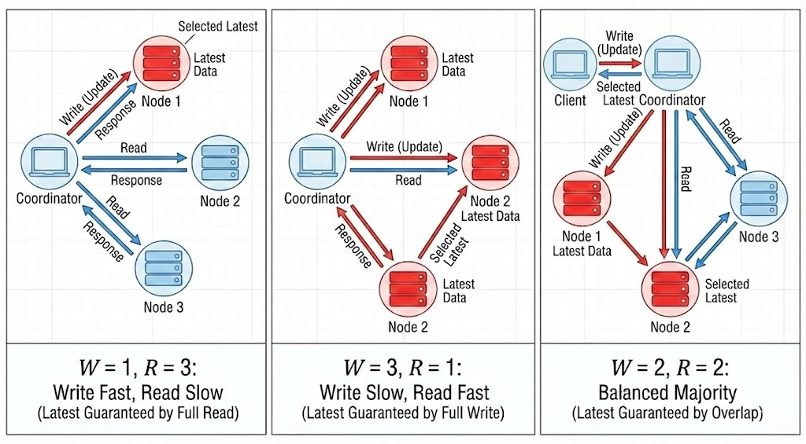
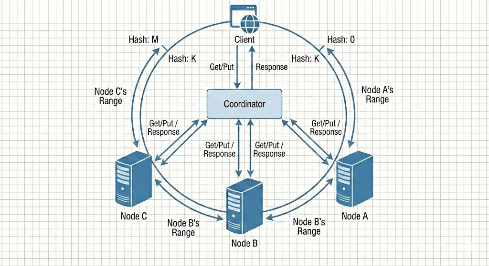

# Key-Value Store
* 해당 저장소에 저장되는 'Key'는 고유한 식별자(identifier)이어야 한다.
  * 해당 Key는 유일해야 하며, 해당 Key에 대한 Value는 Key를 통해서만 접근할 수 있다.
  * 성능 상 Key는 짧을 수록 좋다. (Key의 크기가 적을수록 좋다.)
* Key-Value Store로 자주 쓰이는 것은 'Redis' / 'AWS Dynamo DB' / 'memcached'

---

* 책에서 말하는 완벽한 설계는 없지만, '쓸만한 설계 답안'
> 읽기, 쓰기, 메모리 사용량 사이의 균형을 찾고 데이터의 일관성과 가용성 사이에서 타협적 결정을 내린 설계 

* 책의 K/V Store 설계
> K/V 쌍의 크기는 10KB (10 * 10^3) 이하
> 큰 데이터 저장을 고려해야 한다.
> 높은 가용성 제공 (장애 시에도 서비스 지속)
> 높은 Scalability 제공 (데이터 증가에 따른 자동 서버 증설/삭제)
> 데이터 일관성 수준은 조정이 가능해야한다.
> 응답 Latency가 짧아야 한다.

* 서비스마다 다르겠지만, 개인적으로 중요하게 생각하는 지표는 가용성, Scalability

---
## 단일 서버 K/V Store
* K/V Store를 단일 서버로 사용한다면, 모든 K/V를 메모리에 저장하는게 가장 직관적
  * 빠른 응답을 보장하지만, 데이터가 많아지면 메모리에 모든 데이터를 넣는 것이 힘들 수 있다.
* 해결책으로 다음과 같은 2가지 존재
  * 자주 쓰이는 데이터만 메모리에 두고 나머지는 디스크 저장 -> 디스크는 백업용으로만 사용하고 메모리가 꽉차면 서버 증설 고려해야할듯?
  * 데이터 압축 
    * 데이터 압축을 통해 데이터 크기를 줄여서 메모리 사용량을 줄였었음

---
## 분산 서버 K/V Store
* 사용자의 트래픽이 많아지면 WAS를 Scale out 하는 것처럼, 데이터 양이 많아지면 K/V Store도 Scale Out 해야한다.
* Scale Out 시 고려할 점은 `CAP(Consistency, Availability, Partition tolerance)`

### CAP
* C : Consistency (데이터 일관성)
  * 분산 시스템에 접근하는 클라이언트는 어느 노드에 접근하든지 동일한 데이터를 볼 수 있어야 한다.
* A : Availability (가용성)
  * 분산 시스템에 접근하는 클라이언트는 특정 노드에 장애가 발생하더라도 항상 응답을 받을 수 있어야 한다.
* P : Partition Tolerance (파티션 관용?>)
  * CAP에서 말하는 Partition은 분산 시스템 간의 통신 장애를 의미한다.
  * 따라서, Partition Tolerance는 분산 시스템 간의 통신이 실패하더라도 시스템은 계속 동작해야 한다는 의미.

### CAP 정리 (CAP Theorem)
* CAP 정리란, 3가지 요소 중 2가지를 충족하려면 나머지 1가지는 반드시 희생되어야 한다는 이론이다.

* 즉, CAP 정리에 의하면 분산 시스템은 다음과 같은 3가지 시스템으로 구분할 수 있다.
  * CA
  * CP
  * AP

### CA
* CA : Consistency + Availability로, 시스템 간 통신 장애로 인한 장애는 고려하지 않는다? -> 실무적으로 하면 안되는 시스템
  * 시스템 간 통신 장애가 발생하더라도 시스템이 정상 동작하도록 설계 해야한다! (실질적으로 분산 시스템에서는 P를 항상 지켜야 한다!)
  * 🤔 처음에는 통신 장애가 발생하더라도 장애를 그대로 응답에 전파하면 P를 지키지 않고도 괜찮은 것 아닌가? 했었는데
  * P를 지키지 않는다는 것은 통신 장애가 발생했을 때 프로세스가 그대로 죽거나 무한 대기에 빠지는 것!
  * 그대로 장애를 응답에 보내는 것은 CP임!

### Partition 문제
* 실질적으로 분산 시스템에서 Partition Tolerance를 지켜야 한다.
* 따라서 Partition 문제(네트워크 통신 장애)가 발생했을 때 Availability를 지킬 것인지, Consistency를 지킬 것인지에 따라 CP, AP로 나뉜다.

### CP
* CP : Consistency + Partition Tolerance로 시스템 간 통신 장애가 발생했을 때 Availability 대신 Consistency를 선택
  * "틀린 데이터를 줄 바엔 차라리 응답하지 않겠다" 
  * 시스템 간 통신 장애가 발생했을 때, 데이터 일관성을 중요시하여 가용성을 희생하여 장애가 발생한 시스템에 접근한 클라이언트에게 응답하지 않는다. (장애 발생)
  * e.g) 금융 시스템 : 서로 다른 노드 접근 시 데이터 일관성이 지켜지지 않으면 Critical하므로 보여주지 않고 아예 에러로 응답한다.

### AP
* AP : Availability + Partition Tolerance로 시스템 간 통신 장애가 발생했을 때 Consistency 대신 Availability을 선택
  * "데이터가 틀려도 일단 서비스한다"
  * 시스템 간 통신 장애가 발생했을 때, 가용성을 중요시하여 데이터 일관성을 희생하여 장애가 발생한 시스템에 접근한 클라이언트에게도 틀린 데이터로 응답을 한다. (장애 복구 후 데이터 동기화 필요)
  * e.g) 데이터 일관성이 틀려도 Critical하지 않은 도메인, 시스템 
    * 공고 도메인 -> 사용자가 작성하거나 수정한 공고가 바로 반영되지 않아도 Critical 하지 않고, 장애가 발생하는게 사용자에게 더 부정적인 경험

---
## 분산 K/V Store에 사용되는 시스템 컴포넌트

### 1. 데이터 파티셔닝
* 데이터를 분산 K/V Store에 저장할 때 작은 파티션 단위로 나누어서 저장
* 이때 중요한 점은
  * 파티션된 데이터를 분산 시스템에 고르게 분산시켜야 한다.
  * 분산 시스템 노드가 추가되거나 삭제될 때 데이터의 재배치(이동)을 최소화 해야 한다.
* 이를 위해 Consistent Hashing (안정 해시)를 사용해서 데이터를 파티셔닝한다!
  * 가상 노드를 통해 균등한 분포에 가깝게 배치할 수 있고, 분산 시스템 노드 추가/삭제 시 데이터 이동을 최소화 할 수 있다.

### 2. 데이터 다중화
* 데이터를 단순 파티셔닝만 하여 1개의 특정 서버에만 저장할 경우 해당 서버 장애 시에 가용성을 보장할 수 없다.
* 따라서, 각 파티션된 데이터를 여러 대의 서버에 복제(Replication)하여 저장한다.
* 방법으로는 1개 서버에 데이터가 저장될 때 비동기로 여러 대의 다른 서버에 해당 데이터를 복제하는 방법!

### 3. 데이터 일관성
* 데이터가 다중화 되었을 때 중요한 것은 '데이터 일관성'이다!
  * 데이터를 복제한 서버들에 데이터가 제대로 복제(동기화)되었는가?
* 해당 일관성을 지키기 위해 `Quorum` 방식을 사용한다.
  * **쓰기 작업 시, N개의 복제본 중 W개 이상의 서버에 데이터가 성공적으로 저장되어야 쓰기 작업이 성공으로 간주된다.**
  * **읽기 작업 시, N개의 복제본 중 R개 이상의 서버에서 데이터를 읽어와야 한다.**
  * 이때, W + R > N 이면 강한 일관성(Strong Consistency)을 보장할 수 있다.
    * 즉, 쓰기 작업이 성공적으로 완료된 후에 읽기 작업을 수행하면 항상 최신 데이터를 읽을 수 있다.
  * 반대로 W + R ≤ N 이면 최종 일관성(Eventual Consistency)을 제공한다.
    * 즉, 쓰기 작업이 완료된 후 일정 시간이 지나면 모든 복제본이 동일한 데이터를 갖게 된다.

### 4. 일관성 모델
* 강한 일관성(Strong Consistency)
  * 모든 클라이언트가 항상 최신 데이터를 볼 수 있다.
  * 쓰기 작업이 성공적으로 완료된 후에 읽기 작업을 수행하면 항상 최신 데이터를 읽을 수 있다.
* 최종 일관성(Eventual Consistency)
  * 일정 시간이 지나면 모든 클라이언트가 동일한 데이터를 갖게 된다.
  * 쓰기 작업이 완료된 후 일정 시간이 지나면 모든 복제본이 동일한 데이터를 갖게 된다.
* 강한 일관성은 데이터 일관성을 보장하지만, 쓰기 작업의 지연 시간이 증가할 수 있다.
* 최종 일관성은 쓰기 작업의 지연 시간을 줄일 수 있지만, 일시적으로 데이터 불일치가 발생할 수 있다.

### 5. Eventual Consistency에서 일관성 보장 방법
* 동시에 여러 클라이언트가 동일한 Key에 대해 쓰기 작업을 수행할 때, 데이터 충돌이 발생할 수 있다.
* 해당 데이터 충돌을 해결하는 방법이 '버저닝과 벡터 시계(vector clock)'
  * 벡터 시계를 사용하여 '[서버_ID, 데이터_버전]'으로 데이터 버전을 저장한다.
  * 일반적으로 데이터를 저장할 때 해당 데이터의 Metadata로 함께 저장하여 I/O 비용 절약
  * 데이터 PUT(수정) 시에는 우선 충돌 판단하지 않고 일단 저장
  * 데이터를 GET 할 때 Metadata인 벡터 시계의 데이터 충돌이 발생한지 판단하여 어떤 데이터를 선택할지 판단하고 저장
* 단점
  * 충돌 해결 로직을 클라이언트에서 작성해야 한다.
  * 벡터 시계 버저닝인 '[서버_ID, 데이터 버전]'의 개수가 빨리 늘어나 서버 부하를 많이 차지한다. -> 오래된 버저닝 제거하는 로직 추가

### 6. 장애 감지
* **분산 시스템에서 장애 감지는 일반적으로 2대 이상의 서버가 특정 서버의 장애를 보고해야 장애인 것으로 판단한다.**
* 이를 위해 각 분산 시스템 간의 채널을 구성
  * 멀티캐스팅 채널 : 하나의 서버에서 모든 서버에게 헬스 체크 메시지 전송 -> 서버 수가 늘어나면 헬스체크 메시지 전송 부하 부담
  * 가십 프로토콜 : 하나의 서버에서 특정 N개의 서버를 골라서 헬스 체크 메시지 전송

### 7. 일시적 장애 처리
* 특정 서버에 장애가 발생했을 때, 해당 서버가 복구되었을 때 데이터 일관성을 보장하기 위해 `hinted handoff` 기법을 사용한다.
* **장애가 발생한 특정 서버의 요청들을 다른 서버가 맡아서 처리하고 변경 사항들을 'hint'로 기록해놓는 기법이다.**
* 장애가 복구되었을 때, 기록된 'hint'를 사용하여 변경 사항들을 해당 서버에 전송하여 데이터 일관성을 유지한다.

### 8. 영구 장애 처리
* 분산 시스템 특정 노드가 영구 장애로 판단된다면, 해당 노드를 제거하고 새로운 노드를 추가해야 한다.
* 이 과정에서 키 재할당이 발생할 것이다!
* 이때, 새로운 노드의 할당된 Key들을 기존 노드들에서 데이터 하나씩 비교하는 것은 매우 비효율적이다.
* 따라서, 데이터가 다른 부분을 일치시키는 'Anti Entropy' 알고리즘을 해시 트리라고 불리는 'Merkle Tree'를 사용해서 새로운 노드의 Key를 채운다.
  * 머클 트리는 각 노드의 값들을 Hash Function을 사용한 해시 값으로 저장
  * 데이터 비교 시 상위 노드의 해시 값이 다르면 해당 데이터는 다른 것. 따라서, 해시로 데이터 차이를 판단 
* e.g) A, B, C 노드 운영 중 C 노드 장애 발생 -> D 노드 추가
  * A, B, D 노드에 각각 재할당될 Key 배정
  * A, B 노드에서 변경되는 Key들에 대해서만 머클 트리 생성하고 D의 빈 머클 트리와 비교하여 모두 D에게 데이터 복제

---
## 시스템 아키텍쳐 다이어그램

* 클라이언트 API 제공 (Get/Put)
* 데이터 다중화 (비동기 복제)
* 데이터 일관성 보장 
  * 클라이언트 입장 : Coordinator로 Quorum 방식 사용하여 보장
  * 최종적 일관성 시스템 데이터라면, 벡터 시계 방식 사용하여 충돌 해결하여 최종적 일관성 보장
* Gossip Protocol 기반 장애 감지 / hinted handoff로 일시 장애 처리 & 머클 트리로 영구 장애 처리 (노드 추가 시 키 재할당)

---

## 분산 시스템을 가지는 여러 K/V Store의 시스템 아키텍쳐?

### 1. Redis
> Redis Cluster is a distributed implementation of Redis with the following goals in order of importance in the design:

> - High performance and linear scalability up to 1000 nodes. **There are no proxies, asynchronous replication is used, and no merge operations are performed on values.**
* 1000개 노드까지의 높은 확장성과 높은 성능을 제공
* 프록시는 별도로 없지만 비동기 복제는 사용하고 데이터 충돌을 합치는 merge 연산은 존재하지 않는다.
  * Proxy를 두면 물리적 서버가 늘어서 hop도 증가하고 성능 저하
  * 데이터 Get/Put 마다 Quorum 방식을 사용하지 않음. 데이터 일관성보다 가용성을 중시하는 AP 시스템?
  * 데이터 충돌이 발생하면 `Last Write Wins`으로, 마지막에 쓰인 데이터로 덮어 쓰거나 과반수 지역(Majority)의 데이터로 덮어 씀

> - Acceptable degree of write safety: the system tries (in a best-effort way) to retain all the writes originating from clients connected with the majority of the master nodes. Usually there are small windows where acknowledged writes can be lost. Windows to lose acknowledged writes are larger when clients are in a minority partition.
* 대다수의 마스터 노드가 연결된 구역? 클라이언트에게는 모든 쓰기 작업을 얻기 위해 노력한다.
* 소수의 구역(마스터 노드가 과반수 이하 연결된 구역)에는 큰 데이터 유실이 발생할 수 있다.

> - Availability: Redis Cluster is able to survive partitions where the majority of the master nodes are reachable and there is at least one reachable replica for every master node that is no longer reachable. Moreover using replicas migration, masters no longer replicated by any replica will receive one from a master which is covered by multiple replicas.

