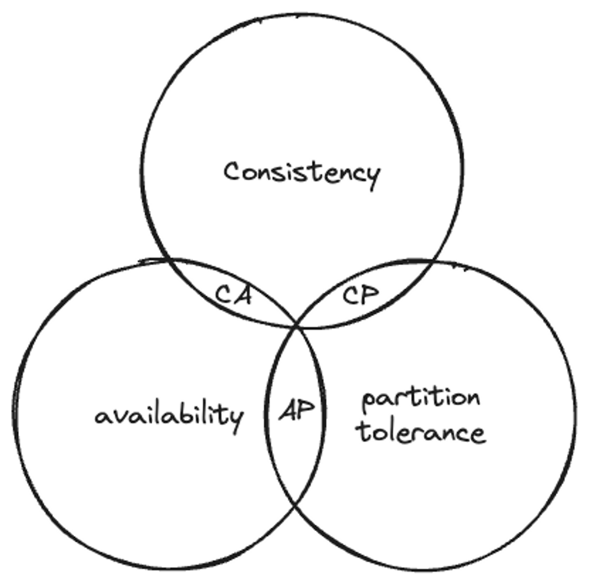
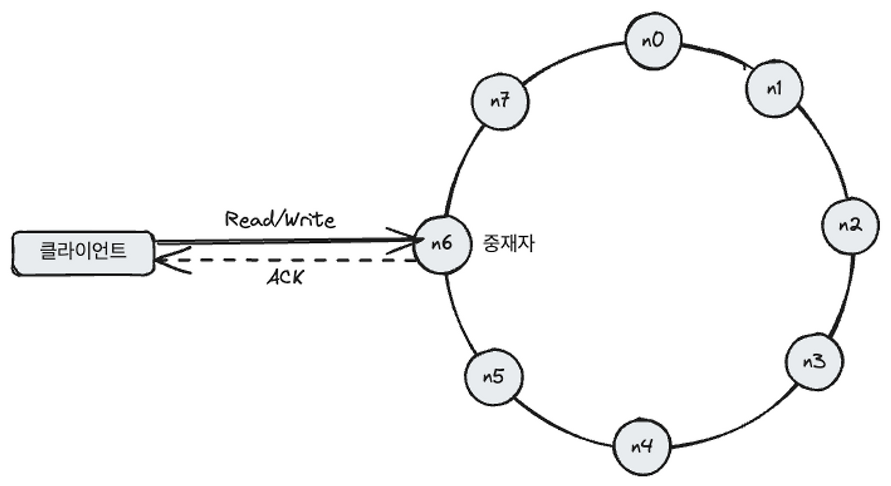
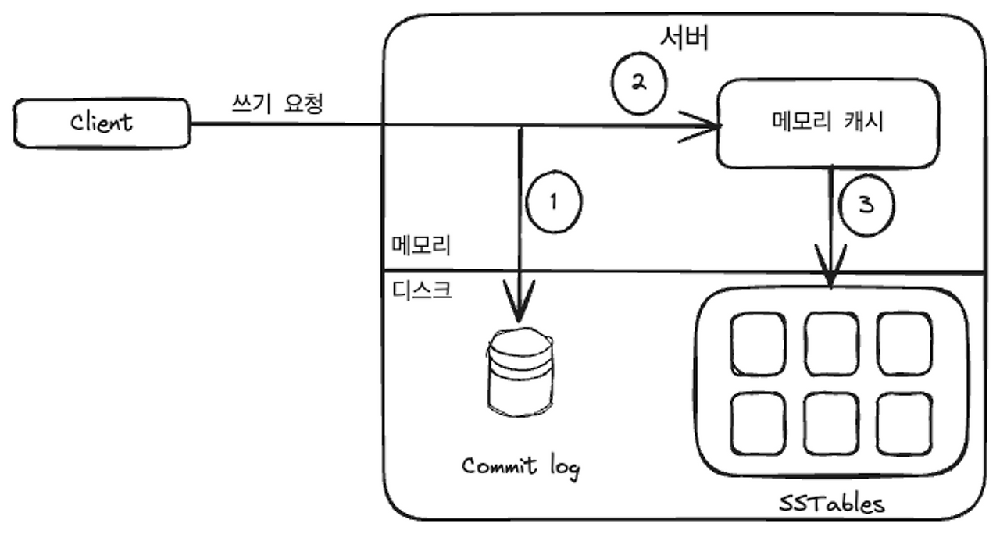
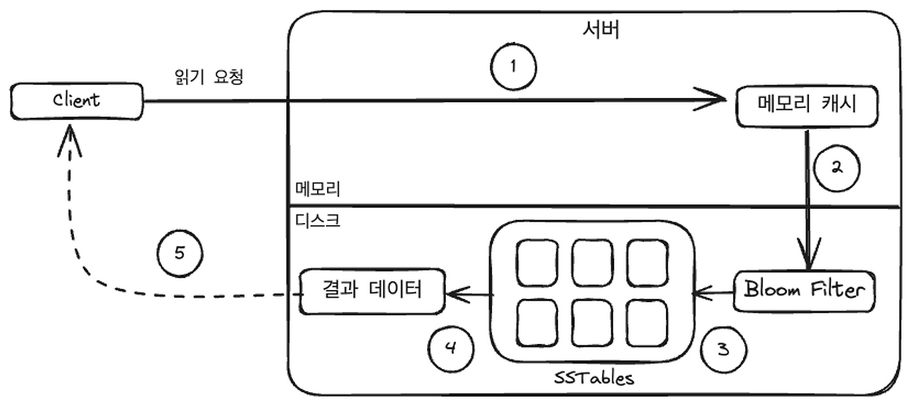

# 00. 개요

이번 장에서는 비 관계형 데이터베이스라고도 불리우는 키-값 저장소를 설계한다.
키-값 쌍에서의 키는 유일해야하며, 성능상의 이유로 키는 짧을수록 좋다.
키-값 쌍에서의 값은 문자열일 수 도 있고 객체일 수 도 있다.

- 대표적인 Key-Value 저장소
    - Amazon DynamoDB
    - Redis
    - Memcached

---

# 01. 문제 이해 및 설계 범위 한정

- 높은 가용성을 제공해야 한다. 따라서 설사 장애가 있더라고 빨리 응답해야한다.
- 높은 규모 확장성을 제공해야한다. 따라서 트래픽 양에 따라 자동적으로 서버 증설이 이뤄져야한다.
- 데이터 일관성 수준은 조정이 가능해야한다.
- latency가 짧아야한다.

---

# 02-(1). 단일 서버 키-값 저장소

한 대의 서버만 사용하는 저장소는 설계하기 쉽다.
가장 직관적인 방법은 키-값 쌍 전부를 메모리에 해시 테이블 형태로 저장하는 것.
→ 하지만 메모리가 부족해 모든 데이터를 쌓는게 현실적으로 불가능할 수 있음
→ 데이터 압축 및 디스크 활용으로 개선 가능
→ 결국 한 대 서버로 부족한 때가 곧 찾아온다. 

---

# 02-(2).분산 키-값 저장소

키-값 쌍을 여러 서버에 분산시키는 방식
분산 시스템을 설계할 때는 CAP 정리를 이해하고 있어야한다.

## 💡CAP 정리

CAP 정리는 아래 세 가지 요구사항을 동시에 만족하는 분산 시스템을 설계하는 것은 불가능하다는 이론.

- Consistency(일관성): 분산 시스템에서, 어떤 노드에 접근하냐에 관계없이 항상 같은 데이터를 보게 되어야한다.
- Availability(가용성): 일부 노드에 장애가 발생해도 항상 응답받을 수 있어야한다.
- Partition Tolerance(파티션 감내)
    - 파티션: 두 노드 사이에 생긴 통신 장애를 의미
    - 파티션 감내는 네트워크 상 파티션이 발생해도, 시스템은 계속 동작하는 것을 의미

따라서 가능한 시스템 종류는 아래와 같다.

- CP: 가용성을 희생
    - MongoDB: 네트워크 장애가 발생해도 강한 일관성을 유지한다. 하지만 일부 가용성을 포기해, 특정 요청은 실패할 수 있다.
    - 보통 은행권 시스템은 데이터 일관성을 양보하지 않아, CP 시스템을 구축한다.
- AP: 일관성을 희생
    - Cassandra: 네트워크 장애가 발생해도 높은 가용성을 제공한다. 하지만 오래된 사본 데이터를 받을 수 있다.
- CA: 파티션 감내를 희생
    - 현실적인 문제로, CA 시스템은 존재하지 않는다.
    - 네트워크 장애는 통상적으로 피할 수 없는 일이기 때문이다.

---

# 03. 시스템 컴포넌트

### 01. 데이터 파티션

대규모 App의 경우 전체 데이터를 한 대 서버에 욱여넣는 것은 불가능하다.
가장 단순한 해결책은 데이터를 작은 **파티션**들로 분할한 다음, 여러 대의 서버에 저장하는 것이다.

데이터를 파티션 단위로 나눌 때는 다음 두 가지 문제를 중요하게 따져봐야한다.

- 데이터를 여러 서버에 고르게 분산할 수 있는가
- 노드가 추가되거나 삭제될 때 데이터의 이동을 최소화할 수 있는가

→ *5장에서 배운 안정 해시를 활용하면 문제를 해결할 수 있을 것으로 보인다!*

### 02. 데이터 다중화

높은 시스템 가용성을 확보하기 위해서는 데이터를 N개 서버에 비동기적으로 다중화할 필요가 있다.

N개 서버를 선정하는 방법은 아래와 같다.

- 어떤 키를 해시 링 위에 배치
- 그 지점으로부터 시계 방향으로 링을 순회하면서 만나는 첫 N개 서버에 데이터 사본을 저장
    - 가상 노드를 사용하면 N개 서버가 실제 물리 서버 N개가 아닐 수 있으니, 중복 선택하지 않도록 설계

### 03. 데이터 일관성

여러 노드에 다중화된 데이터는 동기화가 필수이다.
정족수 프로토콜을 사용하면, R/W 연산 모두 일관성을 보장할 수 있다.

- N: 사본 개수
- W: 쓰기 연산에 대한 정족수, 쓰기 연산이 성공한 것으로 간주되려면 적어도 W개의 서버로부터 쓰기 연산이 성공했다는 응답을 받아야한다.
- R: 읽기 연산에 대한 정족수, 읽기 연산이 성공한 것으로 간주되려면 적어도 R개의 서버로부터 응답을 받아야한다.

이 파라미터를 조정하는 것은 중요하다. 일관성 ↔ 가용성 간 trade-off 관계에 있기 때문이다.

- R = 1: 빠른 읽기 연산
- W = 1: 빠른 쓰기 연산
- W + R > N: 강한 일관성이 보장
    - 최신 데이터를 가진 노드가 최소 하나는 겹치기 때문에, 클라이언트는 절대로 낡은 데이터를 보지 못한다.
- W + R ≤ N: 강한 일관성이 보장되지 않음
- 강한 일관성을 달성하려면?
    - 모든 사본에 쓰기 연산이 반영될 때 까지 해당 데이터에 lock을 걸면 된다.
    - 하지만 고가용성 시스템에서는 적합하지 않다.

💡 약한 일관성, 결과적 일관성을 사용할 때 발생하는 비 일관성 문제는 아래와 같은 기술로 해결 가능

- 버저닝
- 벡터 시계

### 04. 장애 처리

대다수 대규모 시스템에서는 장애는 흔하게 벌어지는 사건이다. 따라서 장애를 어떻게 처리할 것이냐는 굉장히 중요한 문제이다.
우선 장애 감지 기법을 먼저 살펴보고, 장애 해소 전략을 알아보자.

### 04-(1). 장애 감지

- 모든 노드 사이에 채널을 구축해, 서버 장애를 감지하는 것이 가장 쉬운 방법
    - 서버가 많으면 비효율적
- 가십 프로토콜이 더욱 효율적인 방식
    - 각 노드는 멤버십 목록을 관리
    - 멤버십 목록에는 각 노드ID와 heartbeat counter가 관리된다.
    - 각 노드는 무작위로 선정된 노드들에게 주기적으로 자기 박동 카운터 목록을 보낸다.
    - 박동 카운터 목록을 받은 노드는 멤버십 목록을 최신 값으로 갱신한다.
    - 어떤 멤버의 박동 카운터 값이 지정된 시간 동안 갱신되지 않으면 장애 상태인 것으로 간주한다.

### 04-(2). 일시적 장애 처리

- 엄격한 정족수 접근법을 쓴다면 회복될 때 까지 R/W 연산을 금지해야할 것
- 느슨한 정족수 접근법을 쓴다면, 이 조건을 완화하여 가용성을 높인다.
    - R, W을 수행할 서버를 장애 상태인 서버는 무시한 채 고른다.
    - 장애 상태인 서버로 가는 요청은 다른 서버가 잠시 맡아 처리한다.
    - 그동안 발생한 변경사항은, 해당 서버가 복구 되었을 때 일괄 반영해 일관성을 유지한다.
    - 이를 위해 임시 처리한 서버는 단서(hint)를 남겨두는데, 이를 hinted handoff 기법이라 부른다.

### 04-(3). 영구 장애 처리

- Anti-Entropy: 시스템의 다른 부분 간에 데이터를 주기적으로 동기화하여, 영구적으로 손상된 데이터를 복구하고 일관성을 유지한다. 이를 효과적으로하기 위해 Merkle Trees가 사용 된다.
- Merkle Trees: 사본 간 일관성이 망가진 상태를 효과적으로 탐지하고, 전송 데이터 양을 최소화하기 위해 사용. 데이터 블록의 해시를 트리 구조로 저장하여, 두 사본의 데이터가 다를 경우 어느 부분이 다른지 빠르게 식별할 수 있게 한다. 
→ 루트 노드의 해시값이 일치하면? 두 서버는 같은 데이터를 갖는다.

### 05. 시스템 아키텍처 다이어그램

- 클라이언트는 두 가지 단순한 API로 통신
    - `get(key)`
    - `put(key, value)`
- 중재자는 프록시 역할
- 노드는 안정 해시의 해시 링 위에 분포한다.
- 데이터는 여러 노드에 다중화된다.
- 모든 노드가 같은 책임을 가져, **SPOF**는 존재하지 않는다.
- 완전 분산 설계를 채택했으므로, 모든 노드는 아래 기능을 전부 지원해야한다.
    - 클라이언트 API 처리
    - 장애 감지 및 복구
    - 저장소 엔진
    - 데이터 충돌 해소
    - 다중화

### 06. 쓰기 경로

1. 쓰기 요청이 커밋로그 파일에 기록
2. 데이터가 메모리 캐시에 기록
3. 메모리 캐시가 가득차거나 사전에 정의된 어떤 임계치에 도달하면 데이터는 디스크에 있는 SSTable에 기록
    1. Write Buffer(쓰기 지연)의 개념?

### 07. 읽기 경로

1. 데이터가 메모리 있는지 검사, 없으면 2로 이동
2. 데이터가 메모리에 없으므로 블룸(Bloom) 필터를 검사합니다.
3. 블룸 필터를 통해 어떤 SSTable에 키가 보관되어 있는지 알아냅니다.
4. SSTable에서 데이터를 가져옵니다.
5. 해당 데이터를 클라이언트에게 반환합니다.

💡 *Bloom Filter: 어떤 키가 어떤 SSTable에 있는지 확인하는 빠른 방법으로 확률적으로 정확하며 빠르게 키 존재 여부를 판단하는 데이터 구조*

출처: https://dewble.tistory.com/entry/system-design-distributed-key-value-store