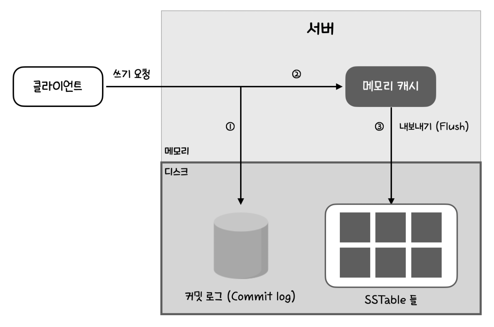
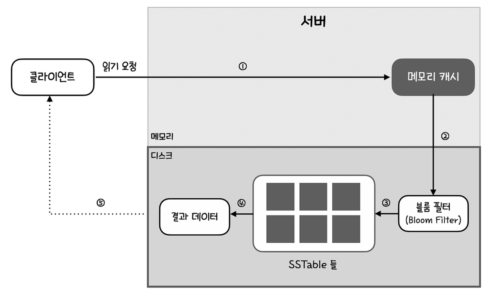

대규모 분산 시스템 환경에서 데이터 저장소의 선택은 전체 시스템의 성능과 확장성을 결정짓는 핵심 요소이다. 

## 키-값 저장소의 정의 및 특징

키-값 저장소는 비관계형 데이터베이스의 일종으로, 고유한 식별자인 '키'와 이에 매핑되는 '값'의 쌍으로 데이터를 관리함.

- **Key:** 일반 텍스트 또는 해시 값으로 구성됨. 성능을 위해 간결할수록 유리함
- **Value:** 객체, 리스트, 단순 문자열 등 데이터 타입에 제약이 없음
- **특징:** 높은 성능과 읽기/쓰기의 단순함 덕분에 캐싱, 세션 관리, 장바구니 등 다양한 도메인에서 활용됨

## CAP 정리

분산 시스템을 설계할 때 가장 먼저 마주하는 이론적 제약은 CAP 정리(Consistency, Availability, Partition Tolerance)임.

- **C: 데이터 일관성**(Consistency): 모든 클라이언트는 어느 노드에 접속하든 최신 데이터를 보아야 함
- **A: 가용성**(Availability): 일부 노드에 장애가 발생해도 시스템은 항상 응답해야 함
- **P:** 파티션 감내(Partition Tolerance)**:** 노드 간 통신 장애가 발생해도 시스템이 중단되지 않아야 함

실질적으로 분산 시스템에서 네트워크 장애는 피할 수 없음. → P는 고정 

서비스의 성격에 따라 CP(일관성 중심)를 택할지 AP(가용성 중심)를 택할지 결정

## 데이터 분산 및 복제 전략

### 1. 데이터 파티셔닝 (Consistent Hashing)

대규모 데이터를 여러 서버에 분산하기 위해 **안정 해시**를 사용함.

- **원리:** 해시 링위에 서버와 데이터를 배치하여, 시계 방향으로 가장 가까운 서버에 데이터를 할당함.
- **장점:** 서버 추가/삭제 시 데이터 재배치를 최소화함.
- **가상 노드:** 각 물리 서버를 링 위의 여러 지점에 대응시켜 데이터 분포를 균등하게 만들고, 서버 사양에 따른 부하 조절이 가능함.

### 2 데이터 다중화

높은 가용성을 위해 데이터를 N개의 서버에 복제함. 해시 링 위에서 시계 방향으로 만나는 첫 N개의 서버를 복제 노드로 선정함. 이때, 가상 노드 사용 시 실제 물리 서버가 중복되지 않도록 주의해야 하며, 안정성을 위해 여러 데이터 센터에 걸쳐 복제하는 것이 권장됨.

## 일관성 모델 및 충돌 해소

### 1 정족수 합의 (Quorum)

읽기/쓰기 연산의 일관성 수준을 조절하기 위해 **N, W, R** 설정을 사용함.

**N:** 사본 개수

**W:** 쓰기 성공으로 간주하기 위해 필요한 응답 수

**R:** 읽기 성공으로 간주하기 위해 필요한 응답 수

**설계 전략:**

- **W + R > N:** 강한 일관성 보장. (보통 N=3, W=2, R=2)
- **R=1, W=N:** 읽기 최적화 시스템.
- **W=1, R=N:** 쓰기 최적화 시스템.

→ W,R을 높일수록 네트워크 왕복 횟수 증가로 latency가 생기기때문에 적절한 선택이 필요하다.

### 2 데이터 버저닝과 벡터 시계 (Vector Clock)

최종 일관성 모델에서는 사본 간 데이터 불일치가 발생할 수 있음. 이를 해결하기 위해 **벡터 시계**를 활용함.

- **구조:** `[서버, 버전]`의 순서쌍을 데이터에 첨부함.
- **충돌 감지:** 버전 간에 선후 관계가 명확하지 않을 경우(인과관계가 끊긴 경우), 충돌이 발생한 것으로 간주하고 클라이언트 측에서 해소하도록 유도함.

## 장애 처리 및 가용성 극대화

### 1. 장애 감지 - 가십 프로토콜

중앙 집중형 관리자 없이 모든 노드가 서로의 상태를 주기적으로 교환함. 각 노드는 멤버십 목록을 관리하며, 특정 노드의 하트비트가 일정 시간 갱신되지 않으면 장애로 판단

### 2. 일시적 장애 처리

네트워크 장애 등으로 일부 노드가 응답하지 못할 때, 건강한 다른 서버가 임시로 쓰기 연산을 대신 처리함. 이후 장애가 복구되면 '힌트'를 기반으로 데이터를 원래 노드로 전송하여 일관성을 회복함.

### 3. 영구 장애 처리 - 머클트리

사본 간의 데이터 차이를 효율적으로 비교하기 위해 **머클 트리**를 사용함. 전체 데이터를 다 비교할 필요 없이 루트 노드의 해시값부터 비교하며 내려감.

→ 머클트리를 사용하면 리밸런싱 때무에 INSERT 비용이 높아지진 않을까?

→ 머클 트리는 쓰기 시점이 아니라 Memtable이 flush되어 SSTable이 생성되는 시점에 한 번 생성되며,
SSTable은 immutable 구조이기 때문에 이후 INSERT 경로에는 영향을 주지 않는다. 그래서 SSTable이 생성되는 시점에 CPU 사용량이 크게 뛸 수 있다.

## 개별 노드의 아키텍처

**LSM 트리 구조**

키-값 저장소의 개별 노드는 쓰기 성능 극대화를 위해 **LSM트리** 구조를 주로 채택함

**쓰기 경로**

**읽기 경로**

## 이것저것

### Redis vs Cassandra vs DynamoDB

- **Redis**
    - 싱글 스레드 기반의 인메모리 저장소. 응답 속도가 매우 빠르나 메모리 크기의 제약이 있음. 주로 **고속 캐싱, 세션 저장소, 실시간 순위표** 등에 적합
    - Spring Data Redis로 쉽게 연동 가능
    - aws valkey 비싸다
    
    → 캐시, 세션, rete limit
    
- **Cassandra/DynamoDB**
    - 분산 P2P 아키텍처 기반. 대규모 쓰기 트래픽 처리에 특화됨.
    - AP 모델(가용성)을 기본으로 하지만 정족수 설정을 통해 일관성 수준을 조정할 수 있음.
    
    → 로그, 사용자 이벤트 히스토리, 사용자 행동 기록
    

### 주의점

- **Hot Key 문제**
    
    특정 키에 트래픽이 몰리는 경우(예: 유명 연예인의 프로필), 특정 노드에 과부하 발생함. 이를 방지하기 위해 키에 랜덤한 접미사(Salt)를 붙이거나 캐싱 레이어를 상단에 둠.
    
    요청 → 로컬캐시 → 분산캐시 → DB
    
- **Serialization 이슈**
    
    Spring에서 Redis연동하는 경우 `RedisTemplate`을 사용하는 순간 기본적으로 `JdkSerializationRedisSerializer`가 적용된다. 자바 전용 직렬화로 메모리 사용량이 크고, 클래스 변경 시 역직렬화 오류가 발생할 수 있다. 따라서 Redis에 저장하는 객체는 `GenericJackson2JsonRedisSerializer` 또는 `Protobuf` 기반 직렬화를 사용하도록 RedisTemplate의 직렬화 설정을 명시적으로 변경해야 한다.
    
    > 보통 Redis 연동 시 `RedisTemplate`을 사용한다. serializer를 기본 JDK 직렬화가 아닌 **Jackson 또는 Protobuf로 설정한다.**
    > 

### 운영 관점

- **커넥션 풀 관리**
    - Lettuce같은 비동기 라이브러리 사용 시 커넥션 풀 설정을 최적화하여 런타임 시 `Connection Timeout`을 방지해야 함.
    - Lettuce는 논블로킹기반이라 요청이 많아도 쓰레드는 크게 안 늘어남. 사실 MVC는 요청마다 쓰레드를 쓰고 블로킹 방식이라 의미가 크게 없을 수는 있지만 MVC 쓰레드가 **하나의 커넥션** 공유 가능해서 좀 더 쓰레드 safe
    - Redis는 단일 스레드 기반. Lua 스크립트는 실행 시간이 길어질 경우 해당 스레드를 독점하여 전체 Redis 요청을 지연시킬 수 있으므로 원자성이 필요한 최소 로직에 한해 사용해야 한다.
- **모니터링 기준**
    - `Eviction Rate`(메모리 부족으로 삭제되는 키 비율)
    - `Replication Lag`(레플리카 반영 지연시간)
    - `CPU Usage`
    - `P99 Latency`