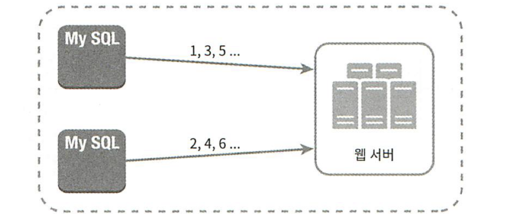
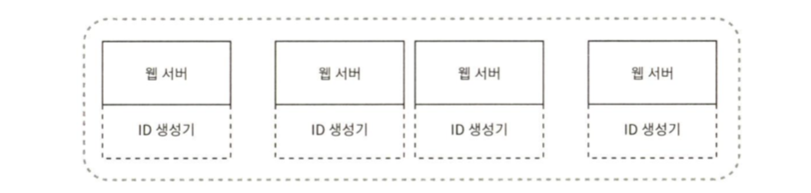
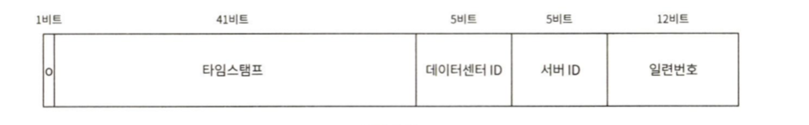

# 개요

- 유일 ID 생성기의 필요성?
    - 분산 데이터베이스 환경을 사용할 때
        - PK를 auto_increment로 생성하면 서버 간 중복이 발생
    - scale-out 된 서버 환경에서 유일 ID를 생성해야할 때
        - 이벤트ID 생성 등

---

# 1. 문제 이해 및 설계 범위 한정

- ID는 유일해야 한다.
- ID는 숫자로만 구성되어야 한다.
- ID는 64비트로 표현될 수 있는 값이어야 한다.
- ID는 발급 날짜에 따라 정렬이 가능해야 한다.
- 초당 10,000개의 ID를 만들 수 있어야 한다.

---

# 2. 개략적 설계안 제시 및 동의 구하기

### 다중 마스터 복제(multi-master replication)

- 이 접근법은 auto_increment 기능을 활용하는 것
- 다만 next_id를 결정할 때 1만큼 증가시키는 것이 아니라 **현재 사용 중인 데이터베이스의 서버 수 k**만큼 증가시킨다.
- 장점
    - 데이터베이스 수를 늘릴수록 초당 생산 가능한 ID 수가 증가한다. (이론상으로는 무한정 확장)
- 단점
    - 데이터베이스 수가 증감되는 상황에서, 잘 동작하도록 만들기 어렵다.
        - k가 동적으로 변하는 상황에서 PK가 충돌나지 않게 만들어야함.
    - 결정된 PK값이 시간 흐름에 따라 생성되었다고 보장할 순 없다.
        - 위 그림에서 봤을 때 4가 먼저 생성되고 1 or 3이 생성될 수 있기 때문에

### UUID

- 128비트의 유일 식별 키
- 중복 UUID가 1개 생길 확률을 50%까지 끌어올리려면 초당 약 10억 개의 UUID를 100년동안 계속 만들어야 한다.
- 서버 간 조율없이 독립적으로 생성 가능하다는 장점

- 단점
    - 저장 공간
        - UUID로 PK를 생성하면 크기가 비대해진다.
        - → 클러스터형 인덱스 크기가 커지게 된다.
        - → 한 데이터 페이지 안에 차지하는 노드 총량이 감소하여, 잦은 디스크I/O를 발생시킨다.
        - → 쿼리 성능을 저하시킬 수 있다.
    - 랜덤성
        - 클러스터형 인덱스는 기본적으로 값이 비슷한 PK를 묶어서 디스크 상 가까운 공간에 저장
        → 조회 성능 상 이점을 발휘
        - 하지만 PK가 랜덤성을 가진다면, 어디에 저장될 지 예측이 불가
        → 조회 시 랜덤I/O가 자주 발생해 성능 저하
- 해결책
    - 시간 기반의 UUID 사용
        - UUID v1, v6 같은 시간 기반의 ID를 사용하면, 생성된 UUID를 시간 순으로 정렬할 수 있음
    - 바이너리 형식 활용
        - UUID를 바이너리 형식으로 압축하여 저장하면, 16바이트까지 저장공간을 줄일 수 있음
        - 물론 이를 다시 핸들링해야하는 비용은 존재

### 💡인덱스 키 값의 크기의 영향

- 인덱스의 노드는 페이지단위로 관리된다.
    - 보통 한 페이지는 16KB
    - 하나의 노드가 키 값(16바이트) + 다음 노드의 주소(12바이트)라고 가정하면 → 한 페이지에 580개 정도의 자식 노드를 가질 수 있다.
    - 만약 키 값이 두 배를 차지하면? 370개 선으로 줄어든다.
    - 이 경우, select 쿼리로 500개의 레코드를 읽어야 한다면 첫 번째 경우는 한번의 디스크 I/O, 두 번째 경우는 두번의 디스크I/O가 발생한다.

### 티켓 서버

- 이 아이디어의 핵심은 auto_increment 기능을 갖춘 서버, 즉 티켓 서버를 중앙 집중형으로 사용하는 것
- 장점
    - 구현하기 쉽다.
    - 중소 규모 애플리케이션에 적합하다.
- 단점
    - SPOF
        - 이슈를 피하려면 티켓 서버를 여러 대 준비해야한다.
        - 하지만 데이터 동기화 문제가 새롭게 발생

### 트위터의 스노우플레이크 접근법

- UUID와 비슷한 접근이지만, 64비트의 저장공간을 활용

- 타임스탬프
    - 기원시각(epoch)이후로 몇 밀리초가 경과했는지 나타내는 값
    - 시간에 따라 증가하기 때문에, 정렬 가능해진다.
    - 41비트로 사용 시 69년동안 정상 동작 가능, 이후에는 epoch를 바꾸거나 다른 ID 체계로 마이그레이션해야한다.
- 데이터센터ID 및 서버ID: 각 5비트 할당
    - 이 값은 동적으로 서버가 생성될 때 외부에서 주입받는 방향으로 가는게 현대 애플리케이션에 더 적합하다.
    - Pod ID, Container ID, Worker ID를 주입받아 5~10 Bit로 사용
- 일련번호: 12비트 할당, 각 서버에서는 밀리초 당 4096개의 ID를 생성할 수 있다.
→ 초당 4,096,000개의 ID를 생성 가능

---

# 3. 마무리

- 각 section 길이의 최적화
    - 각 section의 자릿수는 예시일 뿐, 성격에 따라 유동적으로 변경이 가능하다.
    - 타임스탬프
        - 39bit: 17년
        - 40bit: 34년
        - 41bit: 69년