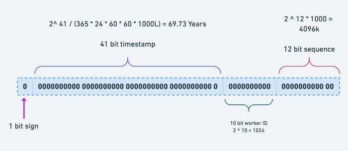
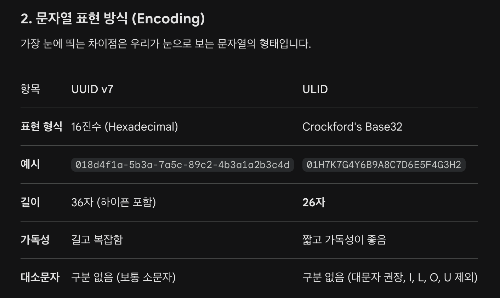

# 분산 시스템을 위한 유일 ID 생성기 설계

* 일반적으로 DB의 PK를 auto increment로 설정하는 경우가 많다.
* 단일 DB 서버에서는 오히려 최적의 설계가 될 수 있다. (빠르고 직관적이게 구현 가능)
* 하지만 분산 DB 환경에서는 Auto Increment로는 유일성을 보장하지 못한다.
  * 각 DB 서버마다 Auto Increment 값이 충돌할 수 있다.

## 문제 이해 및 설계 범위 정의
* ID는 유일해야 한다. (Required)
* ID는 발급 날짜에 따라 정렬 가능해야 한다. (Optional)
* ID는 숫자로만 구성되어야 한다. (Optional)
* ID는 64비트로 표현될 수 있는 값이어야 한다. (Optional)
* 초당 10,000개의 ID를 만들 수 있어야 한다. (Optional)

## 다중 마스터 복제
* ID 생성 시 1만큼 증가시키는 게 아니라 현재 DB 서버의 수만큼 증가시키는 것
  * A DB 서버: 1, 3, 5, 7, ...
  * B DB 서버: 2, 4, 6, 8, ...
* 단점
  * ID의 유일성은 보장되지만 모아서 정렬은 할 수 없다. (A 서버의 3번이 B 서버의 2번보다 이전에 생성될 수 있다.) 
  * DB 서버를 추가하거나 삭제할 때 제대로 동작하기 어렵다.


## UUID
* UUID(Universally Unique Identifier) 128 비트의 표준 문자열 생성
* 버전에 따라 생성 방식이 다르다.
  * V1 : 현재 시간 + MAC 주소
    * 시간순으로 정렬 가능하지만, 장비의 MAC 주소가 노출되므로 문제가 생길 수 있다.
  * V4 (일반적으로 사용) : UUID.randomUUID() 
    * 완전 무작위로 1조개의 UUID에서 중복이 발생할 확률은 10억분의 1
    * 시간순 정렬 불가능
    * DB PK로 사용하게 되었을 때 B-Tree 인덱스 성능 저하 (무작위라 정렬되지 않아서)
  * V7
    * Hibernate 7에서는 UUID v7이 표준 권장 방식
    * 앞 48비트를 Timestamp로 채우고 나머지를 무작위로 생성하여 정렬 가능
  

## 티켓 서버
* ID 생성을 담당하는 서버 OR DB를 따로 두고, 모든 데이터 생성 시마다 해당 서버/DB를 거쳐서 생성
* 단점
  * 해당 서버/DB가 SPOF가 된다. -> 이를 위해 해당 서버를 Scale Out하면 복잡도가 너무 커질 것 같다.
  * hop이 1개 증가하는 것이기 때문에 Latency도 증가할 것


## 스노우플레이크

* 총 64비트의 ID
* 1 bit sign : 1비트를 할당해서 양수 / 음수를 결정, 일반적으로 양수를 나타내기위해 항상 0으로 사용
* 41 bit timestamp : 특정 기준 시간인 Epoch를 정해놓고 그 시점부터 경과한 시간을 ms 단위로 저장
  * 41비트는 약 2의 41승 개의 다른 값을 가질 수 있는데, 이를 기간으로 환산하면 약 69년까지 고유한 값을 저장할 수 있다.
  * 해당 timestamp bit를 통해 ID로 시간순 정렬이 가능하고, 언제 생성되었는지 추적할 수 있다.
* 10 bit worker ID : Snowflake ID를 생성하는 인스턴스마다 고유한 ID를 생성
  * 총 10비트로, 2의 10승 개인 1024개의 분산 인스턴스까지 사용 가능하다.
  * **각 인스턴스마다 ID 고정**
  * 해당 10 bit worker ID를 통해 분산 시스템 간의 Snowflake ID 중복 충돌이 발생하지 않는다.
* 12 bit sequence : 동일한 ms 내에서 여러 ID 생성 시에 사용된다.
  * 기본은 0으로, 만약 동일한 ms 내에 여러 ID를 생성해야 할 때 1씩 증가하면서 2의 12승인 4096까지 나타낼 수 있다.
  * 즉, 동일한 ms 내에서 최대 4096개의 고유한 ID를 생성할 수 있다.
  * 만약 4096개 이상의 동일한 요청이 들어오면 대기한다.


## ULID
* Universally Unique Lexicographically Sortable Identifier
* UUID에 Lexicographically / Sortable 두 가지 추가
  * Lexicographically : 사전적으로
  * Sortable : 정렬가능한
* 따라서, UUID에 정렬 기능이 추가된 생성 방식
```
 01AN4Z07BY      79KA1307SR9X4MV3

|----------|    |----------------|
 Timestamp          Randomness
   48bits             80bits
```

* `UUIDv7과 ULIDs 사이의 선택은 특정 요구에 따라 다르며, ULIDs는 UUIDs가 메타데이터에 사용하는 것보다 6비트의 추가 무작위성을 제공한다.`


## TSID
* Time-Sorted Unique Identifier
* Time 요소 (42 bits)
* Random 요소 (22 bits)
  * node (0 ~ 20 bits)
  * counter (2 ~ 22 bits)
  * 여기서 node, counter는 bit 수가 정해져있지 않고 유연하게 node, counter 수를 조정할 수 있습니다.
  * ex) 현재 인스턴스 수에 맞게 적절하게 node, counter를 조절하여 동시성을 고려할 수 있습니다.

```
                                            adjustable
                                           <---------->
|------------------------------------------|----------|------------|
       time (msecs since 2020-01-01)           node       counter
                42 bits                       10 bits     12 bits

- time:    2^42 = ~69 years or ~139 years (with adjustable epoch)
- node:    2^10 = 1,024 (with adjustable bits)
- counter: 2^12 = 4,096 (initially random)
```
* Snowflake와 유사하지만 다른점 -> 랜덤성 부여
  * node의 ID는 동일한 인스턴스라도 항상 랜덤
  * counter는 1씩 증가가 아닌 항상 랜덤


---
### 그래서 어떤 전략 사용?
* Snowflake / TSID / UUID v7
* UUID v7의 경우 Hibernate 7의 UUID 생성 전략에 포함된 만큼 사용해볼 수 있을 것 같지만, 생성 길이가 128비트로 길기 때문에 조금 부담스럽다.


---
### Reference
[DB PK 생성 전략 알아보기 (feat. Auto Increment, UUID, ULID, Snowflake ID, TSID)](https://ksh-coding.tistory.com/157)


