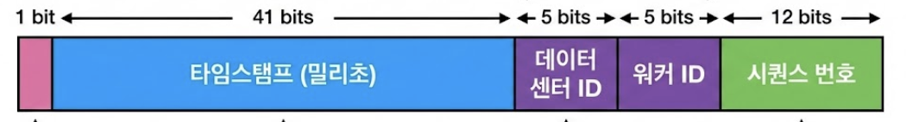

# 분산 시스템을 위한 유일 ID 생성기

이번 장에서는 분산 시스템 환경에서 사용할 수 있는 유일 ID 생성기를 설계한다. 흔히 사용하는 관계형 데이터베이스의 `auto_increment` 속성은 분산 환경에서 다음과 같은 한계가 있어 부적합하다.

- 단일 데이터베이스 서버로는 초당 수만 개의 ID 생성을 감당 불가
- 여러 데이터 센터에 걸쳐 있는 경우, 중앙 데이터베이스와의 통신 지연으로 인해 전체 시스템 성능 저하

## **1. 문제 이해 및 설계 범위 확정**

시스템 설계 면접 문제를 푸는 첫 단계는?**적절한 질문을 통해 모호함을 없애고 설계 방향을 정하는 것이다.**?

> **Q: ID의 특성은 어떠해야 합니까?**
    
    A: 유일해야 하며, 정렬 가능해야 합니다.

> **Q: 새로운 ID는 항상 이전보다 1씩 커져야 합니까?**

    A: 반드시 1씩 증가할 필요는 없지만, 시간 순서대로 생성된 ID는 나중에 만든 것이 더 큰 값을 가져야 합니다.
> **Q: ID는 숫자로만 구성됩니까?**
    
    A: 네, 그렇습니다.
> **Q: 시스템의 규모는 어느 정도입니까?**
    
    A: 초당 10,000개의 ID를 생성할 수 있어야 합니다.

### 설계 요구사항

1. 모든 ID는 유일해야 함
2. 숫자(64비트 정수형)로만 구성
3. 발급 날짜(시간)에 따라 정렬 가능
4. 초당 10,000개 이상의 생성 능력 보유

## 2. 개략적 설계안 및 기술 비교

분산 시스템에서 유일 ID를 생성하는 네 가지 주요 전략을 비교 분석한다.

### **2-1. 다중 마스터 복제**

다중 데이터베이스의 `auto increment` 를 사용하는 방법이다. 단, auto increment 의 증가량이 1이 아니라 서버 대수(k)만큼 증가치를 설정한다.

e.g. 데이터베이스가 총 4대있는 경우. 1번 데이터베이스의 ID 값은 1, 5, 9, 13, ... 으로, 2번 데이터베이스의 ID값은 2, 6, 10, 14, ... 으로, 3번은 3, 7, 11, 15, ... 처럼 증가하도록 설계하면 된다.

**장점**

다중 시스템에서 유일한 ID 를 생성할 수 있으며, 데이터베이스 수를 늘려 초당 생성할 수 있는 ID 수를 늘릴 수 있다.

**한계**

1. 확장성에 불리
    
    데이터베이스 수가 늘거나 줄게되면 중간에 k 값이 변경되는데, 이에 대응하는 것이 어렵다. 이런 특징으로 여러 데이터 센터에 걸쳐 규모를 확장하기 어려울 것이다. 즉, 데이터베이스 수가 끝까지 최초 k 로 고정된 상황에서 쓰기 적합해보이는데, 이는 데이터베이스 수가 무조건 항상 고정되어야 한다는 특징이 보장되어야 하므로 확장성에 불리하다.
    
2. 시간 흐름에 맞게 커짐을 보장하지 않는다
    
    요구사항 중 "ID 는 발급 날짜에 따라 정렬 가능해야 한다" 가 있었다. 그런데, 이 방법에서는 2번 ID 가 1번 ID 보다 먼저 생성될 수 있다. 1번 데이터베이스보다 2번 데이터베이스에서 먼저 요청이 실행되면 발생하는 문제이다. 즉, ID 가 시간적 순서에 따라 정렬되지 않으므로 요구사항을 위반하게 된다.
    

> :bulb:
>숫자로 된 auto increment 데이터베이스의 B-Tree 인덱스 구조에서 삽입 성능이 가장 좋다. 하지만 다중 마스터 방식처럼 ID 간격이 벌어지거나 서버 간 시차가 발생하면 인덱스 페이지의 파편화가 발생할 수 있음을 인지해야한다.


### **2-2. UUID**

UUID 는 정보를 유일하게 식별하기 위한 128bit 짜리 16진수이다. UUID 는 충돌 가능성이 아예 0% 라고는 못하지만, 사실상 충돌할 일이 없다고 보는것이 맞다.

**장점**

서버간 조율 과정도 필요 없으므로 동기화가 필요 없고, 각 서버는 자기가 알아서 쓸 ID 를 만드는 구조이므로 규모 확장이 쉽다.

**단점**

- ID가 128비트로 길어 요구사항(64비트)을 충족하지 못한다.
- 숫자로만 구성되지 않으며(16진수 문자열), 기본 UUID(v4)는 시간순 정렬이 불가능합니다.

### **2-3. 티켓 서버**

아예 유일한 키를 생성하는 서버를 별도로 분리하는건 어떠할까? 플리커라는 회사는 분산 기본 키를 생성하기 위한 방법으로 이를 택했다고 한다.

웹 서버 여러대가 auto increment 로 ID 를 생성하는?**티켓 서버를 중앙 집중형으로 하나만 사용**하는 것이다. 

**장점**

- 이 방법은 유일성이 보장되고, 숫자로만 구성된, 64비트로 표현 가능한, 발급 날짜에 따라 정렬 가능한 ID 를 생성할 수 있다.
- 성능만 갖춰진다면 초당 10,000개의 ID 를 생성할 수 있다.
- 구현도 굉장히 쉽다.

**한계**

1. **SPOF**
    
    티컷 서버를 중앙 집중형으로 단 1대만 사용하기 때문에 티켓 서버 1대에서 장애가 발생하면 모든 서비스를 이용할 수 없게 된다. 이를 해결하기 위해 티켓 서버를 다중화 할 경우 해결하고자 했던 동기화 이슈가 다시 발생한다.
    

### **2-4. 트위터 스노우플레이크**

트위터는 이 문제를 해결하기 위해 스노우플레이크라고 부르는 독자적인 ID 생성 기법을 만들어 해결했다.



| **섹션** | **비트 수** | **설명** |
| --- | --- | --- |
| **사인(Sign) 비트** | 1 bit | 현재 사용하지 않으나, 나중을 위해(양수/음수 구분 등) 확보 |
| **타임스탬프** | 41 bits | 기원 시각(Epoch) 이후 경과된 밀리초(ms). 약 69년 사용 가능 |
| **데이터센터 ID** | 5 bits | 2^5 = 32개의 데이터센터 지원 |
| **서버 ID** | 5 bits | 데이터센터당 32개의 서버 지원 |
| **일련번호** | 12 bits | 각 서버에서 1ms 내에 생성되는 ID마다 증가. 1ms마다 0으로 초기화 |

**요구사항 충족**

- ID 에 타임 스탬프 값을 넣어두기 때문에 시간순으로 정렬이 가능하다.
- 데이터 센터 ID 와 서버 ID 를 사용하여 서로 다른 서버에서 같은 시각에 생성한 ID 도 충돌이 발생하지 않는다.
- 내부적으로 일렵번호를 사용하여 같은 서버에서 생성한 ID 값 끼리도 충돌이 발생하지 않는다. 이 과정은 서버간 동기화가 필요 없기 때문에, 확장성 측면에서도 유리하다.
- ID 전체 길이도  64비트라서 모든 요구사항을 만족한다.

# 3. 추가로 고려해야할 것들

1. **시계 동기화**
    
    우리는 ID 생성 서버들이 모두 같은 시계를 사용한다고 가정했다. 하지만 이런 가정은 하나의 서버가 여러 코어에서 실행될 경우 유효하지 않을 수 있다. 
    
    - NTP(Network Time Protocol)를 사용하여 서버 시계를 동기화하고, ID 생성 로직 내에서 현재 시간이 이전 생성 시간보다 과거일 경우 대기하거나 에러를 발생시키는 로직이 필요합니다.
2. **각 section의 길이 최적화**
    
    예를들어 동시성이 낮고 수명이 긴 애플리케이션이라면 일련번호 절의 길이를 줄이고 타임스탬프 절의 길이를 늘리는 것이 효과적일 수도 있을 것이다.
    
3. **고가용성(HA)**
    
    ID 생성기는 필수 불가결 컴포넌트이므로 아주 높은 가용성을 제공해야 할 것이다.
    

> :bulb:
> 스노우플레이크 ID 생성기를 구현할 때 데이터센터 ID와 Worker ID를 수동으로 고정 관리하는 방식은
서버 증설, 자동 스케일링, 재시작이 잦은 현대적인 인프라 환경에서는 운영 리스크와 관리 비용이 높다.
Kubernetes 환경에서 제공하는 StatefulSet의 ordinal이나 Pod UID와 같은 고유 식별자를 활용해
서버 기동 시점에 Worker ID를 자동으로 결정하는 방식이 더 단순하고 안정적인 선택으로 자리 잡고 있다.
```yaml
env:
  - name: POD_NAME
    valueFrom:
      fieldRef:
        fieldPath: metadata.name
```

> :bulb:
> 연속적인 숫자로 된 ID는 비즈니스 지표(예: 하루 주문 건수, 가입자 수)를 외부에 노출시킬 위험이 있다. 보안이 중요한 API에서는 생성된 ID를 그대로 노출하기보다 해싱하거나, 스노우플레이크처럼 구조화된 ID를 사용하여 외부인이  규모를 짐작하지 못하게 하는 것이 좋다.

> :bulb:
> 자바스크립트는 64비트 정수를 정확히 처리하지 못해 끝자리가 반올림될 수 있다. 반드시 String으로 직렬화하여 내려주는 설계를 해야한다. 
> - Jackson의 @JsonSerialize(using = ToStringSerializer.class) 등을 활용
