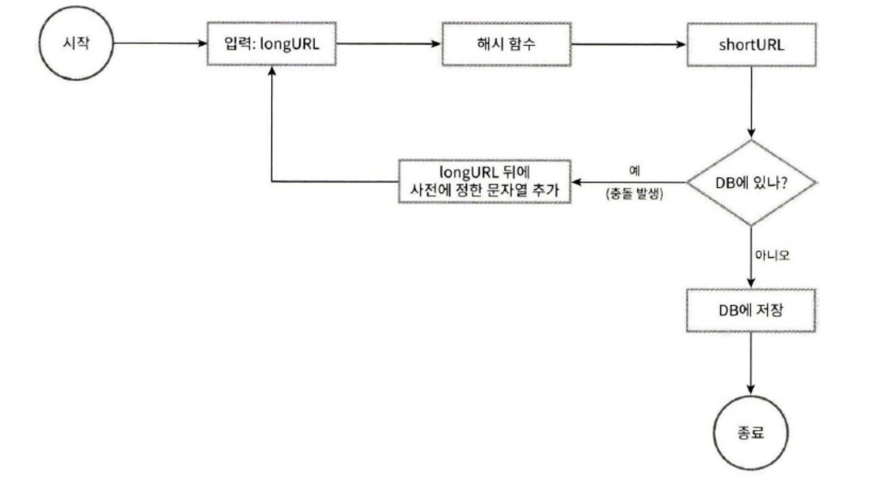
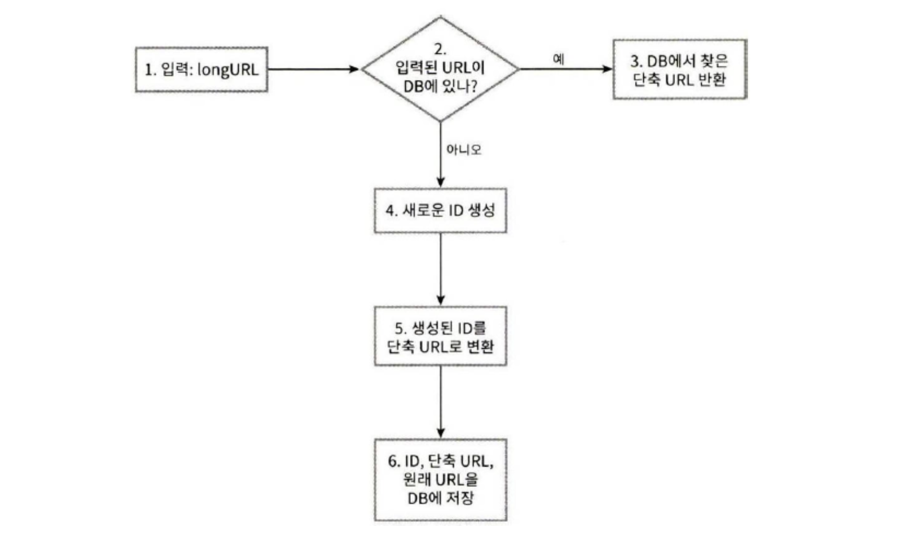

## 개요

재미있으면서도 고전적인!? URL 단축기를 설계해보자.

---

## 1. 문제 이해 및 설계 범위 한정

- 주어진 긴 URL을 훨씬 짧게 줄인다.
- 매일 1억개의 단축 URL을 만들 수 있어야한다.
- 축약된 URL로 HTTP 요청이 오면 원래 URL로 리다이렉션 가능해야한다.

### 개략적 추정

- 쓰기 연산: 매일 1억개의 단축 URL 생성
- 읽기 연산: 쓰기 X 10 = 매일 약 10억, 초당 12,000회의 I/O
- 10년 운영한다 했을 때, 필요한 저장공간은 36.5TB

---

## 2. 개략적 설계안 제시 및 동의 구하기

### API 엔드포인트

현재 설계하는 시스템은 다음 두 가지 목적을 가진 API 엔드포인트를 제공해야한다.

1. URL 단축용 엔드포인트
    1. 클라이언트는 Origin URL 정보를 실어서 POST 요청을 보낸다.
    2. 서버는 단축 URL을 생성해 응답한다.
    3. ex) `POST /api/v1/data/shroten` 
2. URL 리다이렉션용 엔드포인트
    1. 단축 URL에 대해서 HTTP 요청이 오면, Origin URL로 보내주기 위한 용도
    2. 리다이렉션 목적지가 될 원래 URL을 반환한다.
    3. ex) `GET /api/v1/shortUrl` 

### 리다이렉션: 3XX

- 301 Permanently Moved
    - 리소스의 영구 이동
    - 브라우저 캐시를 활용할 수 있어, 서버 부하를 줄일 수 있음
    - 하지만 리다이렉트 시, GET 요청으로 변경되고 Request Body가 제거될 수 있음
    → 만약 POST 등 다른 메서드를 유지해야한다면 `308` 사용
- 302 Found
    - 일시적인 리다이렉트를 의미
    - 따라서 브라우저 캐시를 활용하지 않음
    - 301과 마찬가지로, Get 요청 변경 및 바디가 제거될 수 있음
    - 이러한 불확실성 때문에 `303`, `307`이 등장함
- 그럼 왜 이렇게 강제로 Get으로 변경될까?
    - 정확한건 아니지만, Post 자체가 멱등성을 가지지 못하기 때문에, Get 요청을 통해 완료 페이지로 리다이렉트 시키기 위한 취지가 있을지도..?
    - ex)
        - 쇼핑몰에서 결제 후 결제 완료 페이지로 리다이렉트(중복 결제 방지)
        - 배달 주문 후 주문 완료 페이지로 리다이렉트(중복 주문 방지)
- 303 See Other
    - Get 변경, 바디 제거 강제
- 307 Temporary Redirect
    - `302` 와 동일, 하지만 요청 메서드와 바디가 유지됨
- 308 Permanent Redirect
    - `301` 과 동일, 하지만 요청 메서드와 바디가 유지됨

### URL 단축

- 단축 URL이 [www.tinyurl.com/{hashV}와](http://www.tinyurl.com/{hashV}와) 같은 값이라 해보자.
- 결국 긴 URL을 해시 값으로 대응시킬 해시 함수를 찾는일이 될 것이다.
- 요구사항
    - 입력이 다르면 해시 값도 달라야한다. → 해시 충돌 X
    - 복원될 수 있어야한다.

---

## 3. 상세 설계

### 해시 값

- [0-9, a-z, A-Z]의 문자로 구성
- 사용할 수 있는 문자는 총 62개
- 따라서 총 3650억개의 단축 URL을 만들 수 있어야하니, 62^n > 3650억을 만족하는 최소 n을 잡으면 7이다.
→ 7자리 단축 URL을 사용하면 된다.

### 단축 URL을 생성하는 두 가지 방법

1. 전통적인 해시 함수 사용
    1. CRC32, SHA-1, MD5…
    2. 하지만 아무리 짧게 해도 7보다는 길다. 
    3. 문제를 해결하려면? 7자리에서 자르면 되지만, **해시 충돌**이 발생
    4. 충돌이 발생하면 해소될 때까지 사전에 정한 문자열을 덧붙인다.
    5. 하지만 DB 부담이 커진다. → 블룸 필터를 활용하면 성능을 높일 수 있다.

1. 진법 전환(base conversion)
    1. 진법 전환은 URL 단축기를 구현할 때 흔히 사용되는 접근법이다.
    2. 유일 ID 생성기로 ID를 생성하고, 이를 62진수로 변환하는 것이다.
    3. 하루 1억개의 생성, 즉 초당 1,160개의 유일 ID만 생성하면 가능한 시나리오

