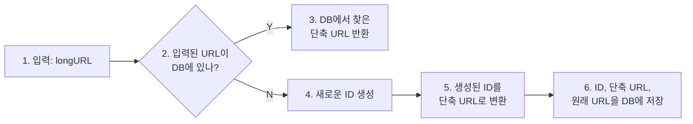
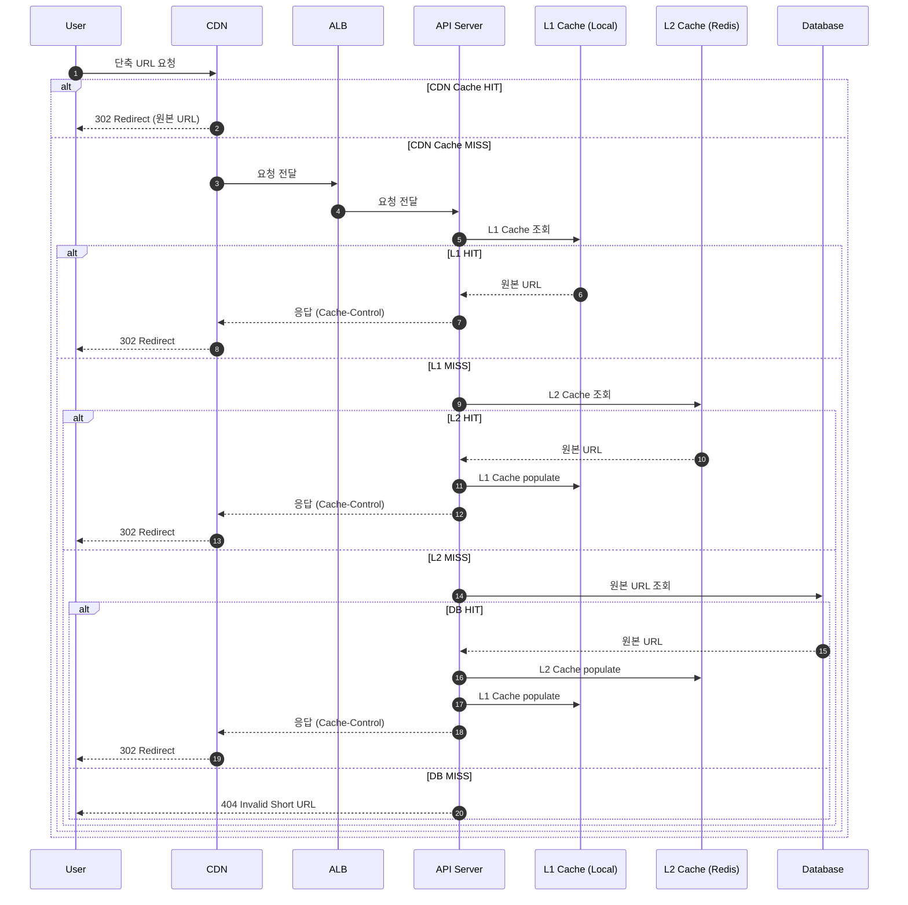
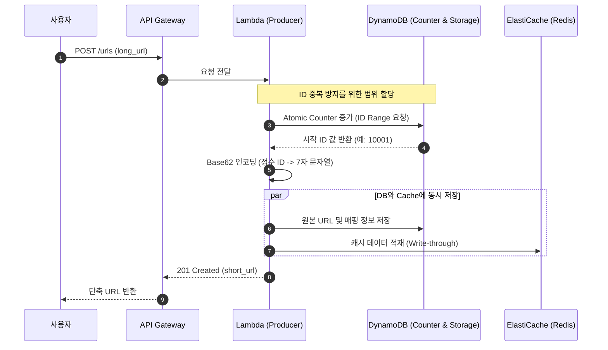
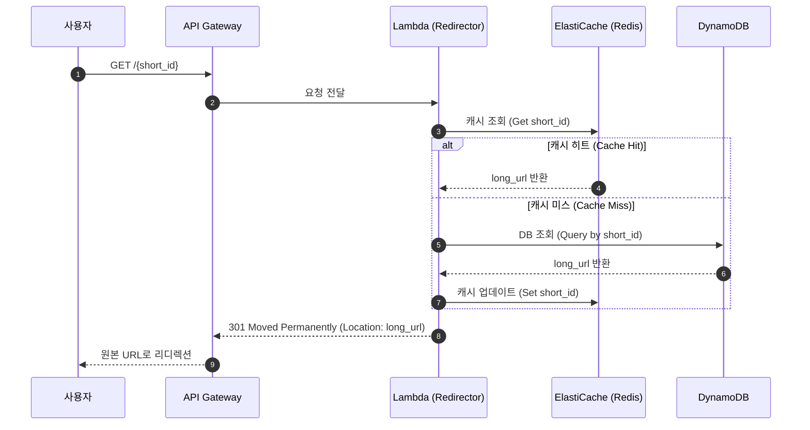

URL단축기란 긴 URL을 짧게 줄이는 사이트이다. 

어떤 이점이 있지?

→ **모바일 + 메신저 환경**에서 보기 좋다.

---

## 1. 요구사항 정의

### 1.1 기능 요구사항

- 긴 URL을 입력받아 고유한 단축 URL 생성
- 단축 URL 접근 시 원본 URL로 리디렉션
- 단축 URL은 삭제 및 수정 불가 (immutable)

### 1.2 비기능 요구사항

- 단축 URL 길이: 가능한 짧게 (7자 이하 권장)
- 문자셋: 영문 대소문자 + 숫자 (총 62개 문자)
- 고가용성, 확장성, 탄력성

### 1.3 용량 추정

| 항목 | 값 |
| --- | --- |
| 일일 단축 URL 생성 | 1억 개 |
| 쓰기 QPS | ~1,160 req/s |
| 읽기:쓰기 비율 | 10:1 |
| 읽기 QPS | ~11,600 req/s |
| 10년 총 레코드 | 3,650억 개 |
| 스토리지 (100byte/URL) | 36.5 TB |

---

## 2. API 설계

### 2.1 URL 단축 API

**POST /api/v1/shorten**

Request Body:

```json
{
  "longUrl": "https://example.com/very/long/url/path"
}
```

Response:

```json
{
  "shortUrl": "https://short.url/abc123"
}
```

### 2.2 리디렉션 API

**GET /:shortCode**

Response: HTTP 301 Redirect with Location header

---

## 3. HTTP 리디렉션 전략

### 3.1 301 vs 302 비교

| 구분 | 301 Permanent | 302 Temporary |
| --- | --- | --- |
| 캐싱 | 브라우저/CDN 캐싱 O | 항상 origin 서버 경유 |
| 서버 부하 | 낮음 | 높음 |
| 추적 가능성 | 불가능 | 가능 (클릭 분석) |
| SEO | Link juice 전달 | 전달 안됨 |

**대부분의 프로덕션 환경에서는 301을 기본으로 사용한다.**

- 이유 1: 캐싱을 통한 latency 감소 및 서버 부하 대폭 감소
- 이유 2: SEO 관점에서 link juice가 원본 URL로 전달됨
- 302는 A/B 테스트, 일시적 우회 등 특수한 경우에만 사용

### ?? 고려사항

301은 브라우저가 오랫동안 캐싱한다. 즉, 실수로 잘못된 매핑을 301로 뱉으면 그 사용자는 평생 잘못된 페이지로 간다.

1. 초반 운영/롤아웃: **302/307 →** 안정화 이후: **301**
- cloudfront, cloud flare에서 http status 설정 가능
    
    https://docs.aws.amazon.com/AmazonCloudFront/latest/DeveloperGuide/http-3xx-status-codes.html?utm_source=chatgpt.com
    
    https://developers.cloudflare.com/rules/url-forwarding/single-redirects/settings/?utm_source=chatgpt.com
    
2. **301 + Cache-Control max-age** 로 제한적 캐싱 제어

---

## 4. 단축 URL 생성 알고리즘

### 4.1 방법 1: 해시 + 충돌 해소

**동작 방식**

1. 긴 URL을 해시 함수(MD5, SHA-256 등)로 해싱
2. 해시값의 앞 7자리 추출
3. 충돌 발생 시 해시값에 문자열 덧붙여 재시도

**장점**

- 구현이 단순함
- 유일 ID 생성기 불필요
- 단축 URL 길이가 고정됨

**단점**

- 충돌 발생 시 DB 조회 오버헤드
- Bloom Filter로 일부 완화 가능

### 4.2 방법 2: Base62 변환

**동작 방식**

1. 유일한 ID 생성 (auto-increment, UUID, Snowflake 등)
2. ID를 Base62로 인코딩 (0-9, a-z, A-Z)
3. 예: ID 125 → base62(125) = '2D'

**장점**

- 충돌 불가능 (ID 유일성 보장)
- 구현이 간단하고 예측 가능

**단점**

- 단축 URL 길이가 가변적 (ID 증가에 따라)
- Sequential ID 사용 시 다음 URL 예측 가능 (보안 이슈)
- 분산 환경에서 유일 ID 생성기 필요 (Snowflake, DB sequence 등)

### 4.3 비교 및 선택 가이드

| 기준 | 해시 + 충돌 해소 | Base62 변환 |
| --- | --- | --- |
| URL 길이 | 고정 | 가변 |
| 충돌 가능성 | 있음 | 없음 |
| ID 생성기 | 불필요 | 필요 |
| 보안 (URL 예측) | 안전 | Sequential ID 시 취약 |

대부분의 경우 Base62 방식을 사용하되, ID 생성기는 Snowflake 같은 분산 ID 생성 알고리즘을 활용하여 예측 불가능성을 확보한다. 

---

## 5. 시스템 아키텍처

### 5.1 URL 단축 플로우



<aside>
?

### 위험할 수 있다.

단축 URL을 만들 때마다 서버가 이 long URL을 하고 DB나 캐시에 먼저 확인 구조인데
이 존재 여부 확인 쿼리 자체가 외부에서 마음대로 두들길 수 있는 엔드포인트가 된다.

→ INSERT only, rate limiter 등을 도입해야한다.

</aside>

### 5.2 URL 리디렉션 플로우



### ? Tip

Cloudflare Workers 나 AWS Lambda@Edge로 DB 안 거치고 리디렉션 가능하게 해놓으면 더 빠르다.

---

## 6. 데이터베이스 설계

### 6.1 테이블 스키마

```sql
CREATE TABLE url_mappings (
  id BIGINT PRIMARY KEY,
  short_code VARCHAR(10) UNIQUE NOT NULL,
  long_url TEXT NOT NULL,
  created_at TIMESTAMP DEFAULT CURRENT_TIMESTAMP,
  INDEX idx_short_code (short_code),
  INDEX idx_long_url_hash (long_url(255))
);
```

- **short_code:** 읽기 쿼리의 primary key, unique index 필수
- **long_url:** 중복 체크를 위한 prefix index (255자)

### 6.3 확장 전략

- **샤딩:** short_code 기준 해시 샤딩 또는 range 샤딩

---

## 7. 캐싱 전략

### 7.1 캐시 키 설계

- **키 패턴:** `url:short:{shortCode}`
- **값:** 원본 URL 문자열

### 7.2 캐시 정책

- **TTL:** 24시간 (트래픽 패턴에 따라 조정)
- **Eviction:** LRU 정책
- **Cache-aside 패턴:** 읽기 시 캐시 미스면 DB 조회 후 캐싱

### 7.3 캐시 워밍

트래픽이 많은 상위 URL은 주기적으로 미리 캐싱하여 cache miss를 최소화한다. 스케줄링 등을 통해 피크 타임 전에 캐시를 준비할 수 있다.

---

## 8. Rate Limiter

Rate limiter의 위치 선정이 중요하다:

- 너무 앞단(CDN)에서 걸면 → 악의적인 짧은 URL 생성 공격 막기 어려움
- 너무 뒷단(DB 앞)에서 걸면 → 서버가 이미 부하를 받음

**권장 전략:**

보통 **API Gateway 또는 Application 레벨**에서 사용자/IP별 rate limit을 두고, 추가로 **shorten API에 하루/사용자당 생성 제한**을 두는 것이 효과적입니다.

---

- 초기에는 단순한 구조로 시작하여, 트래픽 증가에 따라 점진적으로 캐싱, 샤딩, CDN 등을 도입하는 것이 바람직하다. 기능과 비기능 요구사항과 용량을 추정해서 오버엔지니어링 하지 않도록 유의해야할 것 같다. 하지만 설계시에 캐시, ID 생성, DB 샤딩 전략은 처음부터 어느 정도 미래를 염두에 두고 설계해야한다.
- 아얘 서버가 필요하지 않을 수 있다. 서버리스 아키텍처가 가능하다. 하지만 트래픽이 많다면 요금이 훨씬 비싸다.





- spring에서 처리를 해야한다면 전통적인 MVC환경에서의 운용을 힘들수도 있겠다. 쓰레드를 늘려도 또 DB 커넥션 수도 맞춰야하기 때문이다. 따라서 최대한 캐시 히트율이 떨어지지 않도록 관리해야한다.