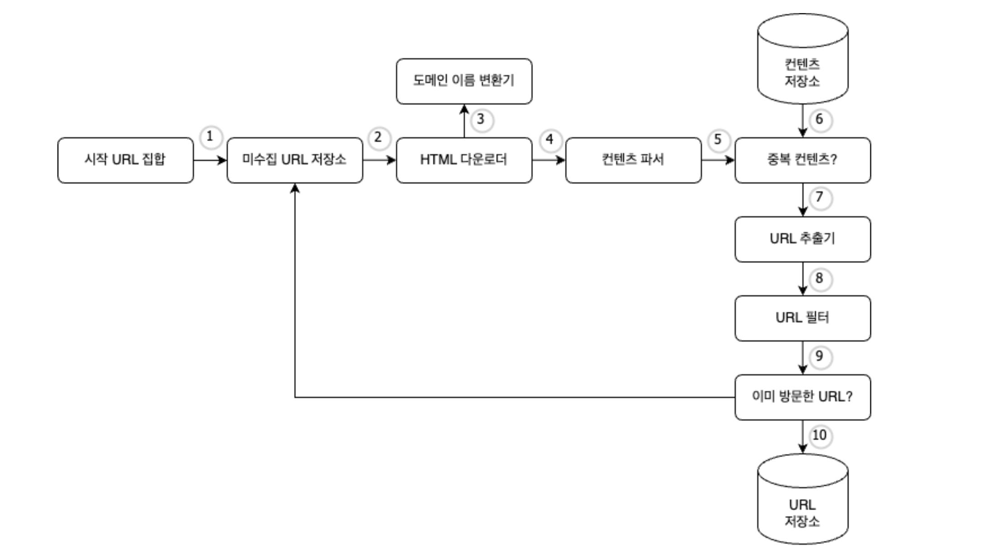
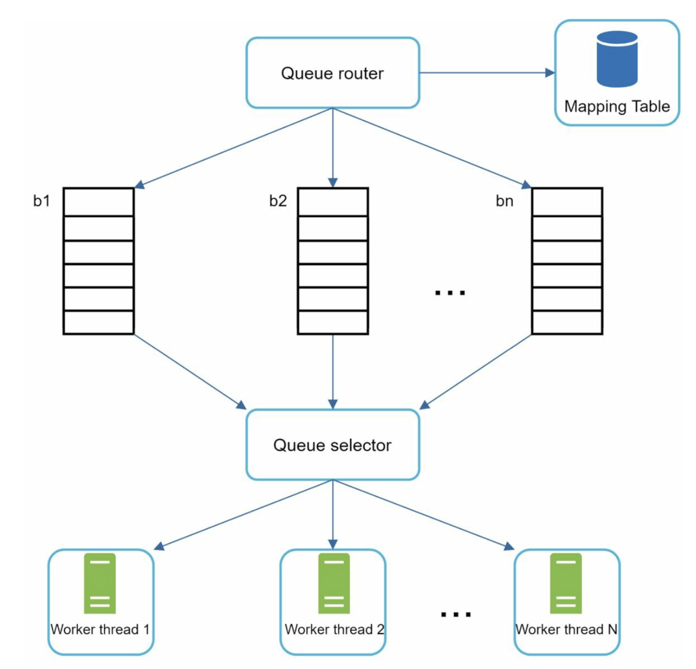
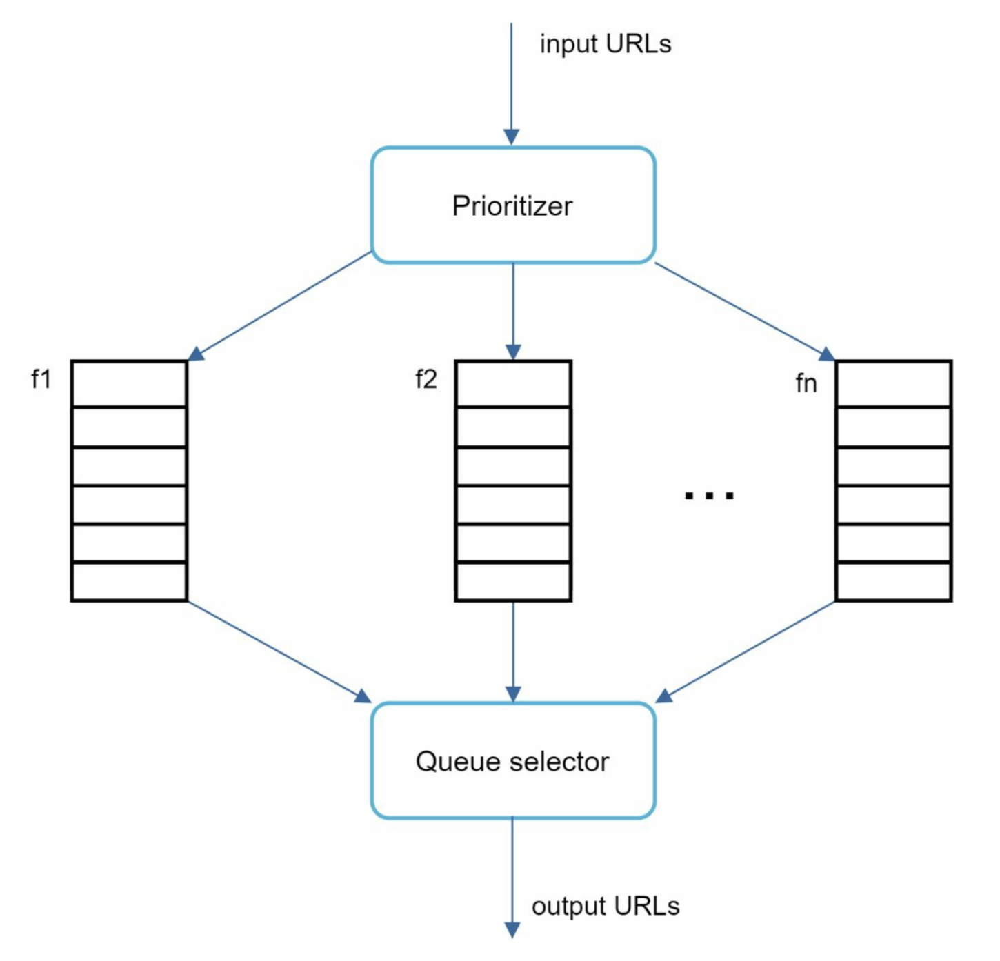

> 목적: **검색 엔진 인덱싱용 대규모 웹 크롤러**를 시스템 설계 관점에서 정리
> 

---

## 1) 문제 이해 & 스코프 확정

### 웹 크롤러가 하는 일

1. URL 집합이 입력으로 주어지면, 모든 웹 페이지를 다운로드
2. 다운로드한 문서에서 새 URL 추출
3. 새 URL을 다시 다운로드 대상으로 넣고 반복

### 인터뷰에서 먼저 물어봐야 할 것

- 용도: 검색 인덱싱 vs 아카이빙 vs 마이닝
- 규모: 월 몇 페이지? (예: 10억 페이지/월)
- 컨텐츠 타입: HTML만? PDF/이미지/동영상 포함?
- 변경 페이지 재방문(재크롤) 필요?
- 저장 기간(예: 5년) / 중복 컨텐츠 처리(동일 페이지/동일 컨텐츠)

### 좋은 크롤러의 설계 원칙

- **Scalability**(수평 확장), **Robustness**(안정성),
- **Politeness**(예절), **Extensibility**(새 타입/정책 추가 용이)

---

## 2) 개략적 설계안 제시 및 동의 구하기

가정(예시): **월 10억 페이지**, 평균 **500KB/page**, **5년 보관**

- QPS ≈ 1,000,000,000 / (3024360) ≈ **400 QPS**
- Peak QPS ≈ **800 QPS**
- 월 저장량 ≈ 10억 * 500KB = **500TB / month**
- 5년 저장량 ≈ 500TB * 12 * 5 = **30PB**

> 포인트: **저장 비용이 설계의 중심축**이며, “무엇을 저장할지(원문 HTML vs 파싱 결과)”가 비용/확장성에 직결.
> 

- **시작 URL 집합:** 웹 크롤러가 작동하는 출발점으로, 특정 도메인 이름이 될 수도 있고, 전체 웹이 될 수도 있다.
    - 특정 도메인이 붙은 모든 페이지의 URL을 시작 URL로 사용할 수 있다.
    - 시작 URL로 무엇을 쓸 것이냐는 질문에 정답은 없다. 의도가 무엇인지만 정확히 전달하도록 하자.
- **미수집 URL 저장소:** 현대적 웹 크롤러는 크롤링 상태를 ‘다운로드 할 URL’ 그리고 ‘다운로드된 URL’의 두 가지로 나눠 관리한다.
    - 다운로드 할 URL을 저장, 관리하는 컴포넌트를 미수집 URL 저장소(URL frontier)라고 부른다. (FIFO 방식)
- **HTML 다운로더:** 인터넷에서 웹 페이지를 다운로드 하는 컴포넌트로, 다운로드할 페이지의 URL은 미수집 URL 저장소가 제공한다.
    - **도메인 이름 변환기:** 웹페이지를 다운받으려면 URL을 IP로 변환하는 절차가 필요하다. HTML 다운로더가 이를 위해 도메인 이름 변환기를 이용한다.
- **콘텐츠 파서:** 웹 페이지를 다운로드하면 파싱과 검증 절차를 거쳐야한다. 이상한 페이지는 문제를 일으킬 수 있고, 저장 공간만 낭비하기 때문이다.
    - 크롤링 서버 안에 파서를 구현하면 크롤링 과정이 느려질 수 있어 독립된 컴포넌트로 분리하였다.
- **중복 콘텐츠인가?:** 웹에 공개된 연구 결과에 따르면, 29% 가량의 웹 페이지 콘텐츠는 중복이다. 따라서 같은 컨텐츠를 여러 번 저장하게 될 수 있다.
    - 문자열을 비교하는 방법은 간단하지만 규모가 커질수록 비효율적이다.
    - 효과적인 방법은 웹 페이지의 해시 값을 비교하는 것이다.
- **콘텐츠 저장소:** HTML 문서를 보관하는 시스템으로, 저장할 데이터의 유형, 크기, 저장소 접근 빈도, 데이터 유효 기간 등을 종합적으로 고려하여 설계한다.
    - 데이터 양이 너무 많아 대부분은 디스크에 저장 → RDB?
    - 인기 있는 콘텐츠는 메모리에 두어 지연시간을 줄인다 → 캐시
    - 본 설계안의 경우 디스크(보통 컨텐츠)와 메모리(접근 빈도수 높은 컨텐츠)를 동시에 쓰는 저장소를 택할 것이다.
- **URL 추출기:** HTML 페이지를 파싱하여 링크들을 골라내는 역할을 한다.
- **URL 필터:** URL 저장소에 저장하기 일부 URL을 크롤링 대상에서 배제하는 역할을 한다.
    - 특정한 컨텐츠 타입이나 파일 확장자를 갖는 URL
    - 접속 시 오류가 발생하는 URL
    - 접근 제외 목록(deny list) 에 포함된 URL 등
- **이미 방문한 URL?:**
    - 해시 테이블
    - 블룸 필터

---

## 3) 상세 설계

### 미수집 URL 저장소

미수집 URL 저장소를 활용하면 예의를 지킬 수 있다. 앞서 살펴본 대로 URL 저장소는 다운로드할 URL을 보관하는 장소다. 이 저장소를 잘 구현하면 예의(politeness) 를 갖추면서, 우선순위와 신선도를 구별하는 크롤러를 구현할 수 있다.

### **예의**

웹 크롤러는 수집 대상 서버로 짧은 시간 안에 너무 많은 요청을 보내는 것을 삼가야 한다. 너무 많은 요청을 보내는 것은 무례한(impolite) 일이며, DoS(Denial-of-Service)로 간주되기도 한다.

예의 바른 크롤러를 만드는 데 있어서 지켜야 할 원칙은 다음과 같다.

> **동일 웹 사이트에 대해서는 한 번에 한 페이지만 요청한다.**
> 
> - 같은 웹 사이트의 페이지를 다운받는 경우, 해당 작업에 시간차를 두고 실행한다.
> - 각 다운로드 스레드가 별도의 FIFO 큐를 가지고, 해당 큐에서 꺼낸 URL만 다운로드하게 하면 된다.

- 매핑 테이블: 호스트 이름과 큐 번호 사이의 관계를 보관하는 테이블
- 큐 라우터: 같은 호스트에 속한 URL은 언제나 같은 큐로 가도록 보장하는 역할
- 큐 선택기: 큐들을 순회하면서 URL을 꺼내, 작업 스레드로 전달하는 역할
- 작업 스레드: URL을 다운로드하는 작업을 수행 → 지연시간 둘 수 있음

### **우선순위**

모든 페이지가 같은 중요도를 가지지는 않는다. 유용성에 따라 URL의 우선순위를 나눌 때는 페이지랭크(PageRank), 트래픽 양, 갱신 빈도 등 다양한 척도를 사용할 수 있다.

큐마다 우선순위를 매기고, 선택기에서 우선순위가 더 높은 큐를 자주 소비하도록 프로그래밍하면 된다.

> 위 두 모듈을 합쳐, 전면 후면 큐로 운영하면 우선순위 + 예의를 보장하는 크롤러를 만들 수 있다.
>

### **신선도**

웹페이지는 수시로 추가되고, 삭제되고, 변경되므로 데이터의 신선함(freshness)를 유지하기 위해서 이미 다운받은 페이지라고 해도 재수집할 필요가 있다. 이 작업을 최적화하기 위한 전략으로는 다음과 같은 것들이 있다.

- 웹 페이지의 변경 이력 활용
- 우선순위가 높은 페이지는 더 자주 재수집

### **💡문제 있는 콘텐츠 감지 및 회피**

### 중복 콘텐츠

해시나 체크섬 등의 방법을 통해 중복 콘텐츠를 쉽게 탐지할 수 있다.

### 거미 덫 (spider trap)

크롤러를 무한루프에 빠뜨리도록 설계한 웹 페이지

- 무한히 깊은 디렉토리 구조 (`spidertrapexample.com/foo/bar/foo/bar/foo/bar…`)

URL의 최대 길이를 제한하면 회피할 수 있다.

- 모든 종류를 다 피할수는 없다.

수작업을 통해 확인하고 찾아내어 크롤러 탐색 대상에서 제외하거나 URL 제외 필터 목록에 넣어둔다.

### 데이터 노이즈

어떤 콘텐츠는 가치가 없을 수 있다.

- 광고, 스크립트 코드 등 이런 콘텐츠는 가능한 제외해야 한다.