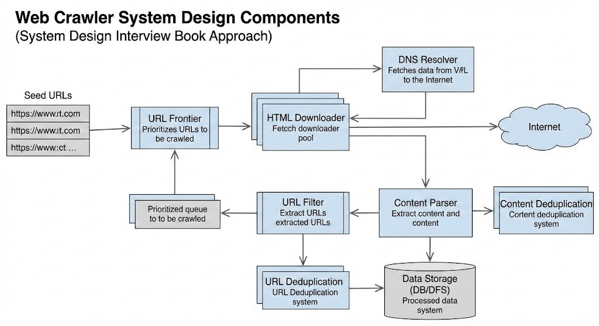
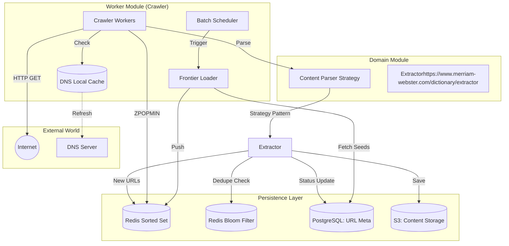
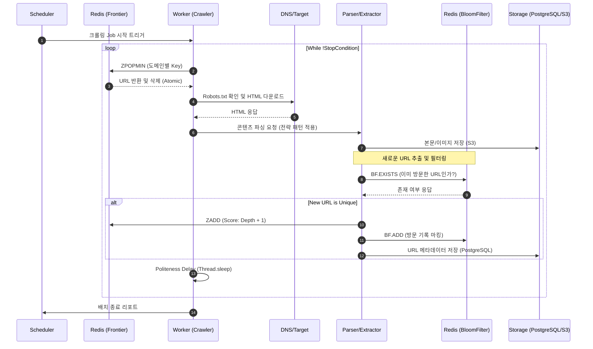

## 웹 크롤러
* 웹에 새로 올라오거나 갱신된 콘텐츠를 찾아내는 프로그램
* 특정 페이지에서 시작해서 링크를 따라나가면서 새로운 콘텐츠 지속적으로 수집

### 용도
* 검색 엔진 인덱싱
  * Google Search
* 웹 아카이빙
  * 특정 페이지를 스냅샷으로 저장하여 관리하기 위함
* 웹 마이닝
  * 웹의 방대한 데이터를 수집하는 것에 그치지 않고 수집한 데이터로 비즈니스에 맞게 분석하는 용도 -> AI 접목
  * 주식 시장 예측을 위한 뉴스 분석, 이커머스 트렌드 분석, 타겟 마케팅 정보 추출
* 웹 모니터링
  * 웹의 정보 변경, 저작권 침해 등을 감시
  * 가격 변동 모니터링(최저가 알림), 저작권 위반 사례 감시

---
## 1. 문제 이해 및 범위 확정
* 크롤링할 URL 리스트들이 가리키는 모든 웹 페이지를 다운로드한다.
* 다운받은 웹 페이지에서 URL들 추출
* 추출된 URL을 다시 URL 리스트에 넣고 위의 과정을 반복

### 설계 범위
* 검색엔진 용도
* 매달 10억 개의 웹 페이지 수집
* 수집한 웹 페이지 5년간 저장
* 중복된 콘텐츠는 무시

### 일반적인 크롤러 설계
* Scalability : 웹 페이지는 수억개가 존재하므로 크롤러를 병렬으로 설계 
* Robustness : 악성 코드가 붙어있는 URL 등을 안전하게 처리
* Politeness : 동일 URL에 대한 요청 빈도 제한
* Extensibility : 여러 형태의 컨텐츠 크롤링을 염두에 두고 설계 (e.g HTML, 이미지 파일, ...)

* e.g) 국내/해외 여러 신문사의 뉴스들을 크롤링한다.

---
## 크롤러 컴포넌트

😂책의 내용들이 뭔가 얕고 안 읽혀져서 구현 단까지 어떻게 설계할지 컴포넌트 별로 기입!

### 크롤링 트리거
* 배치 스케줄링을 통해 트리거
* 비즈니스에 따라 주기, 스케줄을 여러개 둘 것 같다.
* 대기업 채용 공고는 자주 바뀌는 정보가 아니므로 하루에 1번 정도로 크롤링하면 될 것 같고, 주식같은 실시간 변화를 알아야한다면 분/시간 단위로 트리거할 것 같다.

### 시작 URL 리스트
* 각 기업들의 채용 사이트 시작지점의 URL을 선정
  * 최대한 수집할 데이터가 많은 경우의 수를 선정해야 하는데, 메인 페이지에서 여러 링크를 접속하므로?
  * https://recruit.navercorp.com/main.do
  * https://careers.kakao.com/index
  * ...

### URL Frontier (미수집 URL 저장소)
* 처음 시작 URL 리스트를 미수집 URL 저장소에 저장한다.
* 해당 저장소의 URL을 BFS로 꺼내서 Queue에 넣는다.
  * DFS는 하나 도메인만 깊게 가서 중단 지점이 애매해지고 여러 정보를 얻기 힘들다.
* 저장소 결정
  * 수집할 웹 페이지가 매달 10억개, 하루당 약 3천 3백만개 정도이므로 크롤러 애플리케이션을 Scale Out 해야할 것이다.
  * Redis를 사용해서 시작 URL 리스트 저장
      * 서버 분산 시 문제없도록
      * 다양한 자료구조로 구현 가능
* Sorted Set으로 우선순위를 가지는 URL 구현
  * Key로 시작 URL별 도메인 지정 (Polite 지키기위해)
    * frontier:host:naver.com
    * frontier:host:kakao.com
    * ...
  * 우선순위를 Application에서 정해서 해당 우선순위 Score로 저장
* 해당 Key별로 전략 패턴을 이용해서 이후 로직들을 처리하고, 로직이 끝날 때 delay 수행, set에서 제거 (Polite 지키기위해)
* 우선순위 기준은 비즈니스에 따라 커스텀하게 로직 만들기
  * 신선도 (최근에 업데이트된 페이지 우선)
  * 접근성 (depth 작은 페이지)
  * ...

### HTTP 다운로더
* URL Frontier에서 URL을 꺼내서 HTTP 요청을 보내고 응답을 받는 컴포넌트
* 이때, 해당 도메인의 robots.txt를 확인하여 allow인 URL만 필터링해야한다.
* URL을 DNS에서 IP로 변환하는 과정이 병목 (10ms~200ms)
  * 캐시를 사용해서 domain / IP를 저장 후 스케줄링을 통해 갱신
* TimeLimiter 적용
  * 응답이 너무 느린 URL은 일정 시간 이후에 타임아웃 처리

### 컨텐츠 파서
* 다운로드한 페이지에서 Content 추출
  * e.g) HTML 페이지에서 텍스트, 이미지, 링크 등 추출
* 컨텐츠 중복 체크를 위해 특정 저장소에 컨텐츠를 저장해놓기
  * 크기가 크다면 S3 저장, 아니면 디스크 저장
  * 이후 비교 시 해시함수를 통해 비교
* 정보 추출 시 확장성을 위해 상황에 맞게 모듈, 전략 패턴으로 설계
  * 1. 도메인(호스트)별 전략
    * Naver URL 추출 전략
    * Kakao URL 추출 전략
  * 2. 특정 패턴별 전략
    * 링크 상대경로 전략
    * 링크 절대경로 전략
  * 3. 추출 대상별 전략
    * URL 추출 모듈
    * 이미지 모듈
  * ...

### 추출한 컨텐츠 필터링
* 특정 컨텐츠를 필터해야 한다면 필터링 구현

### URL 저장소
* 처리를 마친 URL은 디스크에 저장
* 저장 시 미수집 URL 저장소에도 저장

### 크롤링 중단 시점
* Sorted Set 데이터 없을 때
* 수집 최대 페이지 수 카운트하고 도달 시
* BFS에서 특정 Depth 도달 시
* Timeout

