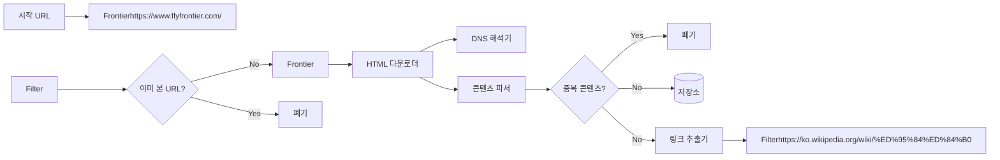
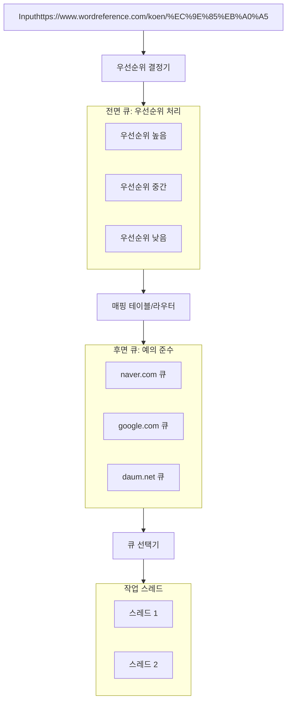
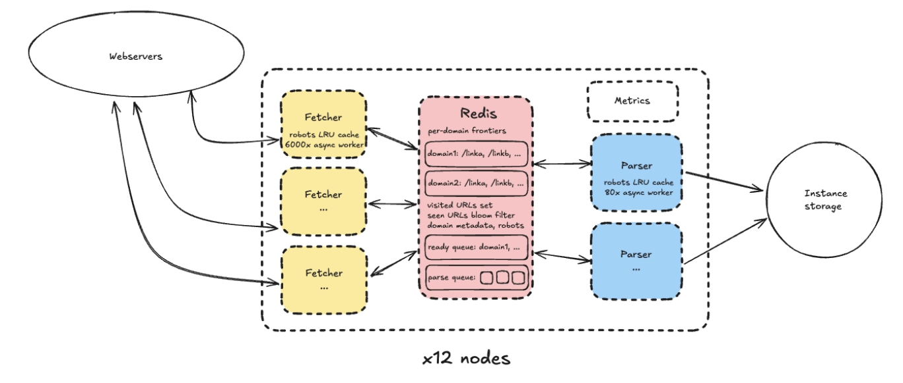

웹크롤러

- 검색·콘텐츠 계열
    - 검색 엔진: 구글, 네이버처럼 웹 페이지를 수집해서 인덱스를 만들고, 순위 알고리즘이 쓸 문서·링크·메타데이터를 모은다.
    - 뉴스·콘텐츠 집계: 여러 언론사·블로그의 기사, 리뷰, 게시글을 모아서 포털 뉴스, 콘텐츠 큐레이션 서비스, 뉴스레터 등에 공금한다.
- 가격·여행·커머스 계열
    - 항공권·호텔 최저가 비교: Skyscanner 같은 서비스가 항공사·OTA 사이트에서 항공권 가격, 일정, 좌석 클래스, 프로모션 정보를 긁어와 한 화면에서 비교할 수 있게한다.
    - 쇼핑 가격 비교·모니터링: 여러 이커머스·오픈마켓에서 상품 가격, 재고, 리뷰를 모아서 가격 비교, 경쟁사 가격 모니터링, 동적 가격 책정에 활용한다.
- B2B 데이터·세일즈 인텔리전스
    - 기술 스택·웹 기술 분석: BuiltWith처럼 웹사이트들을 크롤링해 사용하는 프레임워크, 분석 도구, 결제 모듈 정보를 수집하고, “어떤 회사를 타깃으로 영업할지”를 분석한다.
    - 리드·영업 데이터 수집: 기업 웹사이트, 채용 공고, 뉴스, SNS를 크롤링해서 잠재 고객 리스트, 투자 소식, 조직 변화 등을 자동으로 모은다.
- 데이터·AI·리서치
    - AI 학습 데이터 수집: 텍스트·코드·이미지·뉴스·논문 등 대규모 학습 데이터를 모으는 데 웹 크롤러가 활용된다.
    - 웹 마이닝·리서치: 학계나 기업에서 트렌드 분석, 여론 분석, 시장 조사 등을 위해 특정 도메인/키워드 관련 페이지를 대량 수집한다.

---

## 1단계: 문제 이해 및 설계 범위 확정

코드를 바로 작성하기 전에 요구사항을 명확하게 정리한다.

### 기본 요구사항 정리표

| **항목** | **내용 및 제약조건** | **비고** |
| --- | --- | --- |
| 주된 용도 | **검색 엔진 인덱싱**(SEO) |  |
| 수집 대상 | 매달**10억**개의 웹 페이지 |  |
| 수집 포맷 | **HTML**만 수집 | 트래픽 및 저장소 비용 절감 |
| 데이터 보관 | **5년**간 보관 |  |
| 중복 처리 | **중복된 콘텐츠는 무시** |  |
| QPS | 평균**400 QPS**, 최대**800 QPS** |  |
| 예의 | 대상 서버에 과도한 부하를 주지 않기 | robots.txt규칙 준수 및 요청 간격 조절 필요 |

### 규모 계산하기

- **QPS**

$$
QPS = 1,000,000,000 / (30 × 24 × 3600)
    ? 386 req/s
$$

- **저장 용량:**
    - 페이지당 평균 크기: 500KB (HTML + 헤더)
    - 5년 저장 용량: 30PB

<aside>
?

30PB는 일반적인 데이터베이스에 저장할 수 있는 양이 아니기때문에. 반드시 **HBase, Cassandra** 같은 NoSQL 데이터베이스나 **S3, HDFS(HBase), NAS** 같은 분산 **파일 시스템을** 사용해야함. 

</aside>

---

## 2단계: 개략적 설계안 (High-Level Design)

전체 시스템을 관통하는 데이터 흐름을 먼저 잡고 가자. 아래 다이어그램은 크롤러의 생명주기를 보여줘.

### 핵심 컴포넌트 설명

1. **시작 URL 집합:** 크롤링을 시작하는 URL 목록. 전체 웹을 커버하려면 쇼핑, 뉴스, 포털 등 카테고리별로 주요 사이트를 선정해야 한다
2. **URL 프론티어:** 수집할 URL을 저장하고 관리하는 큐. 우선순위와 크롤링 정책을 여기서 결정한다
3. **HTML 다운로더:** 웹 페이지를 다운로드하는 컴포넌
4. **DNS 해석기:** URL을 IP 주소로 변환한다. 병목이 발생하기 쉬운 구간
5. **콘텐츠 파서:** HTML을 파싱하고 검증. 잘못된 태그나 손상된 파일로 인한 시스템 오류를 방지
6. **중복 판별기:** 웹 페이지의 약 30%는 중복. 해시값 비교로 중복을 제거하여 리소스를 절약
7. **링크 추출기:** HTML의 <a> 태그에서 `href` 속성을 추출하여 새로운 URL을 수집
8. **URL 필터:** 특정 확장자(.png, .pdf 등) 제외, 블랙리스트 도메인 차단 등을 수행

---

## 3단계: 상세 설계

### 3.1 DFS vs BFS:

웹은 거대한 유향 그래프

- **DFS (깊이 우선 탐색):** 
그래프의 깊이를 알 수 없으므로 크롤러에는 **부적합**
- **BFS (너비 우선 탐색):** 
**표준이다.** 얕은 부분부터 넓게 탐색한다.
- 단점
    1. **임폴라이트:** 같은 도메인의 링크가 연속으로 나타날 확률이 높다. 이를 순서대로 처리하면 특정 서버에 초당 수백 건의 요청이 집중되어 DDoS 공격으로 오인될 수 있다.
    2. **우선순위 부재:** 모든 페이지의 가치가 동일하지 않다. 뉴스 메인 페이지와 3년 전 게시판 글은 중요도가 다르다.

### 3.2 URL 프론티어 설계

URL 프론티어는 단순한 FIFO 큐가 아니야. 우선순위와 예의를 동시에 만족시키는 복합적인 큐 시스템이어야 한다.

### 아키텍처: 전면 큐와 후면 큐의 분리

1. **전면 큐 (우선순위):**
    - **역할:** URL의 중요도를 판단한다. PageRank, 트래픽 양, 갱신 빈도 등을 기준으로 우선순위를 매겨서 서로 다른 큐에 넣는다.
    - **구현:** `Kafka`나 `RabbitMQ`의 우선순위 기능을 사용하거나, `Redis Sorted Set`을 사용할 수 있다.
2. **후면 큐 (예의):**
    - **역할:** 같은 호스트(도메인)의 URL은 같은 큐에 넣는다.
    - **핵심 로직:** **"한 큐는 한 번에 하나의 작업 스레드만 처리한다."** 작업과 작업 사이에 딜레이를 둔다. 이렇게 하면 특정 서버에 부하를 주지 않는다.
    - **매핑 테이블:** 어떤 호스트가 어떤 큐에 들어가 있는지 관리하는 테이블이 필요하다.

<aside>
?

책에서는 메모리 큐를 이야기하지만, 10억 개의 URL을 메모리에 다 올리면 OOM이 발생한다.

실제로는 **Redis**를 버퍼로 사용하고, 처리가 밀리면 **Disk**로 내려야 한다. URL 프론티어 자체가 병목이 될 수 있으므로 이 부분도 샤딩이 필요하다.

</aside>

### 3.3 HTML 다운로더 최적화

다운로더는 성능의 핵심이다. 여기서 시간을 줄여야 전체 효율이 올라간다.

1. **Robots.txt 캐싱**
    
    `robots.txt`매 요청마다 다운받으면 엄청난 낭비다. 주기적으로(예: 1시간) 다운받아 메모리에 캐싱해야 한다.
    
2. **DNS Resolver 최적화**
    
    DNS 요청은 동기적이라 스레드를 블로킹한다. 평균 10ms~200ms가 걸리는데, 이게 쌓이면 병목이 된다.
    
    **DNS 전용 캐시**를 만들고, 크롤러 시작 전에 주요 도메인 IP를 미리 프리페칭해두는 것이 좋다.
    
3. **지역성 활용**
    
    크롤링 대상 서버가 미국에 있으면, 미국 리전의 EC2에서 크롤링하는 게 훨씬 빠르다. 네트워크 지연시간을 줄이는 것이다.
    
4. **타임아웃 설정**
    
    타임아웃을 짧게(예: 5초) 설정하고 실패시 빠른 포기 해야 한다.
    

### 3.4 안정성 확보

서버 장애, 전원 차단, 악성 코드 등 다양한 상황에 대비해야 한다.

- **안정 해시**
    
    서버 하나가 다운되어도 전체 해시 키를 재분배하지 않고, 해당 서버의 부하만 인접 서버로 분산할 수 있다.
    
- **크롤링 복구**
    
    크롤러가 중단되었을 때 처음부터 다시 시작하는 것은 비효율적이다. 현재 진행 상황의 스냅샷을 디스크에 주기적으로 저장해야 한다.
    
- **예외 처리**
    
    HTML 파싱 중 에러가 발생해도 전체 프로세스가 중단되어서는 안 된다. `try-catch`로 꼼꼼히 처리하고, 에러 로그만 남긴 뒤 다음 작업으로 진행해야 한다.
    

### 3.5 확장성 - 플러그인 아키텍처

갑자기 "PNG 이미지도 수집해줘"라는 요구사항이 생긴다면?

코드를 전면 수정하지 않고 모듈만 추가해서 대응할 수 있게 설계해야 한다.

- `HTML 다운로더` → `[플러그인: 이미지 추출]` → `[플러그인: URL 추출]` → `[플러그인: 이메일 추출]`
- 이런 파이프라인 형태로 구성하는 것이 좋다.

### 3.6 문제 있는 콘텐츠 감지 및 회피

- **중복 콘텐츠**
    - 해시(MD5, SHA-256)는 조금만 바뀌어도 값이 완전히 달라져서 비효율적
    - **SimHash** 같은 알고리즘을 사용시 "거의 비슷한" 문서도 잡을 수 있다
- **스파이더 트랩(Spider Trap)**
    - URL 최대 길이를 제한하거나, 특정 패턴이 반복되면 차단하는 로직을 넣어야 해.
- **데이터 노이즈**
    - 광고, 스팸, 내비게이션 바 같은 쓸모없는 정보는 파싱 단계에서 제거해야 저장소를 아낌

---

## 4단계: 마무리 및 추가 고려사항

### 1. Server Side Rendering과 동적 페이지

최근 웹사이트 중에는 React나 Vue.js로 만든 SPA가 많다. 이런 사이트는 서버에서 완성된 화면을 내려주지 않고, 최소한의 HTML만 전달. 실제 화면 내용은 브라우저에서 자바스크립트가 실행된 뒤에야 API 호출과 렌더링을 거쳐 만들어진다. 따라서 curl처럼 HTML만 받아오는 도구로 확인하면 페이지 내용이 비어 있는 것처럼 보인다.

- **Playwright, Selenium** 같은 툴을 사용한다.
    
    **단점:** 실제로 띄우는거라서 일반 HTTP 요청보다 리소스를 크게 소모한다.
    

### 2. 안티 스크래핑 우회

많은 사이트가 크롤러를 차단한다.

- **User-Agent 로테이션:** 요청마다 User-Agent 헤더를 변경
- **IP 로테이션 :** 한 IP에서 너무 많이 요청하면 차단된다. IP를 지속적으로 변경

### 3. DB 선택

- **RDBMS:** 스키마가 유연하지 않고 쓰기 속도에 한계가 있어서 권장하지 않는다.
- **NoSQL:**
    - **HBase, Cassandra:** 쓰기 성능이 우수하고 확장이 용이해서 크롤러 저장소에 적합하다. 구글은 Bigtable라는 GCP 리소스를 사용한다.

---

이 책에서는 한 달 동안 10개의 웹페이지를 크롤링하는 예시를 다루지만, 최근 하루 동안 10억 페이지를 크롤링하는 사례가 있어 가져왔다. 이를 따라하며 직접 구현해봐도 좋을 것 같다. 업무상 실제로 크롤러를 구현할 기회는 많지 않을 것 같다.

책에있는 정석적인 내용이랑 상이한 부분이 있어 읽어봐도 좋을것같다.

https://andrewkchan.dev/posts/crawler.html

- 각 역할별로 완전히 나누는 대신 역할을 모두 포함한 노드 12개로 구성했다. url프론티어는 redis로 했다.
    
- selectolax라는 파이썬 html 파서 라이브러리의 성능이 탁월하다
- dns병목은 책과 다르게 크게 없음. 오히려 ssl이 병목이 되는 경우.
- 파싱이 병목이 제일 큼. 파싱의 속도가 크롤링의 성능을 좌우함
- 노드에서 fetcher와 parser는 병렬임