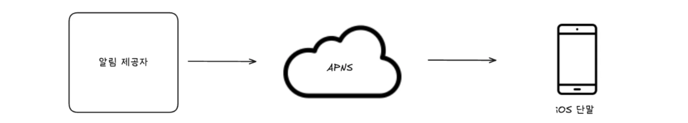
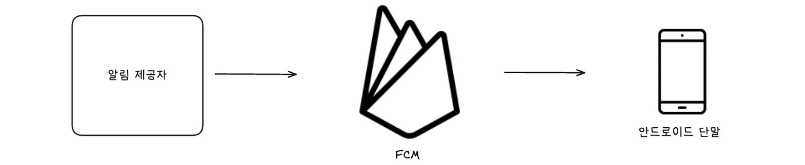
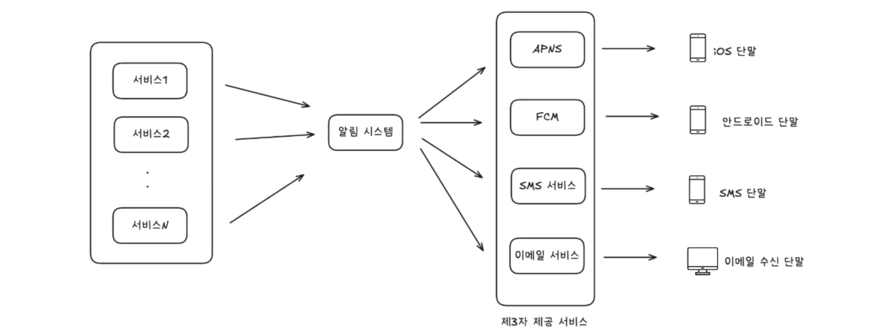
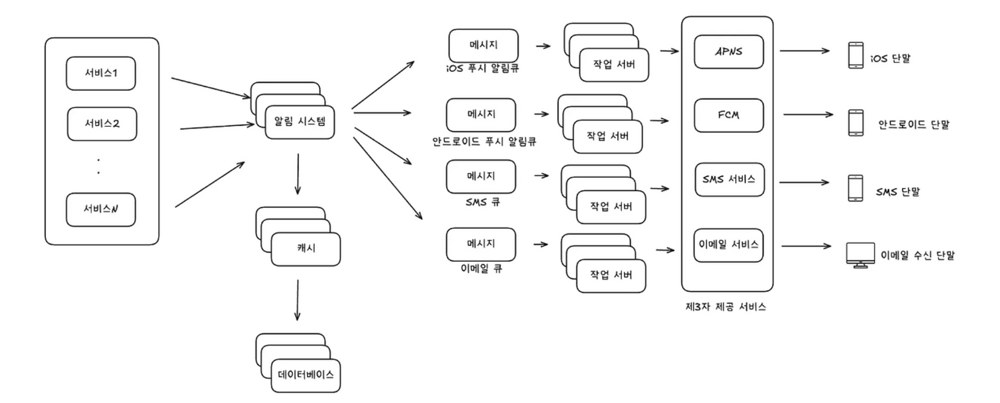
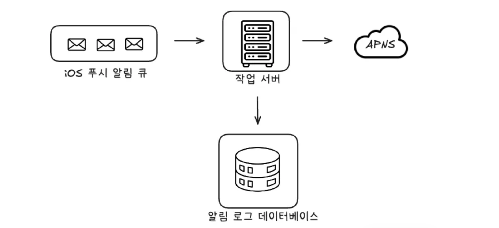

## 1️⃣ 문제 이해 및 설계 범위 확정

- 지원하는 알림 종류
    - 모바일 푸시 알림
    - SMS 메세지
    - 이메일
- 실시간 시스템?
    - 연성 실시간 시스템이라고 가정, 가능한 빨리 전달되면 좋다.
- 지원해야하는 단말 종류
    - iOS, 안드로이드, 랩탑/데스크탑
- 알림을 받지 않도록 설정 할 수 있어야한다.
- 하루 **천만 건**의 모바일 푸시 알림, **백만 건**의 SMS 메세지, **5백만** 건의 이메일

<aside>
💡

유형 별로 요구하는 **트래픽**이 다르니, 같은 서버(워커)에서 모두를 처리하는 것보단, 목적별로 워커를 쪼개서 자유롭게 스케일링 하는게 효과적일 것 같습니다

</aside>

---

## 2️⃣ 개략적 설계안 제시 및 동의 구하기

### iOS 및 안드로이드 푸시 알림

- 모두 APNS(Apple Push Notification Service), FCM(Firebase Cloud Messaging) 이라는 실제 푸시 알림을 담당하는 컴포넌트가 필요하다
- 이는 직접 구현하는 것이 아닌, 존재하는 서비스를 통해 알림을 전송하는 방식

### SMS 메세지, 이메일

- 위와 비슷하게, 대부분 상용 서비스를 통해 실제 알림을 보낸다.
- SMS 메시지
    - 트윌리오, 넥스모
- 이메일
    - 센드그리드, 메일침프

### 개략적 설계안(초안)

- 서비스 1~N: 알림을 발생시키는 클라이언트 주체, 마이크로서비스일 수 도 있고, 배치일 수 도 있다.
- 알림 시스템: 우선 1개의 서버만 사용하는 시스템이라고 가정, 클라이언트 서비스를 위한 API를 제공해야하고, 제3자 제공 서비스에게 전달할 페이로드를 만들고 전송할 수 있어야한다.
- 문제점
    - 제3자 제공 서비스에게 페이로드를 전송할 때 네트워크 문제로 실패하면 유실될 수 있다.
    → Retry 정책 등으로, 일시적인 재시도는 가능하지만 이 역시 완벽하진 않다.
    - iOS, 안드로이드, SMS, 이메일 별로 요구하는 트래픽 수준이 다른데 모두 같은 워커에서 처리한다.
    → 사실상 스케일링의 기준이 가장 높은 트래픽을 차지하는 푸시 알림 서비스로 고정될 것이다.
    → 목적 별로 워커를 쪼개면 효율적인 스케일링이 가능할 것.
    - 알림 시스템이라는 단일 컴포넌트에서 클라이언트 측 요청 수신 및 알림 전송까지 모두 맡아, 단일 실패 지점이 된다. (병목 구간이기도 하다)

### 개략적 설계안(개선된 버전)

- DB 및 캐시를 단일 알림 시스템의 주 서버에서 분리한다.
- 메세지 큐 + 작업 서버를 도입해, 기존 알림 시스템과 제3자 제공 서비스간 의존도를 제거한다.
    - 단순히 의존도를 제거한 효과를 넘어, 알림 유형 별 큐를 운영해 각 워커 별로 자유로운 스케일링이 가능해져 효율적인 운영이 가능
    - 제3자 제공 서비스에 이벤트를 성공적으로 전송하기 전까지 이론상 무한 retry가 가능해졌다.

### 데이터 손실 방지

- 어떤 상황에도 알림이 소실되면 안된다.
- 이 요구사항을 만족하려면 DB에 알림 정보를 보관하고 재시도 메커니즘을 구현해야 한다.

<aside>
💡

책에 있는 위 내용은 큐에 이벤트(메시지)가 적재된 상황을 가정으로 하는데, 사실 알림 시스템에서 한 번의 요청으로 해당 큐에 이벤트가 적재되는 것조차 보장할 수 없습니다.

따라서 큐에 이벤트를 전송하기 전, DB에 이벤트 정보를 먼저 기록하는 Outbox 패턴 등의 기법 활용이 필요하다고 생각합니다.

</aside>

### 중복 알림 전송 방지

> *보내야 할 알림이 도착하면 그 이벤트 ID를 검사하여 이전에 본 적이 있는 이벤트인지 살핀다. 중복된 이벤트라면 버리고, 그렇지 않으면 알림을 발송한다.
- p.176*
> 

위 내용은 보기엔 그럴듯 하지만 아래 내용을 생각해봐야 한다.

**💡 선행 중복 이벤트, 후행 중복 이벤트가 거의 동시에 consume 될 경우**

- Redis, RDB 등에 이미 처리한 이벤트인지 확인할 때 모두 미처리 이벤트로 판단해, 중복 알림이 가능한 상황
- 해결방법
    - Kafka 기준으로, 중복 데이터를 같은 파티션으로 넣는 방식
        - 파티션 Key를 해당 이벤트ID or 특정 도메인 PK로 잡아주면 중복 이벤트에 대해서 같은 파티션으로 데이터가 적재되는 것을 보장할 수 있다.
        - 이러면 해당 파티션의 데이터를 offset 순서대로 처리하기 때문에, 동시에 consume 한다라는 상황 자체가 발생하지 않는다.
    - Redis에서 데이터 존재 여부 체크 + 삽입을 원자적으로 처리하는 방식
        - SET NX 명령
        - 루아 스크립트

### 알림 거부

- 우선 알림 설정 테이블이 필요할 것이다.

| user_id | 유저ID |
| --- | --- |
| channel | 푸시 알림, 이메일, SMS 등 |
| subscribed | 알림 구독 여부 |
1. 알림 상태를 어디서 확인할 것인가?
    1. 아무래도 가장 앞 단인 알림 시스템 레이어에서 미리 체크하는 것이 효율적일 듯
    2. 알림 구독 여부 체크까지 도맡아 하기엔 역할이 과하진 않은지?
2. 캐시 레이어를 충분히 구성할 수 있는가?
    1. 푸시 알림, 이메일, SMS 등 채널 별 Set 자료구조로 블랙리스트를 생성
    2. 알림 거부 시 DB 및 캐시 레이어 업데이트
    3. 유저 수에 비례해 메모리 사용량이 결정될 것이므로, 적정 메모리 수준을 파악하는 것이 관건
    4. 로컬 캐시를 동시에 활용하면 Redis로 몰려드는 부하를 감소시킬 수 있을 듯