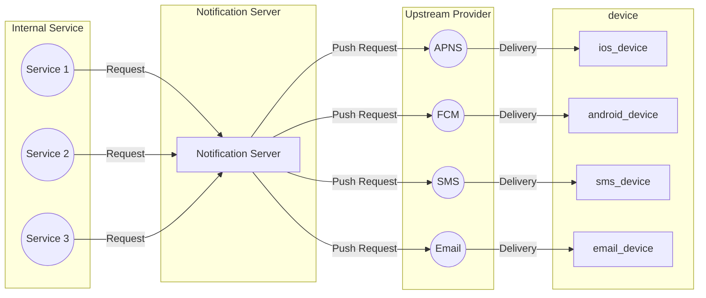
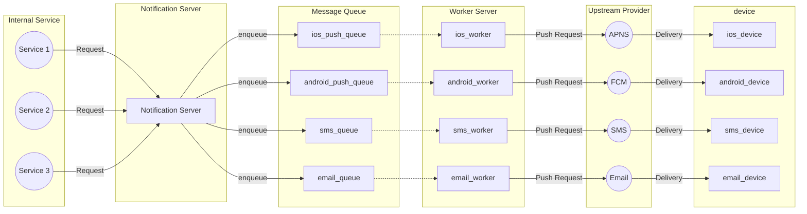

# 알림 시스템 설계

## 알림 시스템 설계 범위
* 알림은 푸시 알림, SMS, 이메일 3가지 종류 지원해야한다.
* 가능한 실시간으로 전달해야 하지만, 약간의 지연은 가능하다.
* iOS, 안드로이드, PC를 지원해야 한다.
* 사용자에게 보낼 알림을 Client Application이 만들거나 서버에서 스케줄링 할 수 있다.
* 알림 거부 설정도 있다.
* 하루에 약 천만 건의 모바일 푸시 알림, 백만 건의 SMS, 5백만건의 이메일

🤔 추가로 어떤 알림을 설계하는지 명확하게 질문하는게 더 구체화가 쉬울 것 같다.
* 특정 시간에 일괄로 보내는 광고성 알림
* 사용자의 액션에 따라 보내는 알림
* 사용자의 데이터에 따라 보내는 알림 (자동결제 7일전 알림 같은)
* ...

---
## 공통 설계
* 알림 시스템은 일반적으로 써드 파티를 사용해서 일반적으로 down stream의 역할을 수행해야한다.
  * upstream인 써드파티의 스펙에 맞게 알림 Request를 만들어서 호출하면 된다.
  * 공통으로 해당 디바이스를 식별할 수 있는 토큰과 알림의 내용을 담은 Payload가 존재한다.
    * **디바이스 토큰은 써드파티에서 제공하는 토큰을 클라이언트가 써드파티에 요청 후 받아서 서버 API로 호출**
    * 서비스 내 특정 사용자 디바이스를 식별하기 위해 userId와 해당 토큰을 매핑하는 테이블을 설계해야 한다.

## 알림 시스템 설계

### 알림 시스템 -> 써드 파티
* 알림 시스템은 디바이스별 써드파티의 API 스펙에 맞게 알림 Request를 만들어서 호출하는 역할을 한다.
* 따라서, 알림 로직들이 모두 upstream인 써드 파티에 위임되기 때문에 확장성있게 설계해야 한다.
  * 특정 서드파티는 특정 지역에 알림을 보내지 못할 수도 있고, 서비스가 망해서 다른 서비스로 대체해야 할 수 있다.
  * OCP를 지켜서 추상화를 잘해놓아야 할 것 같다!

### 내부 서비스 -> 알림 시스템 API 호출
* 알림을 보내는 서비스들이 많을 수 있다.
  * MSA 환경에서는 도메인별 알림이 있을 수 있으므로 API 호출이 여러 도메인에서 있을 수 있다.
  * 모놀리식 환경에서도 사내 공통으로 알림 시스템을 설계한다면 사내 여러 서비스에서 호출이 있을 수 있다.
* 따라서, 최대한 고수준으로 설계하여 모든 알림을 처리할 수 있도록 설계하는 것이 좋을 것 같다.

### 알림 시스템 설계 초안

* 문제점
  * 단일 서버의 문제점과 동일
  * SPOF
  * 특정 알림에 대해서만 Scale Out이 불가능
  * 성능 병목, 장애 전파 -> 특정 알림 로직에 병목이 있거나 장애가 있을 때 다른 알림도 영향을 받는다.

### 알림 시스템 설계 개선
* Notification Server가 단일 서버로 개선 필요
1. 모든 알림이 동기로 처리되어 알림별 처리량을 조절할 수 없다.
2. 특정 알림 로직에 병목이 있거나 장애가 있을 때 다른 알림도 영향을 받는다.
3. 서비스에서 알림을 요청하는 API와 실제 알림 Request를 만들어서 처리하는 부분의 책임 분리가 되어 있지 않다.
   * 써드파티가 변경되어서 알림 Request 만드는 부분이 변경되었을 때 서비스에서 알림 요청하는 API는 변경될 필요가 없다.

✅메시지 큐 도입
* Producer와 Consumer를 분리하여 시스템 컴포넌트 강결합 분리
  * API Server - Message Queue - Worker Server
  * Message Queue와 Worker Server를 알림별로 둬서 장애 전파 방지, 특정 처리량만 조절 가능

* 이메일 알림 처리에 병목이 생긴다면 Email Worker 서버 수만 늘리면 된다.
* 이메일 알림 처리에 장애가 발생해도 다른 알림은 정상적으로 처리된다.

---
## 상세 설계

### 1. 안정성
* 알림이 잠깐 지연될 수는 있어도 유실되면 안된다.
* 어떻게 유실 방지?
  * 알림 로그에 상태를 두고 처리 로직과 처리 완료 상태 업데이트 로직을 트랜잭션으로 묶어서 처리
  * 실패하면 로그에 실패 상태로 저장
  * 스케줄링으로 처리완료되지 않은 데이터 재시도 로직 구현?

### 2. 알림 중복 전송 방지
* Redis SET NX를 통해서 중복 요청을 방지할 수 있을 것 같다.
  * 해당 알림을 식별할 수 있는 키를 만들어서 Redis에 저장하고
  * 해당 Key가 이미 존재한다면 Pass, 존재하지 않는다면 알림 처리

### 3. 알림 큐 모니터링
* 어떤 알림의 병목이 생기고 처리량이 많은지 파악을 위해 모니터링이 필수적이다.
* 큐별로 쌓인 알림의 개수 메트릭을 모니터링해서 해당 처리 서버를 늘릴지 말지 결정해야 한다!

