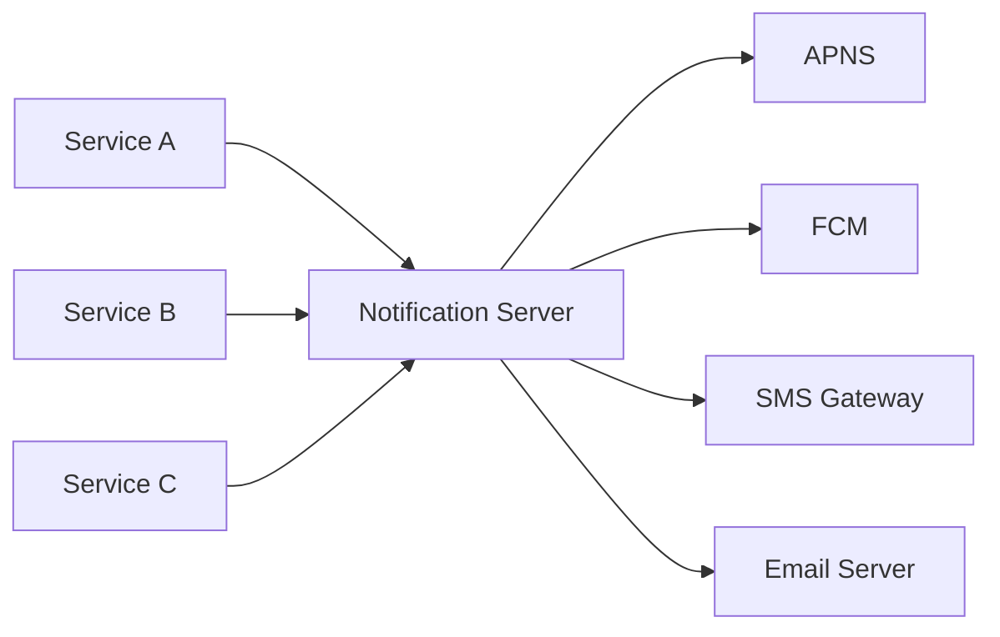
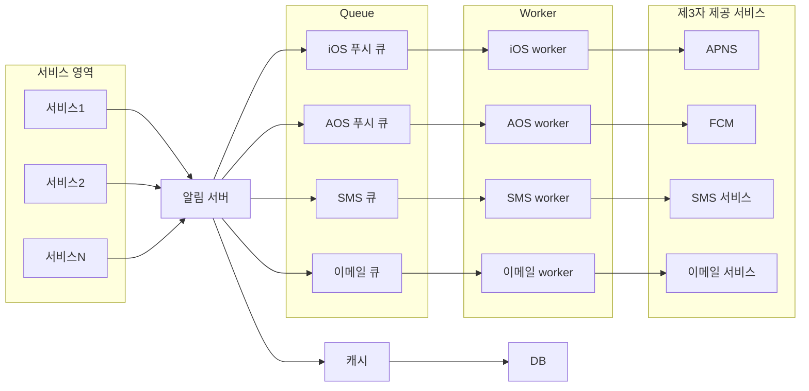
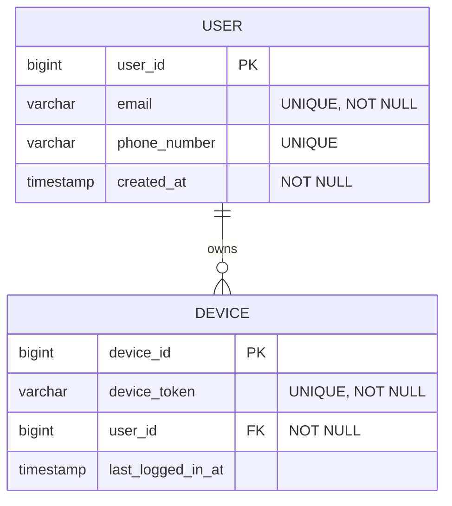
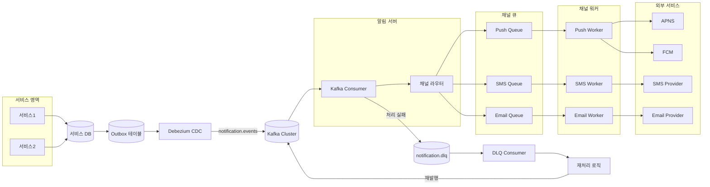

## 1. 문제 이해 및 설계 범위 확정

설계 전에 요구사항을 명확히 한다.

### 1.1 요구사항

- 기능적 요구사항
    - 앱 푸시 알림(iOS, AOS)
    - SMS 메시지
    - 이메일
- 비기능적 요구사항
    - 가능한 한 빨리 전달해야 하지만, 시스템에 부하가 걸렸을 경우 약간의 지연은 허용
    - 사용자가 알림을 받지 않도록 자체적으로 설정할 수 있어야 함.
        - 하루 기준 모바일 푸시 알림 1,000만 건, SMS 100만 건, 이메일 500만 건 전송 보장.

---

## 2. **개략적 설계안 제시 및 동의 구하기**

**초기 기본 설계**



가장 단순한 형태는 단일 알림 서버가 요청을 받아 제 3자 서비스(APNS, FCM)로 직접 전송하는 구조

- **문제점**
    1. 알림 서버가 1대이므로, 해당 서버에 장애가 발생하면 전체 알림 시스템이 마비됨.
    2. 단일 서버 모델에서는 데이터베이스나 캐시를 독립적으로 스케일 아웃하기 어려움
    3. 네트워크 I/O 작업인 외부 서비스 호출이 동기적으로 이루어질 경우, 스레드가 블로킹되어 대규모 트래픽 발생 시 서버가 응답 불능 상태에 빠질 수 있음

**개선된 설계**



**Queue**?- 순간적인 버스트 트래픽이 들어온다 하더라도 Producer - Service 사이에 결합도가 낮아 서비스 장애 전파로 이어질 확률이 낮아지게 된다

**Worker**?- 큐에서 이벤트를 읽어서 채널별 발송 전략을 결정

**제 3자 서비스**?- Notification Service 의 호출을 받아서 실제로 발송 역할수행. adapter 인터페이스를 통해서 구현시 확장성에 용이히다. (APNS, FCM, SMS 서비스, Email 서비스)

**개선점**

1. **데이터베이스 및 캐시 분리**
    
    알림 서버에서 DB(+캐시)를 분리하여 서버를 Stateless 하게해 알림서버의 스케일아웃을 가능하게한다.
    
2. **Message Queue 도입**
    
    알림 서버와 제3자 서비스 사이에 버퍼 역할을 하는 메시지 큐를 배치. 컴포넌트 간 강결합을 끊고 비동기 처리 가능하게 함
    
3. **Worker** 
    
    메시지 큐에서 이벤트를 Consume하여 실제 제3자 서비스로 알림을 전송하는 역할
    

**Payload**

```json
{
	"aps" : {
		"alert" : {
			"title": "Game Reqeust", // 알림 제목
			"body" : "body", // 알림 본문
			"action-loc-key":"PLAY" // 액션 키
		},
	"badge": 5 // 앱 아이콘 배지 카운트
	}
}
```

<aside>
?

**※ 메시지 큐를 종류별로 분리하는 이유**

제3자 서비스(e.g. APNS)에 장애가 발생해 처리가 지연되더라도 다른 종류의 알림(e.g. SMS, 이메일) 전송에는 영향을 주지 않도록 장애를 격리하기 위함

</aside>

### 2.2 정보 수집

- 알림을 보내기 위해서는 사용자의 단말기 토큰, 전화번호, 이메일 주소에대한 정보를 DB에 적재해야한다.
- 사용자가 여러 기기를 사용할 수 있고 여러 알림 채널을 가지고 있을 수 있기 때문에 1:N이어야한다.



---

## 3. 상세 설계

단순히 알림을 보내는 것은 당연하다. 분산 시스템에서 **데이터 유실 없이** 안정적으로 알림을 전송하기 위한 설계가 필요

### 3.1. 데이터 손실 방지

지연이 되더라도 유실 되면 안됨!

- **알림 로그 저장**
    - 발송?전: 큐 적재 직후 상태(PENDING)
    - 발송 중: 작업 서버가 수신했을 때(PROCESSING)
    - 발송 완료: APNS/FCM 응답을 받은 후(SUCCESS?/ FAIL)
- **retry 전략**
    
    제3자 서비스 호출이 실패할 경우, 해당 알림을 DLQ(DLT)에 넣고 백오프 방식으로 지정된 횟수만큼 재시도
    
    - 1분 → 5분 → 15분 → 1시간

### 3.2 중복 알림 방지

분산 시스템의 특성상 네트워크 파티션이나 타임아웃으로 인해 최소 한 번 전달이 발생할 수 있음. 완벽하게 중복을 막는 것은 불가능

- **Event ID 검사**
    1. 보내야 할 알림 데이터에 고유한 event ID를 부여
    2. worker는 알림을 보내기 전에 event ID가 Redis에 이미 전송 성공으로 기록되어 있는지 확인
    3. 기록되어 있다면 중복 알림이므로 알림을 보내지 않는다

### 3.3 추가 필수 컴포넌트 및 고려사항

| **컴포넌트 및 기능** | **설명 및 필요성** |
| --- | --- |
| **알림 템플릿** | 동일한 포맷의 알림(예: 비밀번호 재설정)을 보낼 때, 본문을 하드코딩하지 않고 매개변수(Parameter)만 채워 넣어 알림을 완성하는 기능. 유지보수성 향상. |
| **알림 설정** | 사용자가 특정 알림을 받지 않기로 설정(Opt-out)했는지 확인하는 기능. 알림 서버는 메시지 큐에 이벤트를 넣기 전, 반드시 알림 설정 테이블을 질의하여 전송 여부를 필터링해야 함. |
| **Rate Limiting** | 한 사용자에게 너무 많은 알림이 집중되지 않도록 막는 장치. 알림의 빈도가 너무 높으면 사용자가 알림을 완전히 꺼버릴(Opt-out) 위험이 있음. |
| **보안** | 인증된 클라이언트(사내 서비스 등)만 알림 전송 API를 호출할 수 있도록 AppKey, AppSecret 등을 이용한 보안 장치 마련. |
| **큐 모니터링** | 메시지 큐에 쌓인 이벤트의 개수(Queue length)는 시스템 부하를 나타내는 핵심 지표. 이 수치가 계속 증가한다면 작업 서버(Worker)의 개수를 동적으로 스케일 아웃해야 함. |
| **이벤트 추적** | 전송 성공률, 사용자 클릭률, 수신 거부율 등 메트릭을 수집하여 데이터 분석 팀이나 프로덕트 팀이 의사결정을 내릴 수 있도록 로그를 추적함. |

## 4. 추가 고려사항

1. **컴포넌트의 결합도 낮추기**: API 서버와 전송 역할을 하는 작업 서버를 분리하고, 그 사이에 메시지 큐를 두어 비동기적으로 처리함. 이를 통해 트래픽 폭주 시에도 시스템이 다운되지 않고 버퍼 역할을 수행하게 됨.
2. **수평적 확장 보장**: 모든 알림 서버를 Stateless로 설계하고 캐시/DB를 분리하여 언제든 트래픽 양에 맞춰 서버 인스턴스를 늘리거나 줄일 수 있음.
3. **장애 격리**: 알림 수단(iOS, AOS, SMS, Email)별로 메시지 큐를 물리적/논리적으로 분리하여, 특정 서드파티 서비스의 지연이나 장애가 전체 알림 시스템에 전파되지 않도록 설계함.
4. **데이터 무결성과 안정성**: 알림 로그 기반의 재시도 메커니즘과 이벤트 ID 검증을 통한 중복 제거 로직을 통해 엔터프라이즈급 알림 시스템의 신뢰성을 확보함.

---

# 5. 여러 사례

**배달의 민족 사례**

[CDC 너두 할 수 있어(feat. B2B 알림 서비스에 Kafka CDC 적용하기)](https://techblog.woowahan.com/10000/)    https://techblog.woowahan.com/23199/
    



---

[**TMC25 | Engineering - ???????? ???????? Alert ????????? ????????????**](https://www.youtube.com/watch?v=fcTPQAt7KkA)

[**알림 서비스로 시작하는 서버 개발 / if(kakao)2022**](https://speakerdeck.com/kakao/alrim-seobiseuro-sijaghaneun-seobeo-gaebal)

[**MMORPG 실시간 알림 서비스 개발기 feat. Kafka Streams / if(kakaoAI)2024**](https://www.youtube.com/watch?v=bzJJt4YdhgI)
