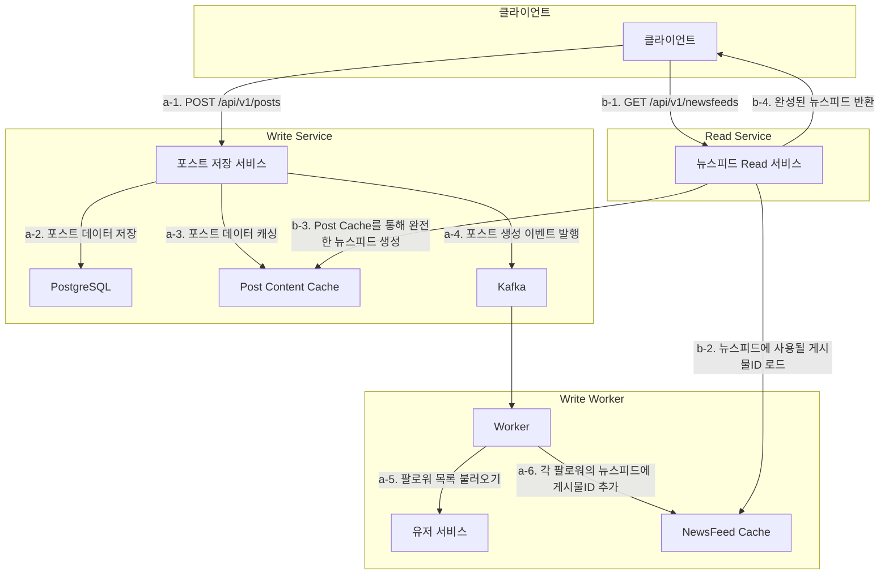
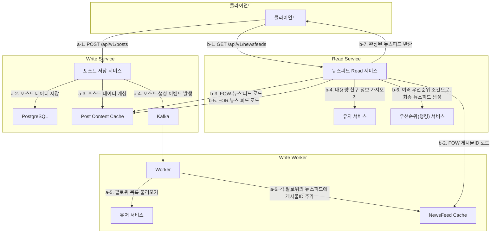

## 개요

뉴스 피드 시스템을 만들자!

## 1. 문제 이해 및 설계 범위 확정

- 요구사항
    - 새로운 스토리(게시물)을 올릴 수 있어야한다.
    - 친구들이 올리는 스토리(게시물)을 볼 수 있어야 한다.
- 디테일
    - 게시물은 단순히 시간 흐름 역순으로 표시되어야한다.
    - 매일 천만명 방문
    - 한 명의 사용자는 최대 5,000명의 친구를 가질 수 있다.

## 2. 개략적 설계안 제시 및 동의 구하기

- 친구가 매우 많은 상황은 당장 고려하지 않고, 단순하게 쓰기 시점 팬아웃(fanout-on-write)모델을 차용

## 3. 상세 설계

뭘 더 개선해야 할까?

- 친구가 매우 많은 경우가 존재해, 포스트 Writer(Worker)의 부담이 커진다.
- 만약 피드 내 게시물의 우선순위가 단순 시간의 역순이 아니라면?

- b-2~3, b-4~5 각 `CompletableFuture` 활용한 비동기 조회 방식을 사용하고, 두 작업이 모두 마무리될 때 하나의 뉴스피드로 Merge, 이후 랭킹 서비스로 전달하면 효율적일듯