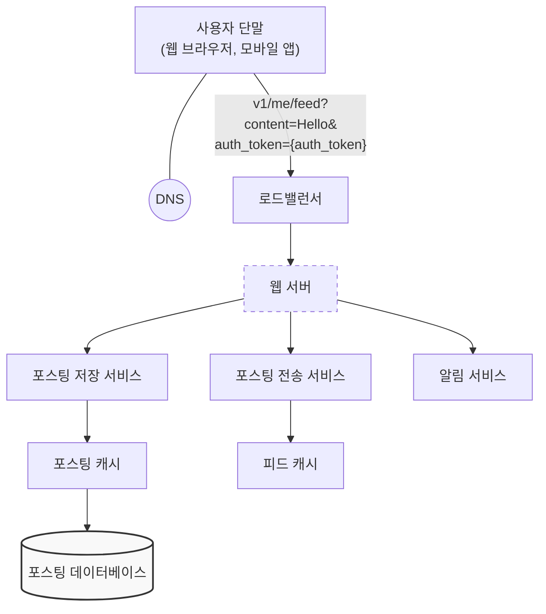
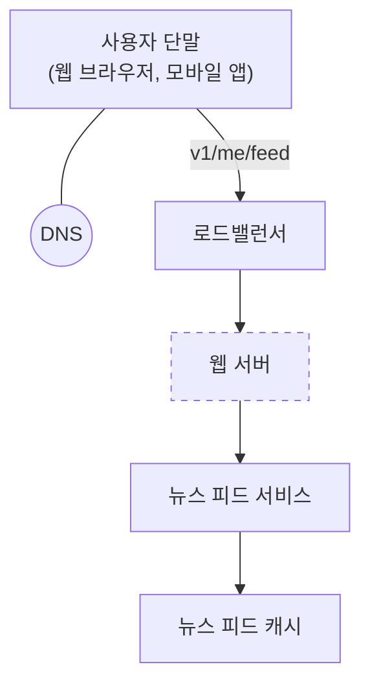
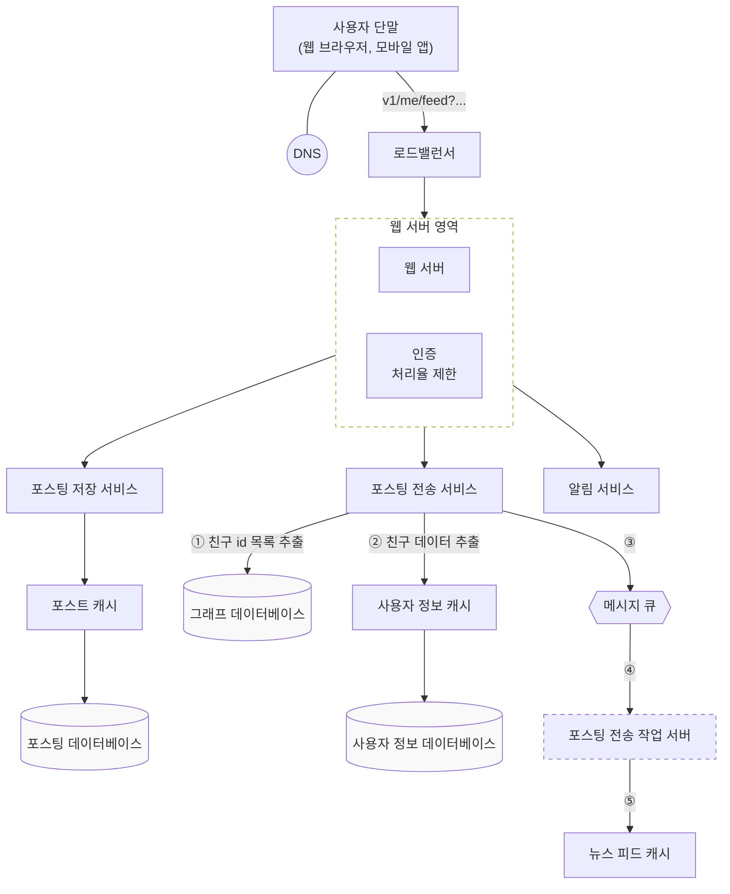
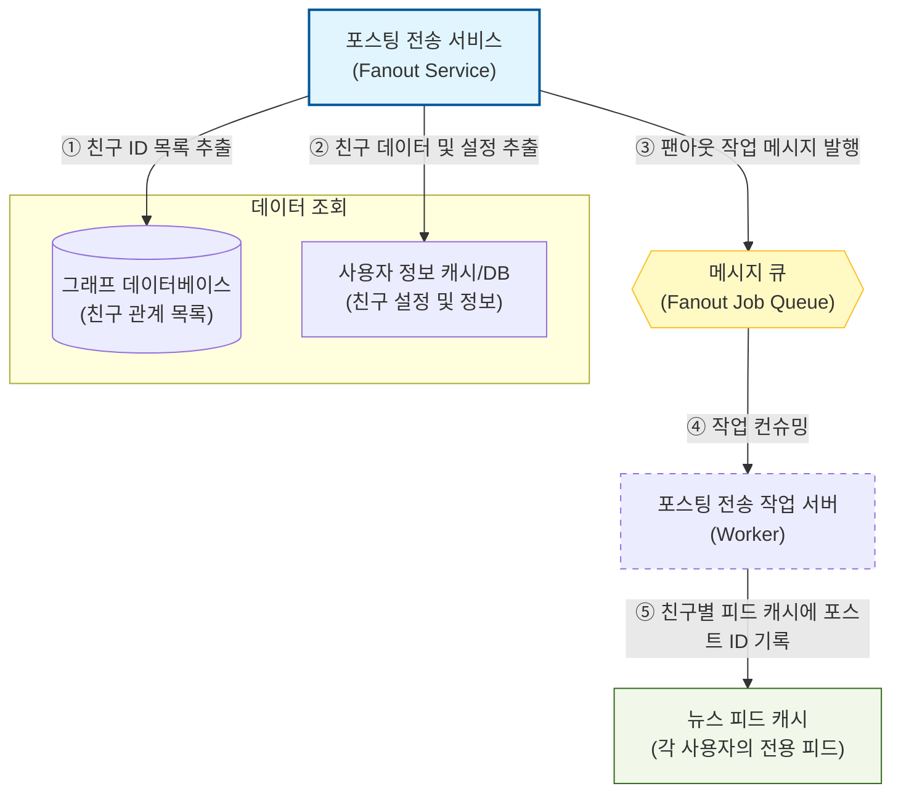
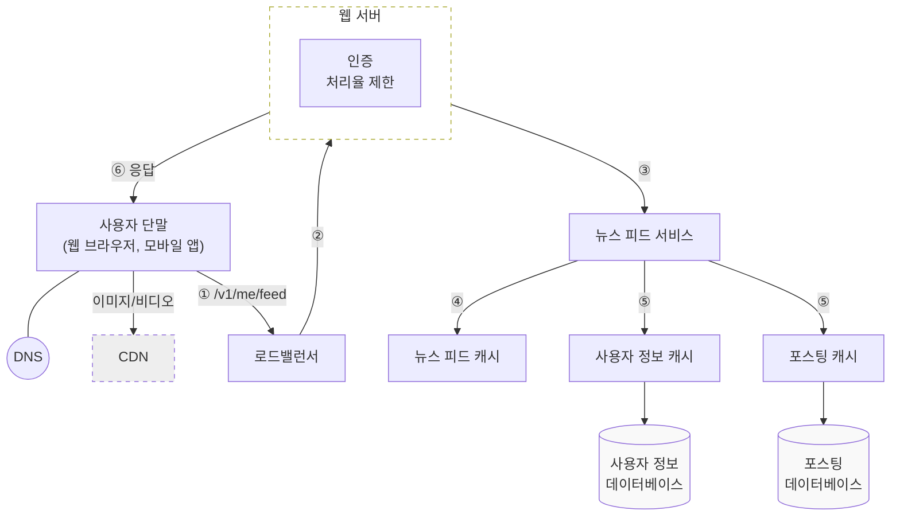

# 뉴스 피드 시스템 설계
* 뉴스 피드는 인스타그램 피드, 페이스북 피드 등 커뮤니티에 지속적으로 업데이트되는 스토리들

## 문제 이해 및 설계 범위 확정

* 디바이스 타입 질문 -> PC/Mobile 둘 다 지원
  * PC, Mobile별로 Display가 다를 수 있으니 BFF?
* 뉴스 피드 기능 질문 -> 새로운 스토리(글)을 올릴 수 있고, 친구들이 올리는 스토리도 볼 수 있어야 한다.
  * 도메인 설계 : 스토리, 친구
* 뉴스 피드 스토리 정렬 : 스토리의 최근 등록 시간 순
* 스토리 컨텐츠 : 텍스트와 이미지, 비디오 포함
  * 파일을 저장할 수 있는 시스템 필요
* 트래픽 규모 : 사용자의 친구는 최대 5000명, 트래픽은 매일 1000만명

* 설계 생각
  * PC, Mobile별로 Display가 다르다면 BFF 지원
  * 도메인은 스토리, 친구, 멤버 정도
  * 컨텐츠에 이미지, 비디오도 들어가므로 파일 시스템 필요 -> 서버 부하를 줄이기 위해 S3, CDN 캐싱 사용

---

## 설계
* 피드 발행 / 피드 생성(조회?) 분리
* '사용자의 뉴스 피드'를 친구의 피드가 생성될 때 미리 만들어 놓는다.
  * 일반적으로는 스토리를 생성하고 피드 조회 시 피드에 조건을 걸어서 무한 스크롤로 구현할 것 같은데,
  * 트래픽이 많다보니 MV처럼 사용자별로 조회될 피드를 미리 생성해놓는 것 같음?

### 피드 발행 

* 트래픽이 1000만명이기 때문에, 도메인별 MSA에서 더 세분화해서 포스팅 비즈니스별로 Application을 나눈 것 같다.
  * 포스팅 저장 서비스 : 사용자가 작성한 포스팅 저장
  * 포스팅 전송 서비스 : 친구의 뉴스 피드 캐시에 전송

### 피드 생성

---
## 상세 설계

* 포스팅 전송 서비스 -> fanout service
  * 시스템 설계에서 **팬아웃(Fan-out)**은 하나의 데이터를 여러 목적지로 전달하거나 분산시키는 과정을 의미합니다.
  * 사용자의 새 포스팅을 친구인 사용자에게 모두 전달하는 서비스 

### RateLimiter
* RateLimiter가 필요할까? 했는데 스팸 글을 막고, 유해 콘텐츠의 잦은 포스팅을 막기 위해 
* RateLimiter 설계, BFF를 사용한다면 Display Application에서 처리

## Fanout Model
* Fanout Model은 2가지 모델이 있다.
  * 쓰기 시점에 Fanout (fanout-on-wrtie / push model)
  * 읽기 시점에 Fanout (fanout-on-read / pull model)
* Fanout을 한다는 것은, 특정 액션이 발생했을 때 해당 데이터를 영항받는 곳에 미리 데이터 전달

### fanout-on-write (push model)
* 새로운 포스팅을 생성한 시점에 해당 데이터를 fanout
* 사용자가 포스팅 작성 시 해당 사용자 친구들의 피드 캐시에 작성한 포스팅 갱신
* 포스팅 작성 시 친구들의 피드 캐시에 데이터 Push

| 장점                                                                             | 단점                                                                                                                                     |
|:-------------------------------------------------------------------------------|:---------------------------------------------------------------------------------------------------------------------------------------|
| 1. 친구들에게 뉴스 피드가 실시간으로 갱신된다.  2. 생성 시 미리 갱신되기 때문에 친구들이 피드 조회 시 조회 시간이 짧아진다. | 1. 최대 5000명의 친구가 있는 사용자의 경우 작성 후 친구들의 모든 피드 캐시를 갱신하는 데 많은 시간이 걸린다.(hotkey 문제)   2. 친구 중 조회를 자주하지 않는 사용자의 데이터도 갱신해야 하므로 비효율적일 수 있다. |  

### fanout-on-read (pull model)
* 피드를 조회하는 시점에 친구의 뉴스 피드를 갱신해오는 요청 기반 pull model

| 장점                                                                                               | 단점                     |
|:-------------------------------------------------------------------------------------------------|:-----------------------|
| 1. 서비스를 자주 이용하지 않는 친구가 많다면 효율적   2. 조회하는 사용자가 pull하는 방식이라서 여러 명의 캐시 갱신이 이루어지는 hotkey 문제가 없다. | 1. 피드 조회 속도가 느려질 수 있다. |  

### fanout model 결정
* 피드 도메인의 특성상 조회 속도가 사용자에게 중요하다.
* 따라서, 일반적으로는 fanout-on-write를 사용하고 follower가 많은 인플루언서는 fanout-on-read를 사용하는 하이브리드 방식 사용
* 안정 해시를 사용해서 fanout-on-write에서 hotkey 문제 줄이기

### Fanout Flow

1. Graph NoSQL DB 사용해서 친구 데이터를 저장하고, 해당 Graph DB에서 조회
   * Graph 자료구조를 기반으로 데이터를 Node(점)와 Edge(선)으로 관리
   * 소셜 네트워크의 follwer, following 관계를 표현하기에 적합
   * 친구의 친구 등 복잡한 관계일 때 RDB는 여러 번의 조인이 필요하지만 Graph는 Node에 있는 Edge를 타고 탐색하므로 성능이 훨씬 좋다.
2. Fanout 메시지 발행
    * 메시지 큐에 fanout 작업 메시지 발행
    * 메시지에 포스팅 ID와 친구 목록 포함
3. Worker 서버에서 메시지 컨슈밍
    * 사용자별 뉴스 피드 캐시는 포스팅 ID와 사용자 ID를 키 매핑으로만 저장
    * 도메인 특성상 최신 피드만 중요하고 오래된 피드는 중요하지 않기 때문에 메모리 제한을 두고 오래된 피드 매핑은 삭제

### 조회 Flow

* 포스팅의 컨텐츠 자체를 S3/CDN으로 서빙
* S3 파일명을 특정 사용자의 포스팅을 식별할 수 있는 이름으로 저장
  * {userId}_{postingId}_{createdAt}.{extension}
* 각 도메인별 캐시에서 정보를 꺼내 파일명을 생성하고 클라이언트에게 응답

---
## 기업 사례

[Graph DB 사례 (와디즈)](https://blog.wadiz.kr/%ea%b7%b8%eb%9e%98%ed%94%84-%eb%8d%b0%ec%9d%b4%ed%84%b0%eb%b2%a0%ec%9d%b4%ec%8a%a4%eb%a1%9c-%ec%b9%9c%ea%b5%ac-%ec%84%9c%eb%b9%84%ec%8a%a4-%eb%8f%84%ec%9e%85%ed%95%98%ea%b8%b0/)
[Fan Out 사례 WITH Redis Streams (LINE)](https://techblog.lycorp.co.jp/ko/building-a-messaging-queuing-system-with-redis-streams)

