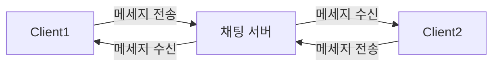
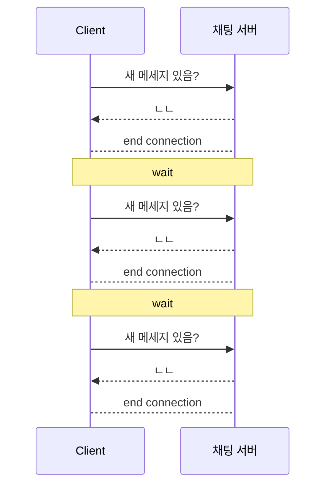
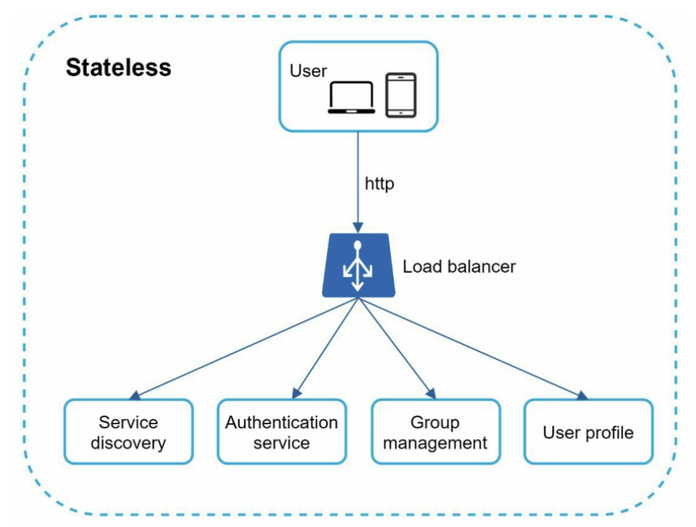
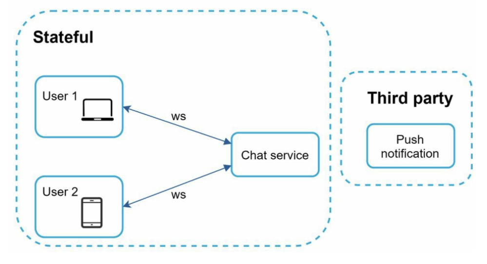
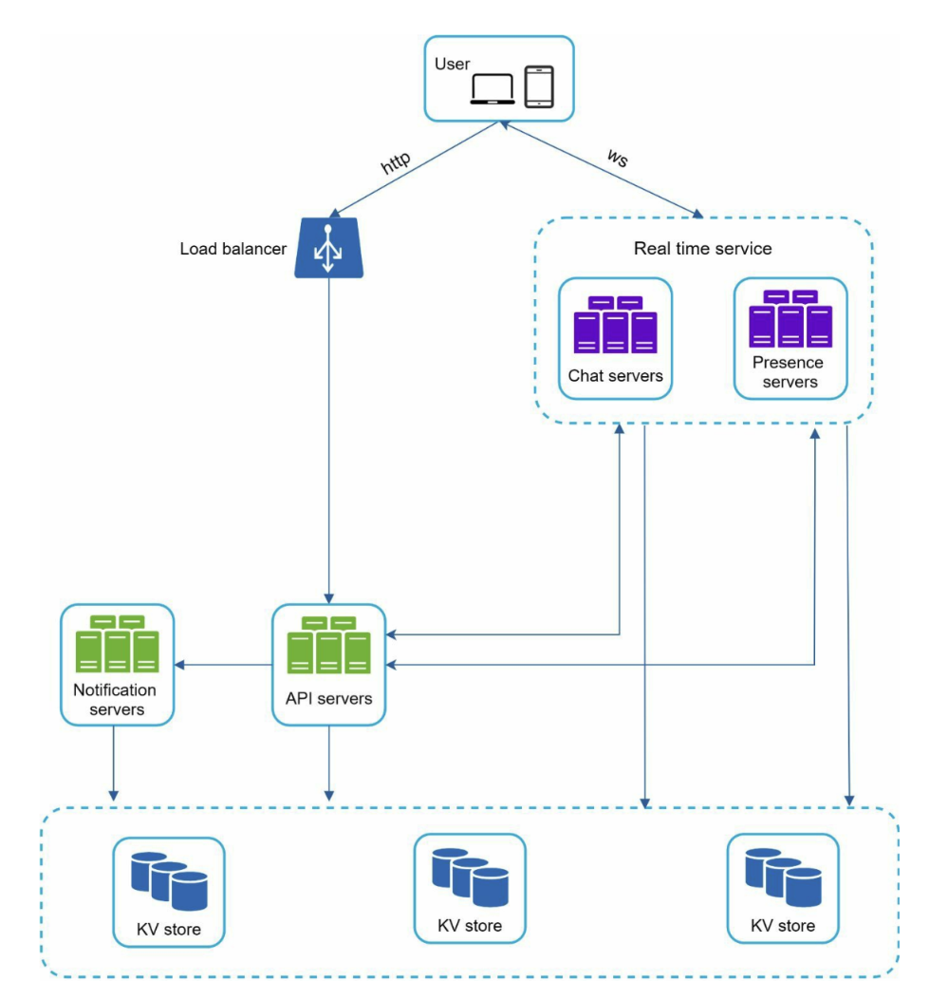
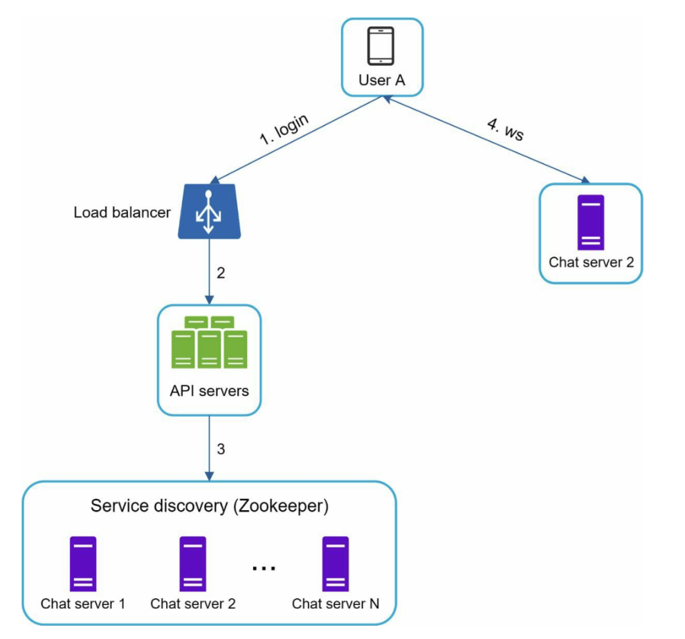
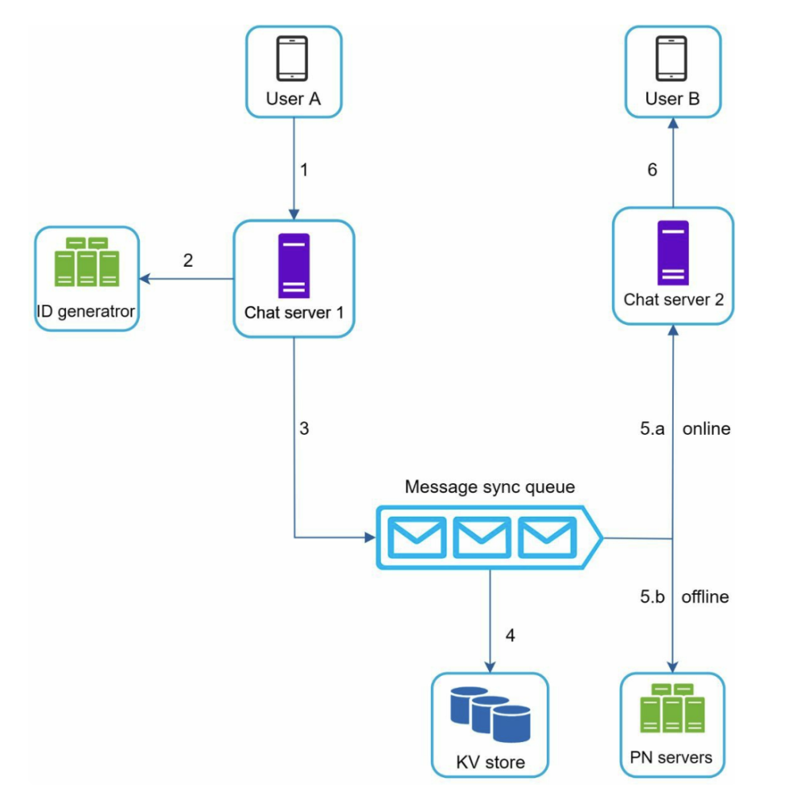
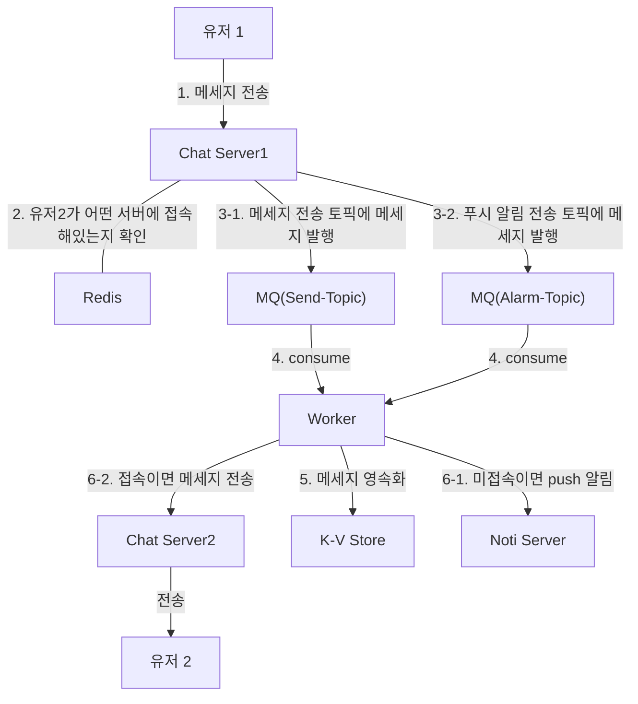
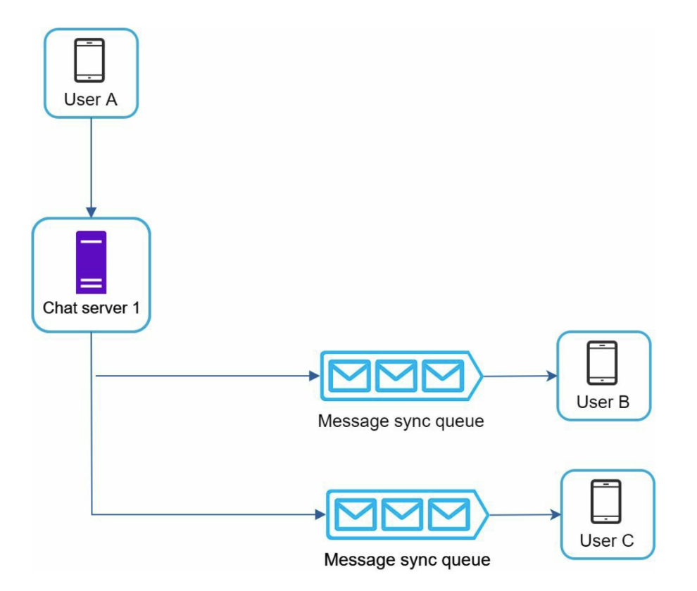
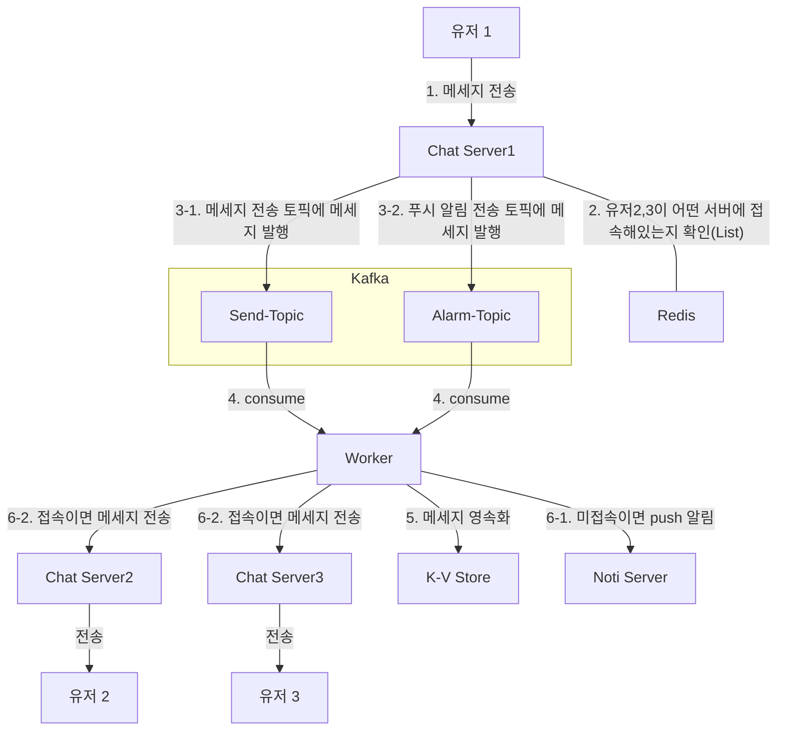

## 1. 문제 이해 및 설계 범위 한정

- 1:1, 그룹 채팅 모두 지원
- DAU 5천만
- 그룹 채팅 최대 100명 참여
- 사용자 접속 상태 표시
- 텍스트만 전송 가능
- 응답지연이 낮은 일대일 채팅
- 푸시알림
- 다양한 단말 지원

→ 페이스북 메신저와 유사한 채팅 앱을 설계해보자.

## 2. 개략적 설계안 제시

### 추상화된 양방향 통신 구조

→ 이를 가능하게 하는 통신 전략은?

- 메세지 전송은 Http만으로도 충분하다.
- 메세지 수신을 어떻게 처리하느냐가 중요
    - 단순 Http 요청에서 메세지 발생했을때 실시간으로 Server → Client로 보내주긴 어렵다.
    - 크게 3가지 방법이 떠오른다.
        - 주기적인 새 메세지 확인(Http, 폴링)
        - SSE(Server-Sent-Event)
        - 웹소켓

### 1. 폴링(With Http)

- 주기적으로 새 메세지가 있는지 들여다보는 방식
- 답해줄 메세지가 없는 경우, 서버의 자원을 낭비하게 되는 꼴
- 폴링 주기가 짧아질수록 비용이 커진다.
- 롱 폴링의 경우도 같은 채팅 서버에 메세지 송수신자가 연결되어있지 않으면 비효율적이다.

### 2. SSE (Server-Sent Event)

Http 기반의 SSE를 활용하면 폴링 기법을 사용하지 않고도 Server → Client로 사용자의 수신 메세지를 전달해줄 수 있다. 

### 3. 웹소켓

웹소켓을 활용하면 상단 추상화된 양방햔 통신 구조 그대로 가져갈 수 있다.

### 개략적 설계

웹 소켓을 사용하는 상태 유지 서비스, 그 외 서비스를 구분하면 아래와 같은 설계안이 나온다.

- 이 중 Service Discovery, 탐색 서비스는 클라이언트가 접속할 최적의 채팅 서버를 골라주는 역할을 한다.
- 규모 확장성을 고려하면 아래와 같은 설계안이 나온다.

<aside>

서버의 규모에 따라 다르지만, 일반적으로 하나의 채팅 서버(Pod)에 안정적으로 동시 연결할 수 있는 커넥션 수는 수천 ~ 수만 수준이라고 한다. 

디스코드:
- 2021년 기준 약 850개의 웹소켓 서버 운영
- 서버당 약 7.2만 연결 처리
- 총 약 6,000만 동시 연결 지원

</aside>

## 3. 상세 설계

### 최적의 채팅 서버 탐색

- 고려해야할 요소
    - 단순히 라운드 로빈 형식으로 분배하는게 올바른가?
        - 아닐듯. 최초 연결을 라운드 로빈으로 해도, 연결 해제는 무작위이다.
        - 그러면 웹소켓 커넥션이 몰려있는 채팅 서버에 또 연결할 수 있다.
    - 따라서 각 채팅 서버에 연결되어있는 client 수 및 서버 자원 활용량을 복합적으로 판단해
    최적의 서버를 선택해야한다.

- 책은 상용 서비스(Apache Zookeeper)를 소개했다.
- 채팅 서버를 모두 Zookeeper에 등록해, 사전에 등록된 조건에 따라 서버를 선택할 수 있도록

<aside>

처음엔 단순히 Redis와 같은 공간에 서버 당 연결된 클라이언트 정보를 관리하면 이를 통해 최적의 서버를 골라낼 수 있겠는데? 생각했는데, 현재 서버의 상태(CPU, 메모리 사용량 등)까지 고려하려면 부족하다.

</aside>

### 1:1 종단 간 메세지 흐름

### 소규모 그룹 종단 간 메세지 흐름

### 채팅 시스템에서의 캐시 효율성

- 채팅 데이터 자체가 NoSQL에 저장되어 조회에 특화되어있긴 하지만, 속도가 중요하다.
- 채팅 데이터의 특징은 “쉽게 변하지 않는 고정적인 데이터”
- 이에 따라 캐시 효율성이 극대화 될 것으로 예상
- 여러가지 샤딩 전략이 있을 것으로 예상
    - ChatRoomId 기반 샤딩 등
- 또한 최신 데이터만 자주 조회되는 특성에 맞춰, TTL을 n주 정도로 설정하면 좋을 듯