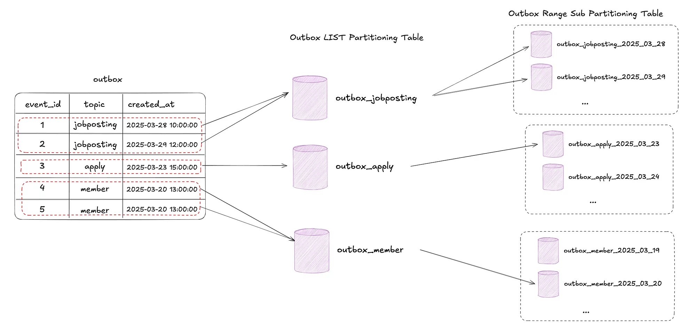

## DB Partitioning (PostgreSQL 기준)
> Partitioning refers to splitting what is logically one large table into smaller physical pieces. (PostgreSQL Partitiong 공식문서)
* 하나의 논리 테이블을 작은 물리 테이블로 분할 하는 것

### DB Partitioning 이점
* 테이블을 작은 단위로 줄여서 Row가 줄어들면서 쿼리 성능 향상
* 특정 파티션에 대량의 Access가 있을 때 Index 대신 Sequential Scan이 되어 성능이 향상된다.
  * Index는 특정 데이터의 주소를 찾고 해당 주소로 가서 데이터를 읽음 (Random Access)
  * Sequential Scan은 테이블을 처음부터 끝까지 쭉 읽음 -> 파티션 테이블 대량 데이터 조회 시 유리

### 활용 사례
* PostgreSQL Outbox 테이블의 쌓이는 데이터를 안전하게 drop하기 위해 토픽, 일자별로 파티셔닝
  * PostgreSQL에서 update/delete 시 Dead Tuple이 되어 AutoVaccum 대상 -> I/O 부하
> These commands also entirely avoid the VACUUM overhead caused by a bulk DELETE. (PostgreSQL Partitiong 공식문서)

### Partitioning 원리 (상속(Inheritance) 구조 )
* 논리(Virtual) 테이블인 부모 테이블 - 데이터가 저장되는 실제 파티션 자식 테이블 구성
* 논리 부모 테이블
  * SELECT, INSERT 등 쿼리의 대상으로만 사용한다.
  * 생성되는 파티션 자식 테이블의 템플릿 역할 수행 
    * 부모 테이블에 인덱스를 생성하면, 생성되어 있거나 생성될 파티션 테이블에 모두 인덱스가 생성된다.
* 물리 파티션 자식 테이블
  * 실제 디스크에 데이터가 저장되는 테이블

-> 부모 - 자식 구조에서 인덱스를 자식 파티션 테이블에만 생성할 수 있고, 조회 시에도 적용된다.

* MySQL 파티셔닝 원리
  * 파티션 테이블 자체가 새로 생성되는게 아닌, 데이터 조각 자체 분리
    * 테이블은 1개인 상태로, 데이터 파일만 파티션되어 분리 (.ibd 파일)

-> MySQL은 인덱스 단위가 테이블 전체 단위라서 특정 파티션 테이블에만 인덱스를 생성할 수 없음.

### 파티션 프루닝(Partition Pruning)
* 파티셔닝 테이블 사용 시 쿼리 성능 Optimization 기법
* 쿼리 실행 시 조건절에 따라 접근하지 않아도 되는 파티션 테이블을 접근하지 않도록 하여 최적화
* `SELECT count(*) FROM measurement WHERE logdate >= DATE '2008-01-01';`
  * 2008년 이하 파티션 테이블은 조회 X
